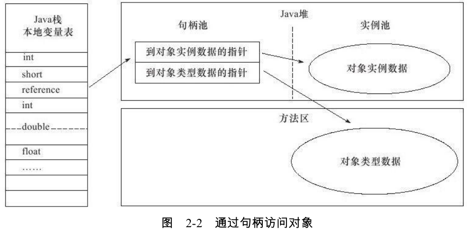
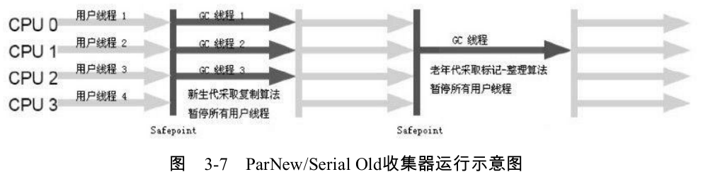
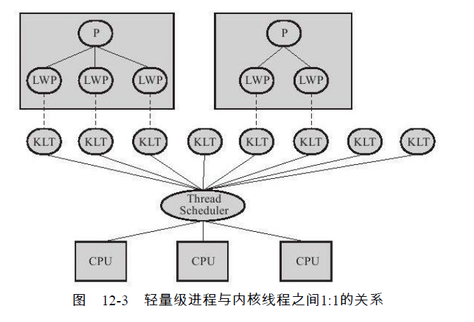

## 反射

**Java 反射机制**：在程序运行的时候，对于任意的一个类，都能够知道这个类的所有属性和方法，对于任意一个对象可以调用它的任意属性和方法这种动态获取信息以及动态调用对象的方法的功能叫做Java反射(reflect)。


# Jvm

## Java 技术体系

* Java 程序设计语言
* 各种平台上的Java 虚拟机
* Java API 类库 
* 来自商业机构和开源社区的第三方Java类库

Java程序设计语言、Java虚拟机、Java API类库这三部分统称为JDK（Java
Development Kit）

Java API类库中的Java
SE API子集 [1] 和Java虚拟机这两部分统称为JRE（Java Runtime Environment）


* Java ME（Micro Edition）：支持Java程序运行在移动终端（手机、PDA）上的平台，对
  Java API有所精简，并加入了针对移动终端的支持，这个版本以前称为J2ME。
* Java SE（Standard Edition）：支持面向桌面级应用（如Windows下的应用程序）的Java
  平台，提供了完整的Java核心API，这个版本以前称为J2SE。
* Java EE（Enterprise Edition）：支持使用多层架构的企业应用（如ERP、CRM应用）的
  Java平台，除了提供Java SE API外，还对其做了大量的扩充 [3] 并提供了相关的部署支持，这
  个版本以前称为J2EE。

混合语言：

多语言混合编程正成为主流，每种语言都可以针
对自己擅长的方面更好地解决问题。试想一下，在一个项目之中，并行处理用Clojure语言编
写，展示层使用JRuby/Rails，中间层则是Java，每个应用层都将使用不同的编程语言来完
成，而且，接口对每一层的开发者都是透明的，各种语言之间的交互不存在任何困难，就像
使用自己语言的原生API一样方便 [1] ，因为它们最终都运行在一个虚拟机之上。

64 位虚拟机：

Java程序运行在64位虚拟机上需要付出比较大的额外代价：首先是内
存问题，由于指针膨胀和各种数据类型对齐补白的原因，运行于64位系统上的Java应用需要
消耗更多的内存，通常要比32位系统额外增加10%～30%的内存消耗；

普通对象指针压缩:

（-XX：+UseCompressedOops，这个参数不建议显式设
置，建议维持默认由虚拟机的Ergonomics机制自动开启）

### Java 内存区域 与 内存溢出异常


### 程序计数器

程序计数器（Program Counter Register）是一块较小的内存空间，它可以看作是当前线
程所执行的字节码的行号指示器。

线程私有

### 虚拟机栈

Java虚拟机栈（Java Virtual Machine Stacks）也是线程私有的，它的
生命周期与线程相同。虚拟机栈描述的是Java方法执行的内存模型：每个方法在执行的同时
都会创建一个栈帧（Stack Frame [1] ）用于存储局部变量表、操作数栈、动态链接、方法出口
等信息。


#### 局部变量表

局部变量表存放了编译期可知的各种基本数据类型：

boolean、byte、char、short、int、
float、long、double，returnAddress

其中64位长度的long和double类型的数据会占用2个局部变量空间（Slot），其余的数据
类型只占用1个。

### 本地方法栈

本地方法栈则为虚拟机使用到的Native方法服务。

### Java 堆

Java堆（Java Heap）是Java虚拟机所管理的内存中最大的一块。
Java堆是被所有线程共享的一块内存区域。

新生代/老年代

再细致一点的有
Eden空间、From Survivor空间、To Survivor空间等。

从内存分配的角度来看，线程共享的
Java堆中可能划分出多个线程私有的分配缓冲区（Thread Local Allocation Buffer,TLAB）。

#### 堆和栈的区别


| 类型     | 堆                                        | 栈                 |
| -------- | ----------------------------------------- | ------------------ |
| 功能     | 堆存储Java对象(成员变量,局部变量，类变量) | 存储局部变量和方法 |
| 共享性   | 线程共有                                  | 线程私有           |
| 异常错误 | StackOverFlowError                        | OutOfMemoryError   |

- 功能不同
      * 堆存储Java中的对象（成员变量，局部变量，类变量）。
          * 栈用来存储局部变量（方法内部的变量）和方法。
- 共享性不同
  - 栈的内存是线程私有的。(方法相关的当然私有啊！！)
  - 堆的内存是线程共有的。
- 异常错误不同
  - 栈空间不足：java.lang.StackOverFlowError。 经典！
  - 堆空间不足：java.lang.OutOfMemoryError。对象存满了 -->

### 栈的组成

栈三部分:

- 局部变量区

  - 结构:以一个字长为单位，从0开始计数的数组。
  - 类型为short、byte和char会被转换成为int
    long和double占据两个连续的元素。
  - 实例方法只是多了一个隐藏的this。
  - 获取数据直接取索引。

- 操作数栈

  - 和局部变量一样，也是字长为1的数组，不是通过索引是用出栈和入栈来决定的。还记得迪杰斯特拉吗？！
    

- 帧数据区

  - Java栈帧还需要一些数据来支持常量池的解析，正常方法的返回。
  - 处理方法的正常结束和异常终止。通过return来正常结束的话，就弹出当前的栈帧，恢复发起调用方法的栈。如果方法有返回值JVM就会将返回值压入调用方法的操作数栈中。
  - 处理异常:保存了一个对此方法异常引用表的引用。

- 栈的整个结构

  ```java
  public class Main {
  public static void addAndPrint(){
      double result = addTwoTypes(1, 88.88);
      System.out.println(result);
  }
  
  public static double addTwoTypes(int i, double d) {
      return i + d;
      }
  }
  ```

  过程快照：
  

如果是方法中的局部变量就存储在堆中。

### 堆

当一颗二叉树的每个节点都大于等于它的两个子节点时，称作堆有序。
用执政表示一个二叉树的话就是一个完全二叉树。

- 由上到下的堆有序:
  - 上浮:只要记住位置k节点的父亲节点是位置k/2
    - 插入元素：将新元素上浮到适合位置
  - 下沉:
    - 删除最大元素：从数组顶端删除最大元素，选择数组最后节点。


### 方法区

是一个各个线程共享的内存区域，用于存储已经被虚拟机加载的类信息，常量，静态变量，及时编译器编译后的代码等数据。别名`Non-Heap`，目的是与Java堆区分开来。

被加载的类信息

常量 

静态变量

即时编译器编译后的代码数据

HotSpot 虚拟机设计团队选择把GC分代收集扩展至方法区

1.7 把放在永久代的字符串常量池移除

##### 运行时常量池

运行时候常量池是方法区的一部分，Class文件除了类的版本，字段，方法等描述信息，还有一个信息是(Constant Pool Table),用于存放字面量和符号引用，这部分将在类加载后进入方法区的运行常量池中。 
类的信息，方法名，方法参数信息。

String 的 intern() 方法可以将运行期间的新的常量也放入池中

JDK 1.7 开始逐步去永久代

### 直接内存

虚拟机运行时数据区的一部分，也不是Java虚拟机规范中定义的内存区域。

NIO 可以通过Native 函数库直接分配堆外内存，然后通过一个存储在Java堆中的DirectByteBuffer对象作为这块内存的引用进行操作。（NIO 为什么这么快）


### 对象创建

1. 首先先再常量池定位某个类的符号引用
2. 内存所需要的大小需要类加载完成后才能知道 
3. 对对象必要设置

### 指针碰撞

为对象分配空间的任务等同于把一块确定大小的内存从Java堆中划分出来。假设Java堆中内存是绝对规整的，所有用过的内存都放在一边，空闲的内存放在另一边，中间放着一个指针作为分界点的指示器，那所分配内存就仅仅是把那个指针向空闲空间那边挪动一段与对象大小相等的距离，这种分配方式称为“指针碰撞”（Bump the Pointer）

### 溢出异常

问题：有多少种Java OOM 异常的可能，并且怎么排查？

#### Java堆溢出

只要不断地创建对象，并且保证GC Roots到对象之间有可达路径来避免垃圾回收机制清除这些对象，那么在对象数量到达最大堆的容量限制后就会产生内存溢出异常。

-Xms20m-Xmx20m

一般由于内存泄露或者堆的大小设置不当引起。

对于内存泄露，需要通过内存监控软件查找程序中的泄露代码。

**调整：**确定不是代码问题后，堆大小可以通过虚拟机参数-Xms,-Xmx等修改。

#### 永久代溢出

Java.lang.OutOfMemoryError: PermGen space 

方法区溢出了，一般出现于大量Class或者jsp页面，或者采用cglib等反射机制的情况，因为上述情况会产生大量的Class信息存储于方法区。

**调整：**通过更改方法区的大小解决，用类似-XX:PermSize=64m –XX:MaxPermSize=256m的形式修改。

#### 栈溢出

Java.lang.StackOverflowError ---不会抛OOM error（斌超哥刚讲）

**可能原因**：JVM栈溢出，一般是由于程序中存在死循环或者深度递归调用造成的，栈大小设置太小也会出现此种溢出。

**调整：**可以通过虚拟机参数-Xss来设置栈的大小。

### 直接内存溢出

Heap Dump文件中不会看见明显的异常，如果读者发现OOM之后Dump文件很小

## HotSpot 虚拟机对象揭秘

1. 虚拟机遇到一条new指令时，首先将去检查这个指令的参数是否能在常量池中定位到一
   个类的符号引用，并且检查这个符号引用代表的类是否已被加载、解析和初始化过。
2. 执行类加载过程，双亲委派
3. 分配内存，指针碰撞或者是空闲列表 Free List 看垃圾收集器
   1. 移动指针并不线程安全  1.CAS配上失败重试   2.每个线程在Java堆中预先分配一小块内
      存，称为本地线程分配缓冲（Thread Local Allocation Buffer,TLAB）
4. 虚拟机需要将分配到的内存空间都初始化为零值（不包括对象头）
5. 虚拟机要对对象进行必要的设置

7/8 69

### 对象内存布局

#### 对象头

* 哈希码
* GC 分代年龄
* 锁状态标志
* 线程持有的锁
* 偏向线程的ID/偏向时间戳

在64 和32 位系统分别是 64bit 和32 bit

在32位的HotSpot虚拟机中，如果对象处于未被锁定的状态下，那么Mark Word的32bit空间中的25bit用于存储对象哈希码，4bit用于存储对象分代年龄，2bit用于存储锁标志位，1bit固定为0，而在其他状态（轻量级锁定、重量级锁定、GC标记、可偏向）下对象的存储内容见表。


#### 对象访问定位

Java 程序通过栈上的reference 数据来操作堆上的具体数据

使用句柄访问的话，那么Java堆中将会划分出一块内存来作为句柄池，reference中存储的就是对象的句柄地址，而句柄中包含了对象实例数据与类型数据各自的具体地址信息：



如果使用直接指针访问，那么Java堆对象的布局中就必须考虑如何放置访问类型数据的相关信息，而reference中存储的直接就是对象地址


使用句柄的好处是在对象被移动的时候只会改变实例的数据指针


直接指针访问方式的最大好处就是速度更快，它节省了一次指针定位的时间开销，
由于对象的访问在Java中非常频繁，因此这类开销积少成多后也是一项非常可观的执行成
本。

## 垃圾收集器与内存分配策略

首先我提出几个问题：

* Java 的内存/垃圾回收机制是什么？
* 什么是内存碎片 如何解决？

Java 不选用引用计数是因为它很难解决对象之间相互循环引用的问题。


为何要选择 这些地方作为GC ROOT？ 因为首先你需要确定的GC ROOT 一定是对象存活的对象，而上图这些位置的对象都能保证存活，或者是不被GC所波及，因为GC所主要处理的位置是堆。

对于Java 的内存回收机制我们主要分为3种：

* 标记-清除算法
  * 不足：效率不高，容易产生内存碎片。
* 复制算法
  * 效率高，复制成本大。
  * 不足：如果是1：1模型，成本太高。
  * 分配担保策略
* 标记-整理算法
  * 因为老年代的对象生存率高，所以使用复制算法效率会很差，就提出了这个标记-整理算法。

我们可以发现每个算法都有他的优劣点，所以JVM 开发者们设计出了 一种名叫 ”分代收集“的方式进行垃圾回收。

新生代选用复制算法，因为剩下的存活对象少

老年代选用"标记—清理","标记—整理"的算法做 	

----------------------------------------------------------------------------

### 前置知识 什么是内存碎片？

#### 内部碎片

分配内存到进程A，内存被进程占据了而不被利用，同时系统也无法利用这块内存，直到进程A被终结，释放内存。

#### 外部碎片

还没被分配出去的内存太少了不足分配给下一个进程，又或者多个不连续的内存总空间长度能满足新申请的进程，但是由于地址是不连续的内存，无法分配给新进程。

Java 中的内存碎片可以理解为外部碎片，因为标记-清除算法只负责将标记的需要回收的内存给回收，对于一块内存，会留下很多小的空的位置，但是这些位置不足以去申请一个连续的对象。

对于内存碎片的解决，我们首先要明确，产生内存碎片的主要是老年代，所以我们主要聊一下这个CMS 如何解决内存碎片。

CMS 提供了 -XX：+UseCMSCompactAtFullCollection 用于在CMS收集器顶不住要进行FullGC时开启内存碎片的合并整理过程。虽然内存碎片没有了，但是停顿时间会变长很多很多，虚拟机设计者提供了 -XX：CMSFullGCsBeforeCompaction，在上一次CMS并发GC执行过后，到底还要再执行多少次full GC才会做压缩。默认是0，也就是在默认配置下每次CMS GC顶不住了而要转入full GC的时候都会做压缩。 

### 可达性分析算法

这个算法的基本思路就是通过一系列的称为“GC Roots”的对象作为起始点，从这些节点开始向下搜索，搜索所走过的路径称为引用链（Reference Chain），当一个对象到GC Roots没有任何引用链相连
（用图论的话来说，就是从GC Roots到这个对象不可达）时，则证明此对象是不可用的。如图3-1所示，对象object 5、object 6、object 7虽然互相有关联，但是它们到GC Roots是不可达的，所以它们将会被判定为是可回收的对象。


在Java语言中，可作为GC Roots的对象包括下面几种：

* 虚拟机栈（栈帧中的本地变量表）中引用的对象。
* 方法区中类静态属性引用的对象。
* 方法区中常量引用的对象。
* 本地方法栈中JNI（即一般说的Native方法）引用的对象

### 生存还是死亡

即使在可达性分析算法中不可达的对象，也并非是“非死不可”的，这时候它们暂时处于“缓刑”阶段，要真正宣告一个对象死亡，至少要经历两次标记过程：如果对象在进行可达性分析后发现没有与GC Roots相连接的引用链，那它将会被第一次标记并且进行一次筛选，筛选的条件是此对象是否有必要执行finalize（）方法。当对象没有覆盖finalize（）方法，或者finalize（）方法已经被虚拟机调用过，虚拟机将这两种情况都视为“没有必要执行”。

如果这个对象有必要执行finalize() 方法，那么这个对象会放置再一个叫做F-Queue 的队列，并在稍后由一个由虚拟机自动建立的、低优先级的Finalizer线程去执行它。

finalize()方法只会被系统自动调用一次，一次逃脱成功，之后就会失败。

### 是否需要回收方法区

方法区（hotspot中的永久代）一般垃圾回收的效率远低于新生代。

永久代回收的主要是两部分内容：

* 废弃常量
  * 进入常量池，当前系统没有任何String对象引用这个常量，也没有地方引用这个字面量，就会被清理出常量池。
* 无用的类（全部满足才算）
  * 该类的所有实例都已经被回收
  * 加载该类的ClassLoader 已经被回收
  * 该类对应的java.lang.Class对象没有任何地方被引用，，无法在任何地方通过反射访问该类的方法。

虚拟机可以对满足上述3个条件的无用类进行回收，这里说的仅仅是“可以”，而并不是和对象一样，不使用了就必然会回收。是否对类进行回收，HotSpot虚拟机提供了`-Xnoclassgc`参数进行控制，还可以使用`-verbose：class`以及`-XX：+TraceClassLoading`、`-XX：
+TraceClassUnLoading`查看类加载和卸载信息，其中`-verbose：class`和`-XX：+TraceClassLoading`可以在Product版的虚拟机中使用，-XX：+TraceClassUnLoading参数需要FastDebug版的虚拟机支持

### 垃圾收集算法

#### 标记-清除

首先标记出所有需要回收的对象，在标记完成后统一回收所有被标记的对象，它的标记过程其实在前一节讲述对象标记判定时已经介绍过了。

主要需要解决两个问题：

* 效率问题：标记和清除效率都不高
* 空间问题：内存碎片

#### 复制算法

把内存分为两个空间一个是From空间，一个是To空间，对象一开始只在From空间分配，To空间是空闲的。GC时把存活的对象从From空间复制粘贴到To空间，之后把To空间变成新的From空间，原来的From空间变成To空间。回收前后对比下图所示：


IBM 研究表明，新生对象98%都是“朝生夕死”，所以并不需要按照`1:1`的比例来划分内存空间。

当回收时，将Eden和Survivor中还存活着的对象一次性地复制到另外一块Survivor空间上，最后清理掉Eden和刚才用过的Survivor空间。HotSpot虚拟机默认Eden和Survivor的大小比例是`8:1`，也就是每次新生代中可用内存空间为整个新生代容量的90%（80%+10%），只有10%的内存会被“浪费”。当然，98%的对象可回收只是一般场景下的数据，我们没有办法保证每次回收都只有不多于10%的对象存活，当Survivor空间不够用时，需要依赖其他内存（这里指老年代）进行`分配担保（Handle Promotion）。`


### 标记整理

针对复制算法的缺陷，效率会变低，如果内存中的对象100%存活的情况，所以老年代不能直接使用这个算法。

标记过程仍然与“标记-清除”算法一样，但后续步骤不是直接对可回收对象进行清理，而是让所有存活的对象都向一端移动，然后直接清理掉端边界以外的内存。


### 分代收集

对象存活周期的不同将内存划分为几块。一般是把Java堆
分为新生代和老年代，这样就可以根据各个年代的特点采用最适当的收集算法。

* 新生代 大批对象死去，少量存活，使用复制
* 老年代 存活概率高，没有额外的空间进行分配担保，使用标记-清理/标记-整理

### HotSpot 算法实现

可达性分析找引用链主要全局性的引用（例如常量或类静态属性）与执行上下文（栈帧中的本地变量表）

GC 停顿，这项分析工作必须在一个能确保一致性的快照中进行，不能出现引用关系还在不断变化的情况。这点是导致GC进行时必须停顿所有Java执行线程（Sun将这件事情称为`“Stop The World”`）的其中一个重要原因，即使是在号称（几乎）不会发生停顿的CMS收集器中，枚举根节点时也是必须要停顿的。

所以当执行系统停顿下来后，并不需要一个不漏地检查完所有
执行上下文和全局的引用位置，虚拟机应当是有办法直接得知哪些地方存放着对象引用。在HotSpot的实现中，是使用一组称为OopMap的数据结构来达到这个目的的。

#### 安全点（Safepoint）

OopMap的协助下，HotSpot可以快速且准确地完成GC Roots枚举，但一个很现实的问题随之而来：可能导致引用关系变化，或者说OopMap内容变化的指令非常多，如果为每一条指令都生成对应的OopMap，那将会需要大量的额外空间，这样GC的空间成本将会变得很高。

只是在“特定的位置”记录了这些信息，这些位置称为安全点（Safepoint）。

#### 安全区域（Safe Region）

安全区域是指在一段代码片段之中，引用关系不会发生变化。在这个区域中的任意地方开始GC都是安全的。我们也可以把Safe Region看做是被扩展了的Safepoint。

### 垃圾回收器 JDK 1.7

如果说收集算法是内存回收的方法论，那么垃圾收集器就是内存回收的具体实现。


展示了7种作用于不同分代的收集器，如果两个收集器之间存在连线，就说明它们可以搭配使用。

#### Serial（串行） 收集器

JDK 1.3.1 之前新生代收集器的唯一选择

单线程收集器

* 不仅仅说明它只会使用一个CPU或一条收集线程去完成垃圾收集工作
* 进行垃圾收集时，必须暂停其他所有的工作线程，直到它收集结束。


JDK 1.3->1.7 HotSpot虚拟机开发团队为消除或者减少工
作线程因内存回收而导致停顿的努力一直在进行着

现在为止还是Client 模式下默认的新生代收集器。

他有着简单而高效（与其他收集器的单线程比），对于单CPU 环境，并且没有上下文切换的开销，专心做垃圾回收。

在用户的桌面应用场景中，分配给虚拟机管理的内存一般来说不会很
大，收集几十兆甚至一两百兆的新生代（仅仅是新生代使用的内存，桌面应用基本上不会再大了），停顿时间完全可以控制在几十毫秒最多一百多毫秒以内，只要不是频繁发生，这点停顿是可以接受的。

#### ParNew 收集器

ParNew收集器其实就是Serial收集器的多线程版本。



* 并行（Parallel）：指多条垃圾收集线程并行工作，但此时用户线程仍然处于等待状态。
* 并发（Concurrent）：指用户线程与垃圾收集线程同时执行（但不一定是并行的，可能会交替执行），用户程序在继续运行，而垃圾收集程序运行于另一个CPU上。

#### CMS 收集器

Concurent Mark Sweep

四个步骤:

* 初始标记
* 并发标记
* 重新标记
* 并发清除

初始标记、重新标记这两个步骤仍然需要“Stop The World”。

初始标记仅仅只是标记一下GC Roots能直接关联到的对象，速度很快，并发标记阶段就是进行GC RootsTracing的过程。

重新标记阶段则是为了修正并发标记期间因用户程序继续运作而导致标记产生变动的那一部分对象的标记记录，这个阶段的停顿时间一般会比初始标记阶段稍长一些，但远比并发标记的时间短。  时间短！


缺点：

* CPU 资源非常敏感 虽然不会造成用户线程停顿，但是用户线程的吞吐量会降低。默认启动的回收线程是CPU 数量 +3/+4  所以核心数很少的情况下，对用户线程的影响越大。
  * 增量式并发收集器 效果不好
* 无法处理浮动垃圾
  * 浮动垃圾：并发清理阶段用户线程还在运行着，伴随程序运行自然就还会有新的垃圾不断产生，这一部分垃圾出现在标记过程之后，CMS无法在当次收集中处理掉它们，只好留待下一次GC时再清理掉。
  * 所以必须预留一段空间间提供并发收集时的程序运作使用。1.5默认设置CMS 收集器在老年代使用68%就被激活，1.6提高到92%。如果内存无法满足需求，就会触发一次Concurrent Mode Failure，启动后备方案 启动 Serial Old 来对老年代进行回收，但是停顿时间就很长了。
  * 内存碎片：CMS 提供了 -XX：+UseCMSCompactAtFullCollection 用于在CMS收集器顶不住要进行FullGC时开启内存碎片的合并整理过程。
* 基于 标记 - 清除算法实现的收集器


#### G1 收集器

G1是一款面向服务端应用的垃圾收集器。HotSpot开发团队赋予它的使命是（在比较长期的）未来可以替换掉JDK 1.5中发布的CMS收集器。


特点：

* 并行与并发：G1能充分利用多CPU、多核环境下的硬件优势，使用多个CPU（CPU或者CPU核心）来缩短Stop-The-World停顿的时间，部分其他收集器原本需要停顿Java线程执行的GC动作，G1收集器仍然可以通过并发的方式让Java程序继续执行。

* 分代收集：与其他收集器一样，分代的概念在G1 中依然保留，不需要其他收集器就能独立管理一整个GC堆。
* 空间整合：G1从整体来看是基于“标记—整理”算法实现的收集器，从局部（两个Region之间）上来看是基于“复制”算法实现的。

* 可预测的停顿：G1除了追求低停顿外，还能建立可预测的停顿时间模型，能让使用者明确指定在一个长度为M毫秒的时间片段内，消耗在垃圾收集上的时间不得超过N毫秒，这几乎已经是实时Java（RTSJ）的垃圾收集器的特征了。

G1  收集器将整个Java 堆划分为多个大小相等的Region，新生代和老年代不再物理隔离，都是一部分Region 的集合。

* 初始标记
* 并发标记
* 最终标记
* 筛选标记

### 内存分配策略

#### 对象优先在Eden分配

大多数情况下，对象在新生代Eden区中分配。当Eden区没有足够空间进行分配时，虚拟机将发起一次Minor GC。

* 新生代GC（Minor GC）：发生再新生代的垃圾回收动作，MinorGC 非常频繁
* 老年代GC （Major GC/Full GC):发生在老年代的GC。


#### 大对象进入老年代

所谓的大对象是指，需要大量连续内存空间的Java对象，最典型的大对象就是那种很长的字符串以及数组。

虚拟机提供了一个-XX：PretenureSizeThreshold参数，令大于这个设置值的对象直接在老年代分配。


### 虚拟机性能监控与故障处理工具

* jps 显示HotSpot 虚拟机进程

* jstat 收集虚机各方面运行数据
  * jstat-gcutil 2764 
  * 
  
  E(Eden):使用了6.2%的空间 
  
  S0  和S1 分别使用了 96.35%和0.00%
  
  老年代 20.96%
  
  metaspeace 95.42%
  
  CCS 93.43
  
  YGC: 新生代GC次数  8
  
  YGCT: 新生代GC总时长
  
  FGC: Full GC 次数
  
  FGCT: Full GC 总时长
  
  
  
* jstack ：命令用于生成虚拟机当前时刻的线程快照

* jmap：命令用于生成堆转储快照，也可以添加-XX：+HeapDumpOnOutOfMemoryError 

  * 不仅仅可以获取dump 文件，还可以查询finalize 执行队列 Java 堆和永久代的详细信息，空间使用率

* jhat : 与jmap搭配使用

#### Jconsole

可以查看新生代老年代 以及堆的所有在时间上面的波动

可以通过查看是否存在互相BLOCKED观察是否是死锁


### Java 类结构

每个Class文件的头4个字节称为魔数（Magic Number），它的唯一作用是确定这个文件是否为一个能被虚拟机接受的Class文件。


第七字节上的指的是52 也就是对应的jdk版本

### 类加载机制


五种情况必须对类进行初始化：

* 使用new、getstatic、putstatic或invokestatic 使用new关键字
  实例化对象的时候、读取或设置一个类的静态字段（被final修饰、已在编译期把结果放入常量池的静态字段除外）的时候，以及调用一个类的静态方法的时候。
* 使用java.lang.reflect包的方法对类进行反射调用的时候，如果类没有进行过初始化，则需要先触发其初始化。
* 当初始化一个类的时候，如果发现其父类还没有进行过初始化，则需要先触发其父类的初始化。
* 当虚拟机启动时，用户需要指定一个要执行的主类（包含main（）方法的那个类），虚拟机会先初始化这个主类。
* 当使用JDK 1.7的动态语言支持时，如果一个java.lang.invoke.MethodHandle实例最后的解析结果REF_getStatic、REF_putStatic、REF_invokeStatic的方法句柄，并且这个方法句柄
  所对应的类没有进行过初始化，则需要先触发其初始化。

#### 加载

* 通过一个类的全限定名来获取定义此类的二进制字节流。
* 将这个字节流所代表的静态存储结构转化为方法区的运行时数据结构。
* 在内存中生成一个代表这个类的java.lang.Class对象，作为方法区这个类的各种数据的访问入口。

#### 验证

虚拟机如果不检查输入的字节流，对其完全信任的话，很可
能会因为载入了有害的字节流而导致系统崩溃，所以验证是虚拟机对自身保护的一项重要工
作。


#### 类加载器

比较两个类是否“相等”，只有在这两个类是由同一个类加载器加载的前提下才有意义，否则，即使这两个类来源于同一个Class文件，被同一个虚拟机加载，只要加载它们的类加载器不同，那这两个类就必定不相等

被破坏:

* 即JDK 1.2发布之前。
* 基础的类调用用户类的api：线程上下文类加载，父类区请求子类加载器加载的动作，逆向使用类加载器。
* 用户追求动态性 每一个程序模块（OSGi中称为Bundle）都有一个自己的类 加载器，当需要更换一个Bundle时，就把Bundle连同类加载器一起换掉以实现代码的热替换

### 虚拟机字节码执行引擎


### 多态的实现

java 的方法主要可以分为 虚方法和非虚方法

非虚方法:静态方法，私有方法，实例构造器，父类方法 也可以指的是在解析阶段（解析调用一定是静态的过程，不会延迟到运行期调用）可以确认唯一的调用版本

虚方法：除了非虚方法和final 方法的其他方法


然后需要再引入一个概念分派：

静态分派和动态分派：

对于重载的方法，java编译器会根据他的静态类型来选择对应的方法

对于重写的方法，编译器会在运行期根据接收者的实际类型来将常量池的类方法符号解析到不同的直接引用上。

但是重写方法的过程


会频繁的进行搜索，所以需要引入这个一个方法表的东西


在类加载的连接阶段，会对这个类的方法表进行创建，加载完成后，调用invokevirtual方法的时候会调用对应的方法表上的方法。

### Java 内存模型

基于高速缓存的存储交互很好地解决了处理器与内存的速度矛盾，但是也为计算机系统带来更高的复杂度，因为它引入了一个新的问题：缓存一致性（Cache Coherence）

乱序执行分为处理器级别和编译器级别


所有变量在主内存。

每条线程有他的工作内存（可以与高速处理器缓存类比）保存了变量在主存的拷贝。线程对变量的所有操作都必须在工作内存中进行，不能直接读写主内存中的变量。


#### 内存间的交互


volatile 对于非原子的操作存在问题。

对于并发的一个自增race操作 在java 字节码中是这样的


其实在getstatic 的那个瞬间所得到的数是正确的，但是执行 下面两个指令的时候，其他线程可能已经把race的值加大了，而在操作栈顶的值就变成了过期的数据，所以putstatic指令执行后就可能把较小的race值同步回主内存之中。


### 先行发生原则

先行发生是Java内存模型中定义的两项操作之间的偏序关系，如果说操作A先行发生于操作B，其实就是说在发生操作B之前，操作A产生的影响能被操作B观察到，“影响”包括修改了内存中共享变量的值、发送了消息、调用了方法等。

但是“时间上先行发生” 不代表这个操作是先行发生的

对于一个单线程的代码

```java
//以下操作在同一个线程中执行
int i=1;
int j=2;
```

两条赋值语句在同一个线程之中，根据程序次序规则，“int i=1”的操作
先行发生于“int j=2”，但是“int j=2”的代码完全可能先被处理器执行，这并不影响先行发生原则的正确性，因为我们在这条线程之中没有办法感知到这点。

程序员对于这两个操作是否真的被重排序并不关心，程序员关心的是程序执行时的语义不能被改变。


先行发生的守则:

* 程序次序规则:在一个线程内，按照程序代码顺序，书写在前面
  的操作先行发生于书写在后面的操作。
* 管程锁定规则:一个unlock操作先行发生于后面对同一个锁的lock
  操作。这里必须强调的是同一个锁，而“后面”是指时间上的先后顺序。
* 对一个volatile变量的写操作先行发生于后面对这个变量的读操作，这里的“后面”同样是指时间上的先后顺序。
* 对线程interrupt（）方法的调用先行发生于被中断线程的代码检测到中断事件的发生，可以通过Thread.interrupted（）方法检测到是否有中断发生。

* 线程中的所有操作都先行发生于对此线程的终止检测，我们可以通过Thread.join（）方法结束Thread.isAlive（）的返回值等手段检测到线程已经终止执行。

  


由于volatile变量只能保证可见性，在不符合以下两条规则的运算场景中，我们仍然要通过加锁（使用synchronized或java.util.concurrent中的原子类）来保证原子性。

* 运算结果并不依赖变量的当前值，或者能够确保只有单一的线程修改变量的值。
* 变量不需要与其他的状态变量共同参与不变约束。

使用volatile变量的第二个语义是禁止指令重排序优化，普通的变量仅仅会保证在该方法的执行过程中所有依赖赋值结果的地方都能获取到正确的结果，而不能保证变量赋值操作的顺序与程序代码中的执行顺序一致。

因为CPU 采用了允许将多条指令不按程序规定的顺序分开发送给各相应电路单元处理，这样的指令重排。所以在最后添加一个，lock addl＄0x0，（%esp） 指的是把修改同步到内存，就意味着之前的操作都已经执行完成，这样就形成了“指令重排不越过内存屏障“

### Java 与线程 

#### 线程的实现

使用内核线程实现、使用用户线程实现和使用用户线程加轻
量级进程混合实现。

内核线程（Kernel-Level Thread,KLT）就是直接由操作系统内核（Kernel，下称内核）支持的线程，这种线程由内核来完成线程切换，内核通过操纵调度器（Scheduler）对线程进行调度，并负责将线程的任务映射到各个处理器上。


程序一般不会直接去使用内核线程，而是去使用内核线程的一种高级接口——轻量级进程（Light Weight Process,LWP），轻量级进程就是我们通常意义上所讲的线程，由于每个轻量级进程都由一个内核线程支持，因此只有先支持内核线程，才能有轻量级进程。



LWP 的好处：由于内核线程的支持，每个轻量级进程都成为一个独立的调度单元，即使有一个轻量级进程在系统调用中阻塞了，也不会影响整个进程继续工作。

坏处：系统调用代价比较高

用户线程：


狭义的用户线程是完全建立在用户空间的线程库上，系统内核不能感知线程的实现。 线程的建立 同步 销毁完全在用户态进行。快速且低消耗。可以支持更多的线程数量。

优势：不需要系统内核支援

劣势：没有系统内核的支援


用户线程和轻量级线程混合实现

用户线程与轻量级进程的数量比是不定的，即为N：M的关系

线程模型替换为基于操作系统原生线程模型来实现。因此，在目前的JDK版本中，操作系统支持怎样的线程模型，在很大程度上决定了Java虚拟机的线程是怎样映射的，这点在不同的平台上没有办法达成一致。

java 在JDK 1.2 之前 绿色线程的用户线程实现


### 


1.2 之后。


在爱奇艺做了什么？ 排障 

负载均衡算法 怎么 把流量打均匀 session（redis） 

一个对象的生命周期

JVM 是怎么创建一个线程的

两台机子最多能建立多少个TCP链接

为什么要有三次握手和四次挥手 

三次握手怎么匹配 sq number

布隆过滤器怎么调参

布隆过滤器的哈希函数是自己实现的吗? 不是

为什么wait time 是2MSL 如果是10MSL 20MSL 会怎么样

MSL 是怎么算出来的？

NIO 的核心理念是什么？为什么叫NIO 

NIO 多路复用select()  epoll() 演进流程  同步到异步

原子类线程调度的关系

JVM 内存模型（你给我说清楚 是JVM 还是JMM)

一定要有老年代和新生代吗 没有没关系吗？

JMM 工作内存 和 主内存主要是什么 

JMM 最重要的准则是什么 happens before ？

JVM 运行时候数据模型是怎么样的?

老年代垃圾回收算法

happens before 原则运用

实现热加载主要解决了什么问题 热加载 我说重新new 类加载器 他好像不满意？？

双亲委派怎么实现的 解决了什么问题 

解决碎片 不怎么了解垃圾回收器？ 解决碎片主要用什么收集器？

反转链表


