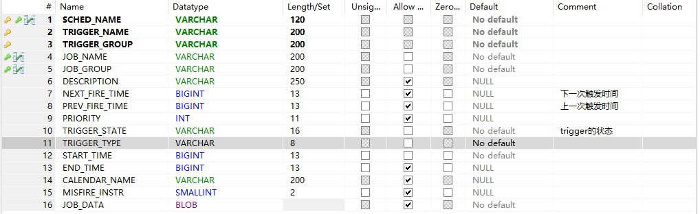
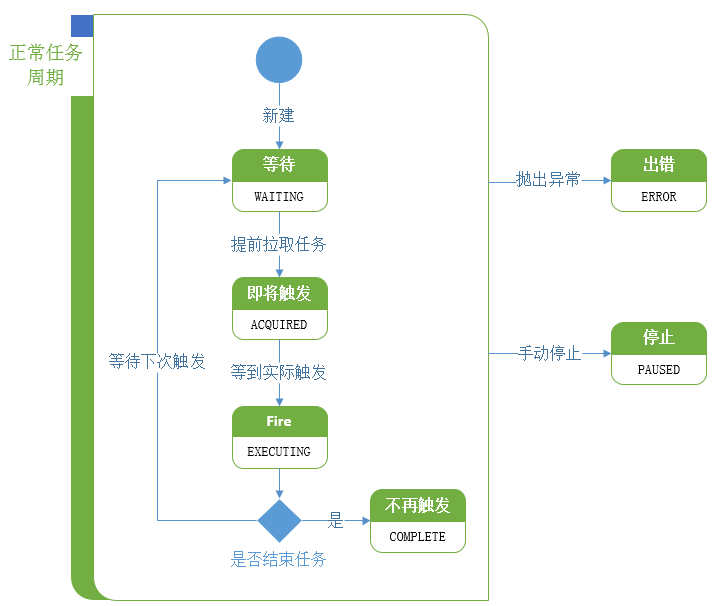

*  序列化问题
* 行锁保证线程安全
* 类加载
* 为什么事务就能保证安全了？


触发JOB fire

**TRIGGER_STATE** 是当前trigger 的状态 **PREV_FIRE_TIME** 是上次触发的时间



locks表 Quart 支持分布式，也就是会存在多个线程同时抢占资源的情况处理这种状况。



```java
protected <T> T executeInNonManagedTXLock(
            String lockName, 
            TransactionCallback<T> txCallback, final TransactionValidator<T> txValidator) throws JobPersistenceException {
        boolean transOwner = false;
        Connection conn = null;
        try {
            if (lockName != null) {
                // If we aren't using db locks, then delay getting DB connection 
                // until after acquiring the lock since it isn't needed.
                if (getLockHandler().requiresConnection()) {
                    conn = getNonManagedTXConnection();
                }
                
                transOwner = getLockHandler().obtainLock(conn, lockName);
            }
            
            if (conn == null) {
                conn = getNonManagedTXConnection();
            }
            
            final T result = txCallback.execute(conn);
            try {
                commitConnection(conn);
            } catch (JobPersistenceException e) {
                rollbackConnection(conn);
                if (txValidator == null || !retryExecuteInNonManagedTXLock(lockName, new TransactionCallback<Boolean>() {
                    @Override
                    public Boolean execute(Connection conn) throws JobPersistenceException {
                        return txValidator.validate(conn, result);
                    }
                })) {
                    throw e;
                }
            }

            Long sigTime = clearAndGetSignalSchedulingChangeOnTxCompletion();
            if(sigTime != null && sigTime >= 0) {
                signalSchedulingChangeImmediately(sigTime);
            }
            
            return result;
        } catch (JobPersistenceException e) {
            rollbackConnection(conn);
            throw e;
        } catch (RuntimeException e) {
            rollbackConnection(conn);
            throw new JobPersistenceException("Unexpected runtime exception: "
                    + e.getMessage(), e);
        } finally {
            try {
                releaseLock(lockName, transOwner);
            } finally {
                cleanupConnection(conn);
            }
        }
    }
```

