* ~~负载均衡算法维持会话使用的算法 7层~~
* ~~nio 中 在 unix 函数用了什么？ epoll ？~~
* ~~cas 自旋的好处？~~
* ~~线程池如何运作？他的参数是什么？阻塞队列的作用是什么？为什么要有阻塞队列~~
* ~~nio 多路复用是同步还是异步的?~~
* ~~mysql 悲观锁乐观锁 用sql 怎么写~~
* ~~线程池在请求来了的时候是怎么创建线程和利用请求队列的？~~
* ~~mysql 事务是怎么实现的?~~
* ~~HashMap 线程不安全的情况? 1.8 1.7 分析~~
* ~~聚集索引与非聚集索引的区别~~
* ~~mysql 默认的隔离级别~~
* ~~volatile 的实现 内存屏障的实现 指令重排序的应用场景~~
* ~~mysql 的两个引擎的区别  性能 差多少  为什么？~~
* chm 怎么计算分段的数量 构造函数里面有 忘了
* 项目中有没有用到过行锁，怎么实现的（四种锁）？
* ~~死锁发生的条件，对锁超时，如果遇到抢占锁怎么办？~~


## LVS 持久性连接

从用户端来解释，就是当一个用户第一次访问被负载均衡代理到后端服务器A并登录后，服务器A上保留了用户的登录信息；当用户再次发送请求时，根据负载均衡策略可能被代理到后端不同的服务器，例如服务器B，由于这台服务器B没有用户的登录信息，所以导致用户需要重新登录。这对用户来说是不可忍受的。所以，在实施负载均衡的时候，我们必须考虑Session的问题。

### 问题出在哪里？ 如何处理？

* 会话保持（案例：Nginx、Haproxy）
* 会话复制（案例：Tomcat）
* 会话共享（案例：Memcached、Redis）

我们这里主要讲的是 会话保持的方式，这个方式也主要是从负载均衡这一层进行解决。

首先讲两个十分通用的方式吧！

### 会话保持


#### IP_HASH

每个请求按照访问的ip的Hash结果进行分配，这样每个访客可以访问同一个后端服务器，达到保持Session的方法。

```
upstream bakend {
   ip_hash;
   server192.168.0.11:80;
   server192.168.0.12:80;
 }
```

#### Cookie 识别

也就是Haproxy在用户第一次访问的后在用户浏览器插入了一个Cookie，用户下一次访问的时候浏览器就会带上这个Cookie给Haproxy，Haproxy进行识别

`配置指令:cookie  SESSION_COOKIE  insert indirect nocache`

配置例子如下：

```
cookie SERVERID insert indirect nocache
server web01 192.168.56.11:8080 check cookie web01
server web02 192.168.56.12:8080 check cookie web02
```

其次就是一个三方模块 nginx-sticky-module

注意：cookie需要浏览器支持，且有时候会泄露数据

#### nginx-sticky-module

工作原理:

* Sticky是nginx的一个模块，它是基于cookie的一种nginx的负载均衡解决方案，通过分发和识别cookie，来使同一个客户端的请求落在同一台服务器上，默认标识名为route

1. 客户端首次发起访问请求，nginx接收后，发现请求头没有cookie，则以轮询方式将请求分发给后端服务器。
2. 后端服务器处理完请求，将响应数据返回给nginx。
3. 此时nginx生成带route的cookie，返回给客户端。route的值与后端服务器对应，可能是明文，也可能是md5、sha1等Hash值
4. 客户端接收请求，并保存带route的cookie。
5. 当客户端下一次发送请求时，会带上route，nginx根据接收到的cookie中的route值，转发给对应的后端服务器。


无论如何刷新你都会发现这个 route 不会改变。

### 会话共享

既然会话保持和会话复制都不完美，那么我们为什么不把Session放在一个统一的地方呢，这样集群中的所有节点都在一个地方进行Session的存取就可以解决问题。

​    **Session存放到哪里？**

对于Session来说，肯定是频繁使用的，虽然你可以把它存放在数据库中，但是真正生产环境中我更推荐存放在性能更快的分布式KV数据中，例如：Memcached和Redis。

## nio 中 在 unix 函数用了什么？ epoll ？

select，poll，epoll都是IO多路复用的机制。

I/O多路复用就是通过一种机制，一个进程可以监视多个描述符，一旦某个描述符就绪（一般是读就绪或者写就绪），能够通知程序进行相应的读写操作。

但select，poll，epoll本质上都是同步I/O，因为他们都需要在读写事件就绪后自己负责进行读写，也就是说这个读写过程是阻塞的，而异步I/O则无需自己负责进行读写，异步I/O的实现会负责把数据从内核拷贝到用户空间。

### select()

`int select (int n, fd_set *readfds, fd_set *writefds, fd_set *exceptfds, struct timeval *timeout);`

select 描述符分为3类 writefds、readfds、和exceptfds

函数返回。当select函数返回后，可以 通过遍历fdset，来找到就绪的描述符。

优点：select目前几乎在所有的平台上支持，其良好跨平台支持也是它的一个优点。

缺点 ： select的一 个缺点在于单个进程能够监视的文件描述符的数量存在最大限制，在Linux上一般为1024。


### 对于NIO 

执行selector.select()方法，poll0 函数把指向socket 句柄和事件的内存地址传给底层函数。

1. 如果之前没有发生事件，程序就阻塞在select处，当然不会一直阻塞，因为epoll在timeout时间内如果没有事件，也会返回。
2. 一旦有对应的事件发生，poll0方法就会返回。
3. 统计有事件发生的SelectionKey数量，并把符合条件发生事件的SelectionKey添加到selectedKeys哈希表中，提供给后续使用。

* 在早期的JDK1.4和1.5 update10版本之前，Selector基于select/poll模型实现
* 在JDK1.5 update10和linux core2.6以上版本，sun优化了Selctor的实现，底层使用epoll替换了select/poll。


### 线程如何运作呢？

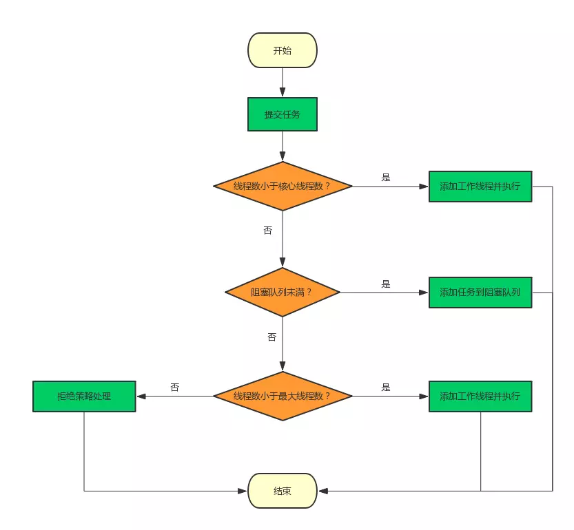

### 乐观锁 

https://juejin.im/post/5c9b1b7df265da60e21c0b57#heading-8

乐观锁 MVCC 多版本控制 

### 隔离级别

 `MySQL`是一个服务器／客户端架构的软件，对于同一个服务器来说，可以有若干个客户端与之连接，每个客户端与服务器连接上之后，就可以称之为一个会话（`Session`）。我们可以同时在不同的会话里输入各种语句，这些语句可以作为事务的一部分进行处理。不同的会话可以同时发送请求，也就是说服务器可能同时在处理多个事务，这样子就会导致不同的事务可能同时访问到相同的记录。我们前边说过事务有一个特性称之为`隔离性`，理论上在某个事务对某个数据进行访问时，其他事务应该进行排队，当该事务提交之后，其他事务才可以继续访问这个数据。但是这样子的话对性能影响太大，所以设计数据库的大叔提出了各种`隔离级别`，来最大限度的提升系统并发处理事务的能力，但是这也是以牺牲一定的`隔离性`来达到的。

### 未提交读:

一个事务读到了另一个未提交事务修改过的数据

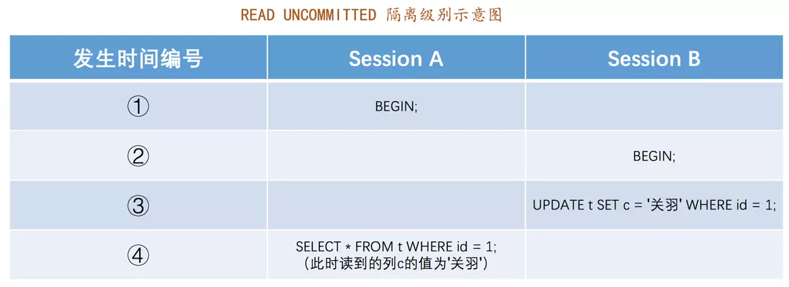

如果session B 进行回滚，那么session A 就会读到一个存在的数据。

就是`脏读`。

### 已提交读

一个事务只能读到另一个已经提交的事务修改过的数据，并且其他事务每对该数据进行一次修改并提交后，该事务都能查询得到最新值。

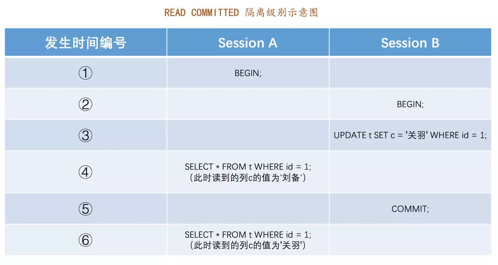

对于某个处在在`已提交读`隔离级别下的事务来说，只要其他事务修改了某个数据的值，并且之后提交了，那么该事务就会读到该数据的最新值，比方说：

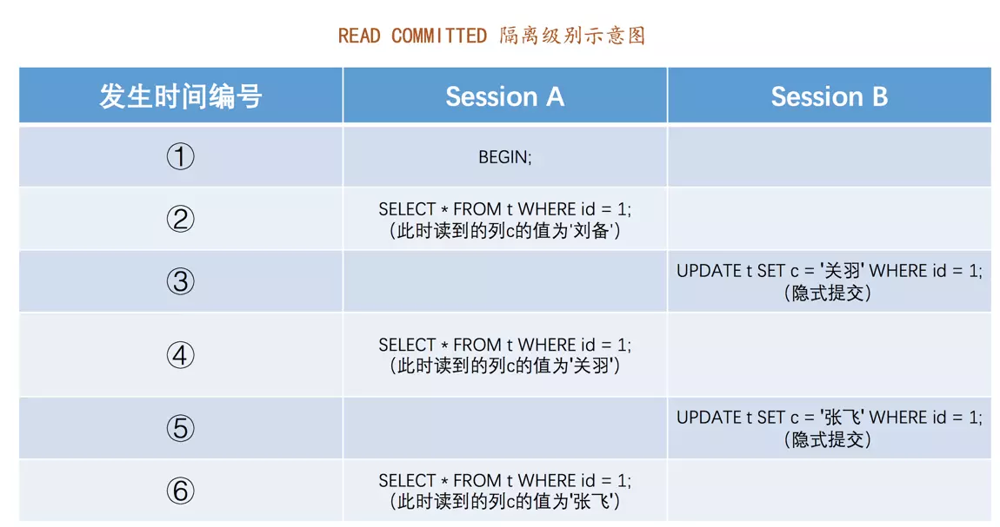

我们在`Session B`中提交了几个隐式事务，这些事务都修改了`id`为`1`的记录的列c的值，每次事务提交之后，`Session A`中的事务都可以查看到最新的值。这种现象也被称之为`不可重复读`。

### 可重复读

在一些业务场景中，一个事务只能读到另一个已经提交的事务修改过的数据，但是第一次读过某条记录后，即使其他事务修改了该记录的值并且提交，该事务之后再读该条记录时，读到的仍是第一次读到的值，而不是每次都读到不同的数据。那么这种`隔离级别`就称之为`可重复读`（英文名：`REPEATABLE READ`），如图所示：

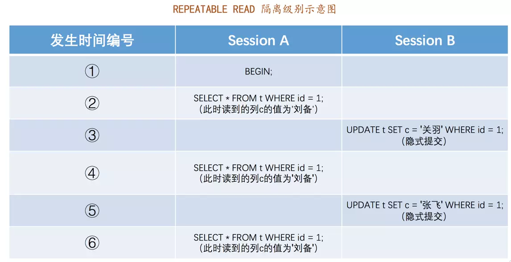
从图中可以看出来，`Session A`中的事务在第一次读取`id`为`1`的记录时，列`c`的值为`'刘备'`，之后虽然`Session B`中隐式提交了多个事务，每个事务都修改了这条记录，但是`Session A`中的事务读到的列`c`的值仍为`'刘备'`，与第一次读取的值是相同的。

### 串行化

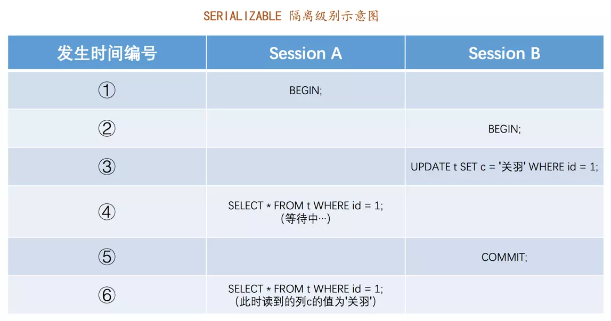

如图所示，当`Session B`中的事务更新了`id`为`1`的记录后，之后`Session A`中的事务再去访问这条记录时就被卡住了，直到`Session B`中的事务提交之后，`Session A`中的事务才可以获取到查询结果。

### 事务的实现

### 版本链

对于使用`InnoDB`存储引擎的表来说，它的聚簇索引记录中都包含两个必要的隐藏列（`row_id`并不是必要的，我们创建的表中有主键或者非NULL唯一键时都不会包含`row_id`列）：

* trx_id: 每次对某条聚簇索引记录改变时候，都会把对应事务赋值给trx_id隐藏列。
* roll_pointer:每次对某条聚簇索引记录进行改动时，都会把旧的版本写入到`undo日志`中。

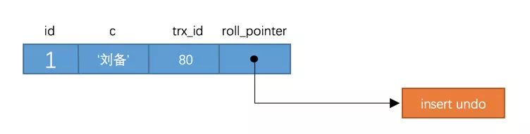

每次对记录进行改动，都会记录一条`undo日志`，每条`undo日志`也都有一个`roll_pointer`属性（`INSERT`操作对应的`undo日志`没有该属性，因为该记录并没有更早的版本），可以将这些`undo日志`都连起来，串成一个链表，所以现在的情况就像下图一样：

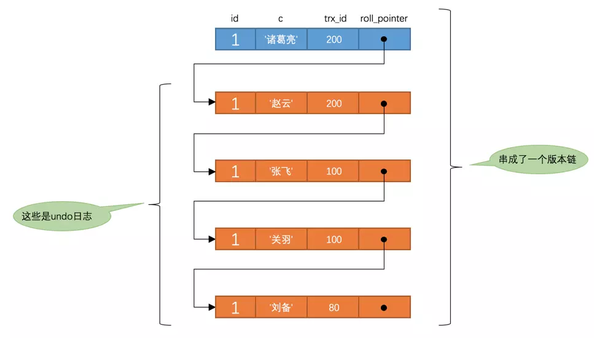

* 对于未提交读只要获取最新一条就行了

对于提交读和重复读采用ReadView:

把当前活跃的id放到一个列表中命名为 m_ids

* 如果被访问版本的`trx_id`属性值小于`m_ids`列表中最小的事务id，表明生成该版本的事务在生成`ReadView`前已经提交，所以该版本可以被当前事务访问。

* 如果被访问版本的`trx_id`属性值大于`m_ids`列表中最大的事务id，表明生成该版本的事务在生成`ReadView`后才生成，所以该版本不可以被当前事务访问。

* 如果被访问版本的`trx_id`属性值在`m_ids`列表中最大的事务id和最小事务id之间，那就需要判断一下`trx_id`属性值是不是在`m_ids`列表中，如果在，说明创建`ReadView`时生成该版本的事务还是活跃的，该版本不可以被访问；如果不在，说明创建`ReadView`时生成该版本的事务已经被提交，该版本可以被访问。

提交读是在每次selelct的时候生成一个ReadView

可重复读是在第一次select的时候生成一个ReadView，之后复用

## HashMap 线程不安全的情况? 1.8 1.7 分析

* 1.7 成环 数据丢失 数据覆盖
* 1.8 数据覆盖

#### 1.7 成环

假设现在有两个线程A、B同时对下面这个`HashMap`进行扩容操作：
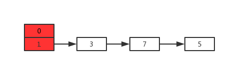
正常扩容后的结果是下面这样的：
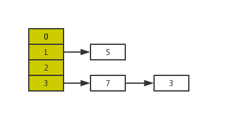
但是当线程A执行到上面`transfer`函数的第11行代码时，CPU时间片耗尽，线程A被挂起。即如下图中位置所示：

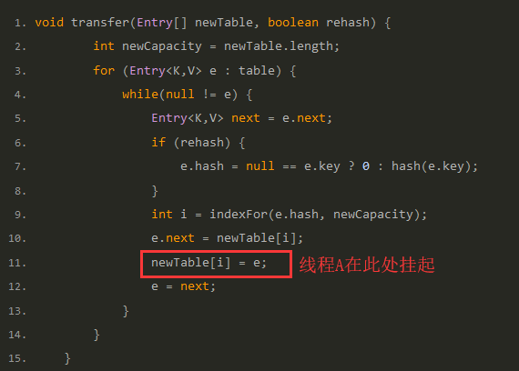

此时线程A中：e=3、next=7、e.next=null
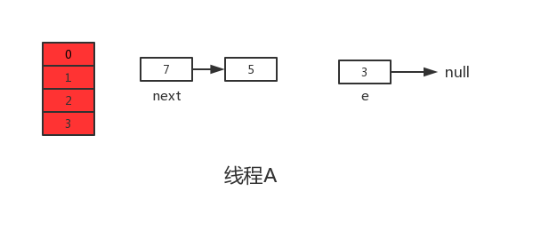
当线程A的时间片耗尽后，CPU开始执行线程B，并在线程B中成功的完成了数据迁移
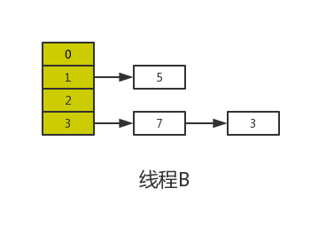
重点来了，根据Java内存模式可知，线程B执行完数据迁移后，此时主内存中`newTable`和`table`都是最新的，也就是说：7.next=3、3.next=null。

随后线程A获得CPU时间片继续执行`newTable[i] = e`，将3放入新数组对应的位置，执行完此轮循环后线程A的情况如下：
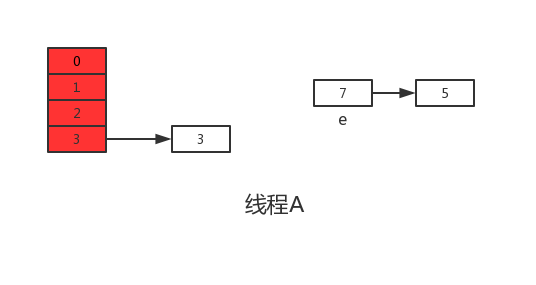
接着继续执行下一轮循环，此时e=7，从主内存中读取e.next时发现主内存中7.next=3，于是乎next=3，并将7采用头插法的方式放入新数组中，并继续执行完此轮循环，结果如下：
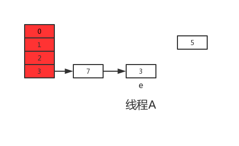
执行下一次循环可以发现，next=e.next=null，所以此轮循环将会是最后一轮循环。接下来当执行完e.next=newTable[i]即3.next=7后，3和7之间就相互连接了，当执行完newTable[i]=e后，3被头插法重新插入到链表中，执行结果如下图所示：
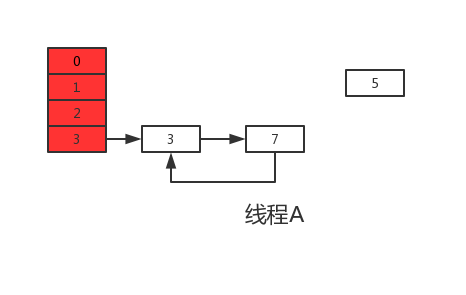
上面说了此时e.next=null即next=null，当执行完e=null后，将不会进行下一轮循环。到此线程A、B的扩容操作完成，很明显当线程A执行完后，`HashMap`中出现了环形结构，当在以后对该`HashMap`进行操作时会出现死循环。

并且从上图可以发现，元素5在扩容期间被莫名的丢失了，这就发生了数据丢失的问题。

#### 1.8 数据覆盖

根据上面JDK1.7出现的问题，在JDK1.8中已经得到了很好的解决，如果你去阅读1.8的源码会发现找不到`transfer`函数，因为JDK1.8直接在`resize`函数中完成了数据迁移。另外说一句，JDK1.8在进行元素插入时使用的是尾插法。

```java
final V putVal(int hash, K key, V value, boolean onlyIfAbsent,
                   boolean evict) {
        Node<K,V>[] tab; Node<K,V> p; int n, i;
        if ((tab = table) == null || (n = tab.length) == 0)
            n = (tab = resize()).length;
        if ((p = tab[i = (n - 1) & hash]) == null)
            tab[i] = newNode(hash, key, value, null);
        else {
            Node<K,V> e; K k;
            if (p.hash == hash &&
                ((k = p.key) == key || (key != null && key.equals(k))))
                e = p;
            else if (p instanceof TreeNode)
                e = ((TreeNode<K,V>)p).putTreeVal(this, tab, hash, key, value);
            else {
                for (int binCount = 0; ; ++binCount) {
                    if ((e = p.next) == null) {
                        p.next = newNode(hash, key, value, null);
                        if (binCount >= TREEIFY_THRESHOLD - 1) // -1 for 1st
                            treeifyBin(tab, hash);
                        break;
                    }
                    if (e.hash == hash &&
                        ((k = e.key) == key || (key != null && key.equals(k))))
                        break;
                    p = e;
                }
            }
            if (e != null) { // existing mapping for key
                V oldValue = e.value;
                if (!onlyIfAbsent || oldValue == null)
                    e.value = value;
                afterNodeAccess(e);
                return oldValue;
            }
        }
        ++modCount;
        if (++size > threshold)
            resize();
        afterNodeInsertion(evict);
        return null;
    }
```

线程A 执行完哈希碰撞检测后正好上下文切换，如果线程B 通过了哈希碰撞并且直接插入元素，那么线程A获得CPU的时候，继续执行插入会导致数据覆盖。

## 死锁发生的条件

* 互斥条件：一个资源每次只能被一个进程使用。
* 占有且等待：一个进程因请求资源而阻塞时，对已获得的资源保持不放。
* 不可强行占有:进程已获得的资源，在末使用完之前，不能强行剥夺。
* 循环等待条件:若干进程之间形成一种头尾相接的循环等待资源关系。

这个就需要一个id值了,保护加锁的顺序是从序号小的资源开始.

```java
class Account {
  private int id;
  private int balance;
  // 转账
  void transfer(Account target, int amt){
    Account left = this;       ①
    Account right = target;    ②
    // left是序号小的资源锁
    if (this.id > target.id) { ③
      left = target;           ④
      right = this;            ⑤
    }                          ⑥
    // 锁定序号小的账户
    synchronized(left){
      // 锁定序号大的账户
      synchronized(right){ 
        if (this.balance > amt){
          this.balance -= amt;
          target.balance += amt;
        }
      }
    }
  } 
}
```

填水坑 O(n^2)的做法

```java
class Solution {
    public int trap(int[] height) {
        int sum = 0;
        for(int i=0;i<height.length;i++){
            int max_left = 0;
            int max_right = 0;
            for(int j =0;j<i;j++){
                max_left = Math.max(max_left,height[j]);
            }
            for(int k =i+1;k<height.length;k++){
                max_right = Math.max(max_right,height[k]);
            }
            int res = Math.min(max_right,max_left);

            if(res>height[i]){
                sum += res - height[i];
            }
        }
        return sum;
    }
}
```


### volatile 

Java编程语言允许线程访问共享变量，为了确保共享变量能被准确和一致地更新，线程应该确保通过排他锁单独获得这个变量。Java语言提供了volatile，在某些情况下比锁要更加方便。如果一个字段被声明成volatile，Java线程内存模型确保所有线程看到这个变量的值是一致的.

内存屏障：memory barriers  是一组处理器指令，实现对内存操作的顺序限制。

* 将当前处理器缓存行的数据写回系统内存
* 这个写回内存的操作会使其他CPU里缓存了该内存的数据无效

就是一个cpu向内存写入数据的时候，会让其他处理器通过嗅探的方式检查自己的数据是否过期了，如果过期就使他无效，如果存在修改这条缓存行的数据的时候，就重新从系统内存中把数据读到处理器缓存中。

实现原则:

* Lock前缀指令会引起处理器缓存回写到内存.
* 一个处理器的缓存回写到内存会导致其他处理器的缓存无效.

happens-before 原则

在JMM中，如果一个操作执行的结果需要对另一个操作可见，那么这两个操作之间必须要存在happens-before关
系。这里提到的两个操作既可以是在一个线程之内，也可以是在不同线程之间。

如果A线程的写操作a与B线程的读操作b之间存在happens-before关系，尽管a操作和b操作在不同的线程中执行，但JMM向程序员保证a操作将对b操作可见

程序员对于这两个操作是否真的被重排序并不关心，程序员关心的是程序执行时的语义不能被改变

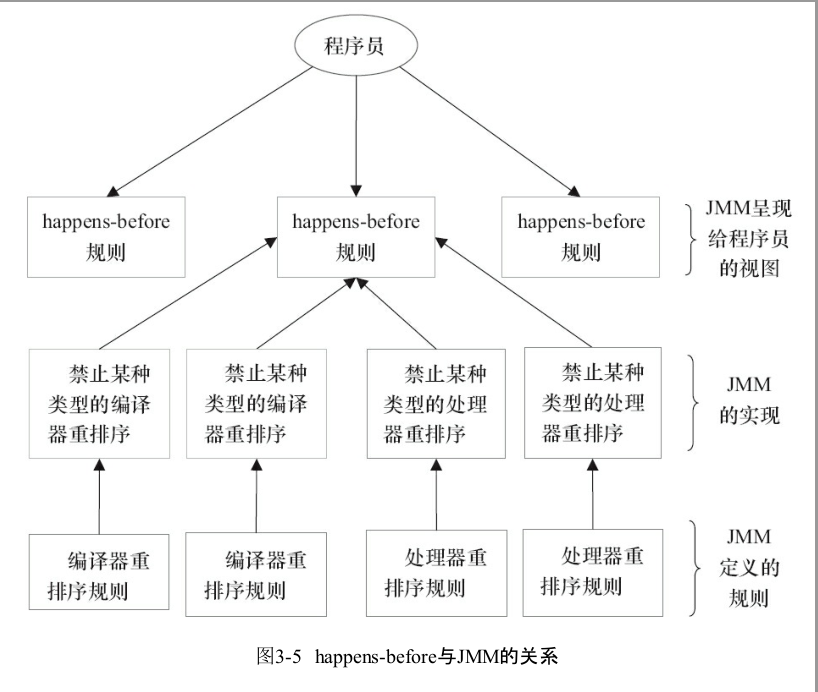

as-if-serial语义把单线程程序保护了起来，遵守as-if-serial语义的编译器、runtime和处理器
共同为编写单线程程序的程序员创建了一个幻觉：单线程程序是按程序的顺序来执行的。as-
if-serial语义使单线程程序员无需担心重排序会干扰他们，也无需担心内存可见性问题。


