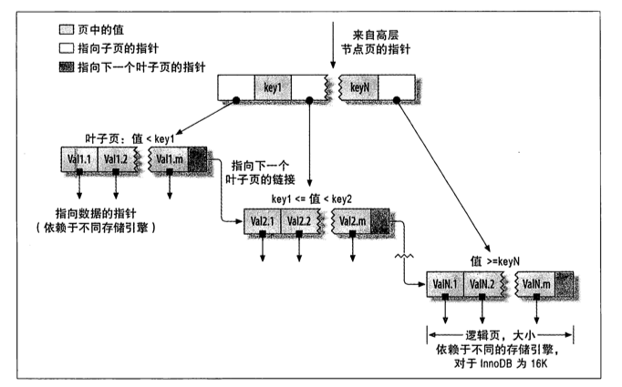

## 索引的类型:

### B-Tree 索引 
InnoDB 使用的是B+Tree   

 
根节点的槽中存放了指向子节点的指针，存储引擎根据这些指针向下查找。通过要查找的值来找到合适的指针进入下层节点。

假设有如下数据表

```sql
create table people(
    last_name varchar(50) not null,
    first_name varchar(50) not null,
    dob date not null,
    gender enum('m','f') not null,
    key(last_name,first_name,dob)
);
```

对于表中的每一行数据，索引中包含了last_name,first_name 和 dob 列的值。 显示了该索引是如何组织数据存储的。


有效使用索引：
* 全值匹配
* 匹配最左前缀
* 匹配列前缀 
* 匹配范围值 
* 精确匹配某一列并范围匹配另外一列 
* 值访问索引

B-Tree 索引的限制：

* 如果不是按照索引的最左侧开始查找，就无法使用索引。
* 不能跳过索引中的列，如果要查找姓名为 A 生日在 B 的人是只能使用索引的第一列。


### B-树   

* 内部节点:含有与页相关联的页的副本   
* 外部节点:含有指向实际数据的引用   
* 哨兵键:小于其他所有键，一开始B-树只含有   
一个根节点，节点初始化出的就是哨兵节点   

#### 查找和插入    

查找:在可能含有被查找键的唯一子树中进行一次递归的  
搜索   

插入:    
如果被插入的节点变成一个溢出的节点   
递归调用不断向上调用分裂溢出的节点   


## 为什么使用B-Tree / B+Tree 

主要和硬盘的存取原理有关。
硬盘不是按需读取的，每次读取都会预读一些。
```
当一个数据被用到的时候，其附近的数据也会通常马上使用程序运行期间所需要的数据通常比较集中
```

一般预读的长度为页的整数倍

为什么使用B-Tree/B+Tree 不用红黑树  
出度大，并且高度小（通常不会超过3）

为什么使用 B+树
* 适合外部存储，内部没有data域，一个索引节点可以存储多个节点，一个索引节点可以存储大量分支，每个节点能够索引的范围更大更精确，也意为着B+树单次IO信息量大于B- 树 I/O效率高
* B+树查询必须找到叶子节点，B树只要匹配到就可以不管元素位置，而且更加稳定（并不慢）
* B+树只要顺序遍历叶子节点，B树却需要重复的中序遍历。


## 数据库使用乐观锁
比较 交换


1.使用数据版本（Version）记录机制实现，这是乐观锁最常用的一种实现方式。何谓数据版本？即为数据增加一个版本标识，一般是通过为数据库表增加一个数字类型的 “version” 字段来实现。当读取数据时，将version字段的值一同读出，数据每更新一次，对此version值加一。当我们提交更新的时候，判断数据库表对应记录的当前版本信息与第一次取出来的version值进行比对，如果数据库表当前版本号与第一次取出来的version值相等，则予以更新，否则认为是过期数据。用下面的一张图来说明：


使用举例：以MySQL InnoDB为例

还是拿之前的实例来举：商品goods表中有一个字段status，status为1代表商品未被下单，status为2代表商品已经被下单，那么我们对某个商品下单时必须确保该商品status为1。假设商品的id为1。

 

下单操作包括3步骤：

1.查询出商品信息

select (status,status,version) from t_goods where id=#{id}

2.根据商品信息生成订单

3.修改商品status为2

update t_goods 

set status=2,version=version+1

where id=#{id} and version=#{version};

 

那么为了使用乐观锁，我们首先修改t_goods表，增加一个version字段，数据默认version值为1。

t_goods表初始数据如下：

```sql
select * from t_goods;  
+----+--------+------+---------+  
| id | status | name | version |  
+----+--------+------+---------+  
|  1 |      1 | 道具 |       1 |  
|  2 |      2 | 装备 |       2 |  
+----+--------+------+---------+  
2 rows in set  
```


Goods实体类:

```java
/** 
 * ClassName: Goods <br/> 
 * Function: 商品实体. <br/> 
 * date: 2013-5-8 上午09:16:19 <br/> 
 * @author chenzhou1025@126.com 
 */  
public class Goods implements Serializable {  
  
    /** 
     * serialVersionUID:序列化ID. 
     */  
    private static final long serialVersionUID = 6803791908148880587L;  
      
    /** 
     * id:主键id. 
     */  
    private int id;  
      
    /** 
     * status:商品状态：1未下单、2已下单. 
     */  
    private int status;  
      
    /** 
     * name:商品名称. 
     */  
    private String name;  
      
    /** 
     * version:商品数据版本号. 
     */  
    private int version;  
      
    @Override  
    public String toString(){  
        return "good id:"+id+",goods status:"+status+",goods name:"+name+",goods version:"+version;  
    }  
  
    //setter and getter  
  
}  
```

Dao

```java
@Mapper
public interface GoodsDao {
        @Select("select ID,status,name,version from t_goods where id=#{id}")
    Goods getGood(@Param("id")int id);

    @Update("  update t_goods \n" +
            "        set status=#{status},name=#{name},version=version+1 \n" +
            "        where id=#{id} and version=#{version}")
    int update(Goods goods);
}

```

java 代码

```java
@Test  
public void goodsDaoTest(){  
    int goodsId = 1;  
    //根据相同的id查询出商品信息，赋给2个对象  
    Goods goods1 = this.goodsDao.getGoodsById(goodsId);  
    Goods goods2 = this.goodsDao.getGoodsById(goodsId);  
      
    //打印当前商品信息  
    System.out.println(goods1);  
    System.out.println(goods2);  
      
    //更新商品信息1  
    goods1.setStatus(2);//修改status为2  
    int updateResult1 = this.goodsDao.updateGoodsUseCAS(goods1);  
    System.out.println("修改商品信息1"+(updateResult1==1?"成功":"失败"));  
      
    //更新商品信息2  
    goods1.setStatus(2);//修改status为2  
    int updateResult2 = this.goodsDao.updateGoodsUseCAS(goods1);  
    System.out.println("修改商品信息2"+(updateResult2==1?"成功":"失败"));  
}  
```
查出同一版本的数据，赋值给不同对象先对good1进行更新操作，执行成功，将version++。然后修改good2 这时候去比较version java对象的version 还是1 但是数据库的值已经是2了 所以就无法匹配了。