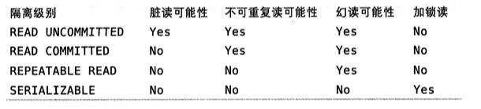
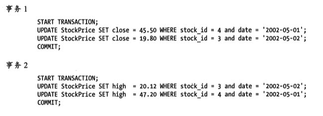

# 并发控制 
## 读写锁 
一个用户在阅读邮箱的时候，另一个用户试图删除这个邮件，就会产生不确定的后果。
并发控制:在处理并发读或者写的时候，通过实现一个由两种类型的锁组成的锁系统来解决问题  
通常被称为共享锁和排他锁也叫读锁和写锁。

概念如下：读锁是共享的，或者说是互相不阻塞的，多个客户在同一时刻可以读取同一个资源，互相不干扰
。写锁是排他的，就是一个写锁会阻塞其他写锁和读锁。只有这样才能确保在给定时间里，只有一个用户执行写入
并防止其他用户读取正在写入的同一资源。

## 锁粒度

### 表锁

最基本的锁策略，并且是开销最小的策略，会首先锁定整张表，一个用户在对表进行
写操作（插入，删除，更新）需要先获得写锁，这会阻塞其他用户的所有读写操作。
只有没有写锁的情况下，其他读取用户才能获得读锁，读锁之间是不相互阻塞的。

### 行级锁

行级锁只在存储引擎实现，服务层完全不了解存储引擎的锁实现。

# 事务

## ACID
事务就是一组原子性的sql查询，事务中的语句要么全部执行成功，要么全部执行失败。
系统必须通过严格的ACID测试，否则空谈事务的概念是不够的。
ACID表示原子性，一致性，隔离性，持久性。

* 原子性（atomicity）
    事物必须视为一个不可分割的最小工作单元，整个事务中所有操作要么全部提交成功要么全部失败回滚
* 一致性（consistency）
    数据库总是从一个一致性的状态转换到另一个一致性的状态。
* 隔离性（isolation）
    一个事务所做的修改在最终提交以前，对其他事务是不可见的。
* 持久性（duarbility）
    一旦事务提交，则其所做的修改都会永久保存到数据库中。

## 隔离级别 

SQL标准定义了四种隔离级别，每一种级别都规定了一个事务所做的修改

* READ UNCOMMITTED（未提交读）
    事务的修改即使没有提交对其他事务都是可见的，事务可以读取未提交的数据也就被称为脏读（Dirty Read）
    一般很少使用。
* READ COMMITED（提交读）
    一个事务开始的时候只能“看见”已经提交事务所做的修改，也就是说一个事务从开始到提交之前，所做的任何修改
    都是对其他事务不可见的。
    也叫不可重复读，因为一个事务中同样的两次操作会查出不同的结果。
* REPEATABLE READ（可重复读）
    MySQL 的默认事务隔离级别
    无法解决幻行（Phantom Row）
    虽说解决了不可重复读（修改和删除）但是对于别的提交的事务插入的数据进行二次查询会发生幻行。
* SERIALIZABLE（可串行化）

## 死锁

死锁指的是两个或者多个事务在同一资源上相互占用，并请求锁定对方占用资源，导致恶性循环的行为

InnoDB 目前处理死锁的方法是，将持有最少行的排他锁事务进行回滚。

## 事务冲突情况

* 脏读   
    当一个事务读取了另一个事务未提交的修改，产生脏读。
    
* 不可重复读    
    统一查询在同一事务多次进行，但是由于其他事务所做的**修改**或者**删除**，每次返回回不同的结果集，此时发生幻像读。

* 幻像读  
    同一查询在同一事务中多次进行，由于其他提交事务所做的**插入**操作，每次返回不同的结果集，此时发生幻像读。

* 更新丢失 
    1. 第一类更新丢失，回滚覆盖。撤消一个事务时，在该事务内的写操作要回滚，把其它已提交的事务写入的数据覆盖了。 
    2. 第二类更新丢失，提交覆盖：提交一个事务时，写操作依赖于事务内读到的数据，读发生在其他事务提交前，写发生在其他事务提交后，把其他已提交的事务写入的数据覆盖了。这是不可重复读的特例。就是一个事务先读，然后中间发生了提交了的修改事务，但是当前事务没有察觉，就拿之前的数据去修改了。就覆盖了中间的更新。