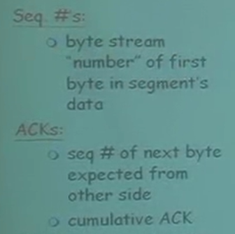
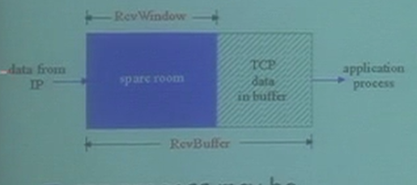
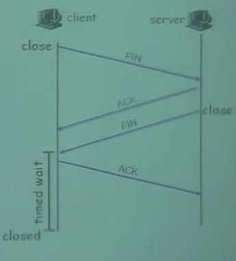
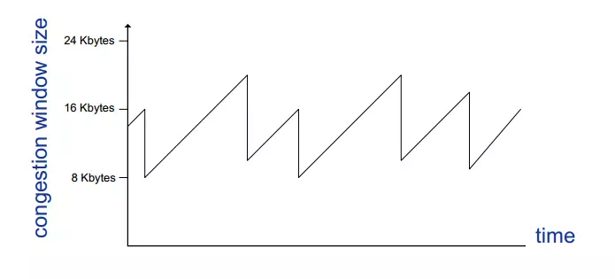

## 网络概论笔记

## TCP 协议

### 滑动窗口协议

#### go back N

如果是out-of-order:

* 丢弃封包
* 回复一个最大的有序的数组

就像上图如果中间一个2号封包丢失了，receiver收到3号封包的时候，是处于out-of-order的情况所以需要返回一个最大的in-order数字也就是回复1号。

#### selective repeat

 

* 发送方

如果最左边变成绿色，就可以移动窗口。

直到下一个没有收到ack的窗口

Sliding Sender Window

* 接受方

如果按照顺序接受到封包，就将in-order的所有封包滑动到下一个没有被收到的地方。

如果收到延迟/迟到的封包，就丢掉返回ACK(n)

**存在的问题**:

Windows size 最好是 seq size 的一半

#### segment

Receive window : 这个参数指的是滑动窗口的长度

S: SYN 建立连线

F: FIN 连线完成

R: RST 关闭连线

SEQ:你data中第一个byte的seq number

ACKs: 你希望下一次收到的seq number （隐含了之前都收到了）

对于没有按照顺序的封包：看开发者的实现方式。

#### TCP Round Trip Time and Timeout

timeout 应该大于RTT

使用 SampleRTT：采用取样的方式，测量时间直到收到ACK，忽略重送的封包时间。

#### 快速重传

resend segment before timer expires  

在定时器结束之前重传。

#### flow control 流量控制

流量控制指的是 sender 不要把 receiver 塞爆。

sender 能送多少的数据取决于RevWindow 的大小 

这个的大小会存储在segment的字段中。

receiver 来控制sender 送的频率，如果不想让sender 送数据那么就将传送过去的window的大小设置为0。

### 三次握手

1. 发送SYN为1的segment到服务器
   * 确定初始化的seq
   * 不需要data
2. 接受SYN
   * 申请buffers
   * 确定server的初始化seq
3. 客户端收到SYNACK。还要再回复一个ACK，但是这个封包可能含有数据。

#### TCP 连接管理

**客户端结束**：

 

一个connection 有两个buffer 分别是sender的和receiver的。

### 拥塞控制

* 定义：分组交换网络中传送分组的数目太多时，由于存储转发节点的资源有限而造成网络传输性能下降的情况。

* 现象：
  * 掉封包
  * 封包queue中，很长时间的延迟

* 解决方式：
  * 根据自己手上有的资讯进行判断
  * 根据路由器的埋点进行通知发送方

但是TCP 主要采用的是通过两端的发送方和接受方的进行判断的。

**AIMD**

首先探测网络的频宽有多大，所以他会越送越快，直到掉落分包为止。

* 每一个RTT时间就增加一个MSS(最大segment的大小) ，每个RTT 直到丢失封包
* 减少一半的**CongWin** 

$$
rate = \frac{CongWin}{RTT}    Bytes/sec
$$

#### 总结

* 双向的连接

* 每个seq的单位是1byte
* 根据流量控制和拥塞控制来决定窗口的大小

**slow start**

一开始比较慢，然后指数增长 CongWin 的大小，也就是MSS的数目。

当连接开始的时候，提升每个 RTT 发送的 CongWin 的大小。

* 收到ACK的时候提升两倍CongWin的大小，也是就是两倍的segment的数目。

