## 网络概论笔记

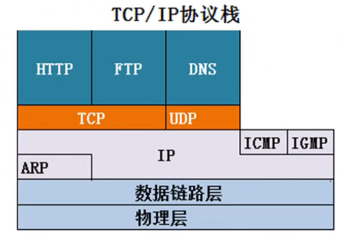

## 传输**层** 

TCP:客户端与服务器端需要维持会话，TCP需要传输的文件进行分段 传输进行可靠传输 

流量控制功能

UDP:  一个数据包就能够完成数据传输，不需要建立绘画，不需要流量控制 

etc：DNS

屏幕  广播 （多播）  

传输层协议和应用层协议的关系

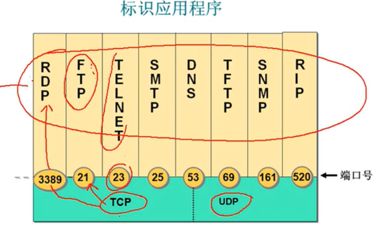

HTTP =TCP + 80

HTTPS = TCP+443

RDP = TCP+3389

FTP = TCP + 31

telnet = TCP + 23

SQL = TCP+1433

DNS = UDP + 53

POP3 = TCP +110

IP 层协议主要提供了主机之间的逻辑通讯

TCP/UDP 主要提供了应用程序之间的逻辑通讯

传输层的端口：TCP 6 UDP 17 ICMP 17

登记端口号：数值1024~49151

客户端端口号：数值49152~6553

### UDP

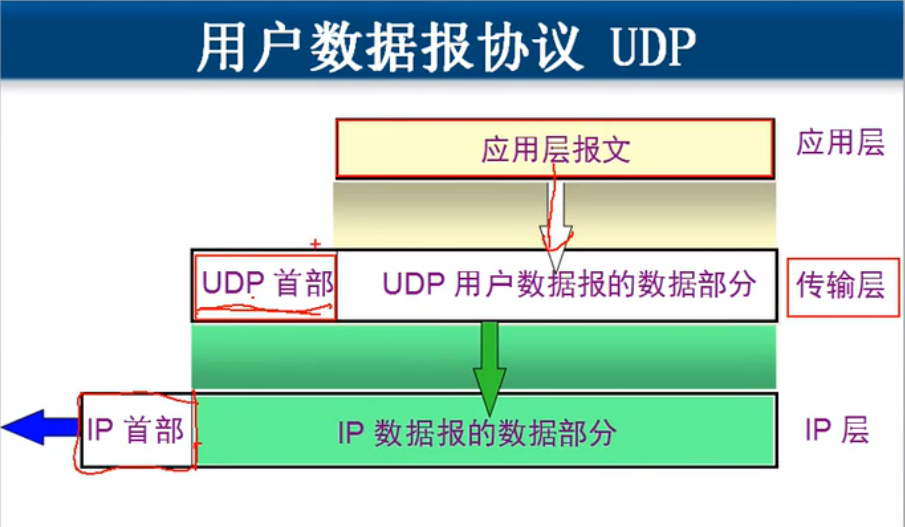

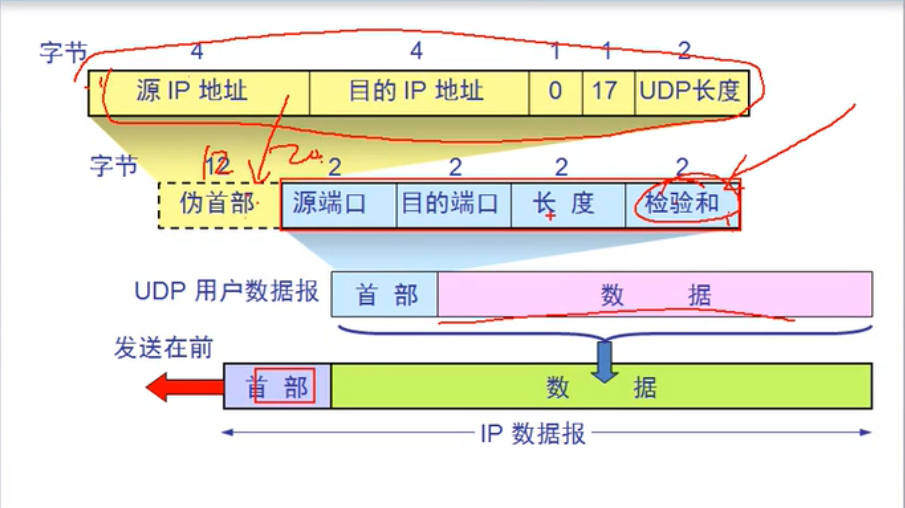

需要从 网络层提炼出20个字节 一起计算首部

#### 伪首部

源地址

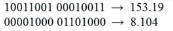

目标地址

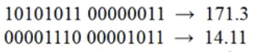

源地址+目标地址 总和为8个字节

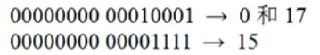

全 0 和 UDP 协议号以及 UDP 的长度

就组成了一个伪首部

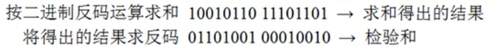

### TCP 

TCP 学什么？

* TCP 特点
* 如何实现可靠传输
* 如何实现流量控制
* 如何避免网络拥塞

面向连接的传输协议

每条 TCP 连接只能有两个端点 点对点

提供可靠传输的服务

TCP 提供全双工通讯： 因为需要反馈 才能确定自己发的消息是否是对方能听到的

面向字节流

socket = （IP地址：端口）

SEQ:你data中第一个byte的seq number

ACKs: 你希望下一次收到的seq number （隐含了之前都收到了）

对于没有按照顺序的封包：看开发者的实现方式。

#### TCP Round Trip Time and Timeout

timeout 应该大于RTT

使用 SampleRTT：采用取样的方式，测量时间直到收到ACK，忽略重送的封包时间。

#### 快速重传

resend segment before timer expires  

在定时器结束之前重传。

###  1. 如何实现可靠传输与三次握手

#### 停止等待协议 

##### 无差错

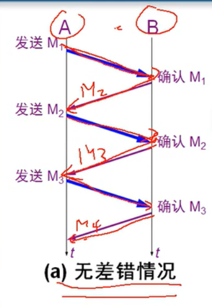

##### 有差错

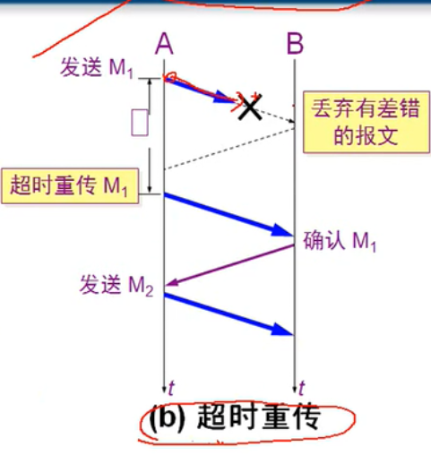

超时重传的等待时间为一个往返的时间稍微长一些

##### 确认丢失

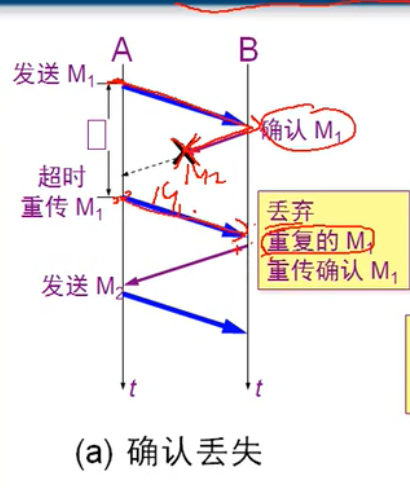

#####  确认迟到

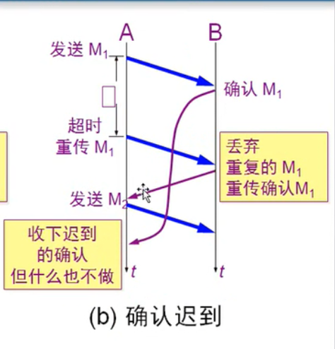

使用上述的确认和重传机制，就可以在不可靠的网络上实现可靠的通讯。 `自动重传请求 ARQ`

#### 信道利用率

RTT 数据包往返时间
$$
U = \frac{T_D}{T_D+RTT+T_A}
$$
发送一个数据包的时间占用总共是时间的比率

所以需要提高 Td 的占比就可以提高信道利用率

流水线传输：发送方连续的发送多个分组

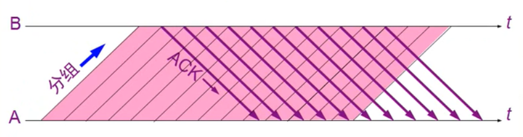

但是问题又来了 如何实现可靠的传输在流水线传输的基础上：

我们使用一个窗口将数据包放在里面

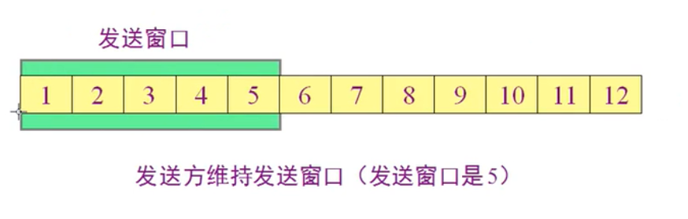

每当最左边的数据包收到就向左移动一格

#### 累计确认

对于发送方A 和 接受方B 

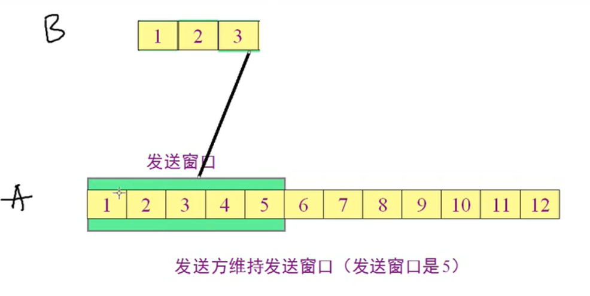

B 收到了 3个数据包分别是 1 2 3 这时 B 对应 3 的ACK 发送到了A 但是 1 2 的ACK 没有收到，这个时候 A 就会默认 1 和 2 是已经收到了，不需要确认了。

#### 返回最大有序的ACK

[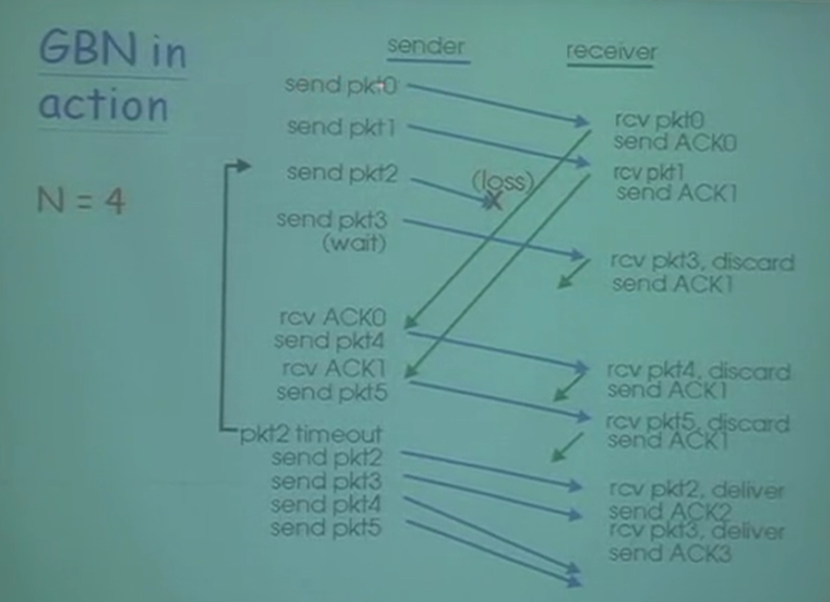](https://github.com/xiantang/Java-BackEnd-Notes/blob/master/doc/images/1559222070250.png)

如果是out-of-order:

- 丢弃封包
- 回复一个最大的有序的数组

就像上图如果中间一个2号封包丢失了，receiver收到3号封包的时候，是处于out-of-order的情况所以需要返回一个最大的in-order数字也就是回复1号。

TCP 每发送一个报文段，就要对报文段设置一次计时器。只要计时器设置的重传时间还没有收到确认，就要重传这一段报文段。

##### TCP 报文段 segment

TCP 首部

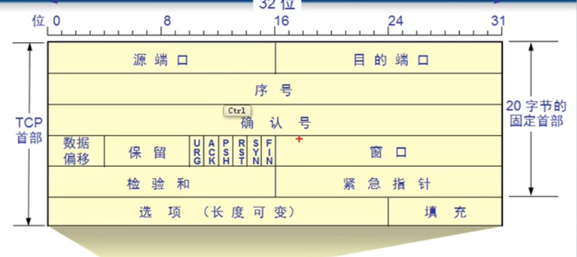

[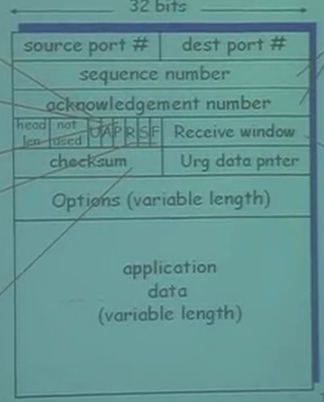](https://github.com/xiantang/Java-BackEnd-Notes/blob/master/doc/images/1559224720528.png)

Receive window : 这个参数指的是滑动窗口的长度

序号 sequence number：指的是这个段中的数据的第一个字节 占在第几个位置

确认号 acknowledgement number: 发送当前收到的有序的数据包在对面的位置+1

偏移量 head len: TCP 数据 是从多少个字节之后开始的  因为TCP 数据包是除了20字节的首部 还有一定的长度 所以头部是可变长的

S: SYN 建立连线

F: FIN 连线完成

R: RST 关闭连线 就像点击浏览器的×一样 一方关闭连接

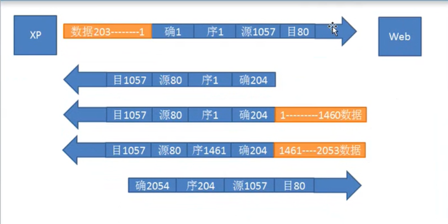

### 

SYN: 发起一个链接

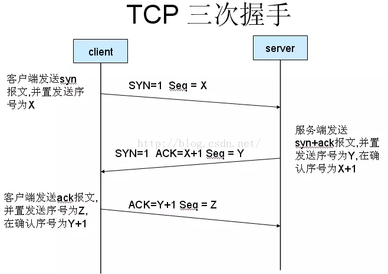

1. 发送SYN为1的segment到服务器
   * 确定初始化的seq
   * 不需要data
2. 接受SYN
   * 申请buffers
   * 确定server的初始化seq
3. 客户端收到SYNACK。还要再回复一个ACK，但是这个封包可能含有数据。

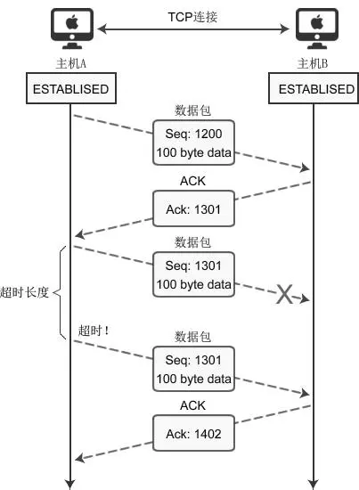

TCP 传输数据 客户端发送 SEQ 和 100 byte 的数据 服务端收到 并且将ACK number 设置成 SEQ + 100 byte +1 表示这个ack number 之前的数据都已经收到了。

#### TCP 连接管理

**客户端结束**：

 

一个connection 有两个buffer 分别是sender的和receiver的。

为什么TCP为什么是四次挥手？

因为是全双工通信的

1. 第一次挥手发送fin 表示主动方不会再继续发送报文了，但是可以发送报文
2. 第二次挥手被动方可能有相应的数据报文需要发送，需要发送ACK，告诉主动方我知道你要断开请求了
3. 第三次挥手被动方在处理完数据报文后，便发送给主动方FIN报文；这样可以保证数据通信正常可靠地完成。发送完FIN报文后，被动方进入LAST_ACK阶段（超时等待）。
4. 如果主动方及时发送ACK报文进行连接中断的确认，这时被动方就直接释放连接，进入可用状态。

为什么要等2MSL ?

* ack 是 主动端发送的是吧 然后 服务器不一定能收到这个ack 如果收不到服务器就会重发一个FIN-ACK回去 这就是两个RTT MSL 大于一个RTT
* 防止重发的数据骚扰服务端

### 2.flow control 流量控制

流量控制指的是 sender 不要把 receiver 塞爆。

sender 能送多少的数据取决于接受端RevWindow 的大小 

这个的大小会存储在segment的字段中。

receiver 来控制sender 送的频率，如果不想让sender 送数据那么就将传送过去的window的大小设置为0。

如果发送端收到一个 rwnd 的长度为0的ACK 并且一直在等待，但是接收方一直不发送长度不为0的ACK 过来索要数据，发送端需要发送一个心跳包确保连接是否还建立。

### 3.拥塞控制

* 定义：分组交换网络中传送分组的数目太多时，由于存储转发节点的资源有限而造成网络传输性能下降的情况。

* 现象：
  * 掉封包
  * 封包queue中，很长时间的延迟

* 解决方式：
  * 根据自己手上有的资讯进行判断
  * 根据路由器的埋点进行通知发送方

但是TCP 主要采用的是通过两端的发送方和接受方的进行判断的。

**AIMD**

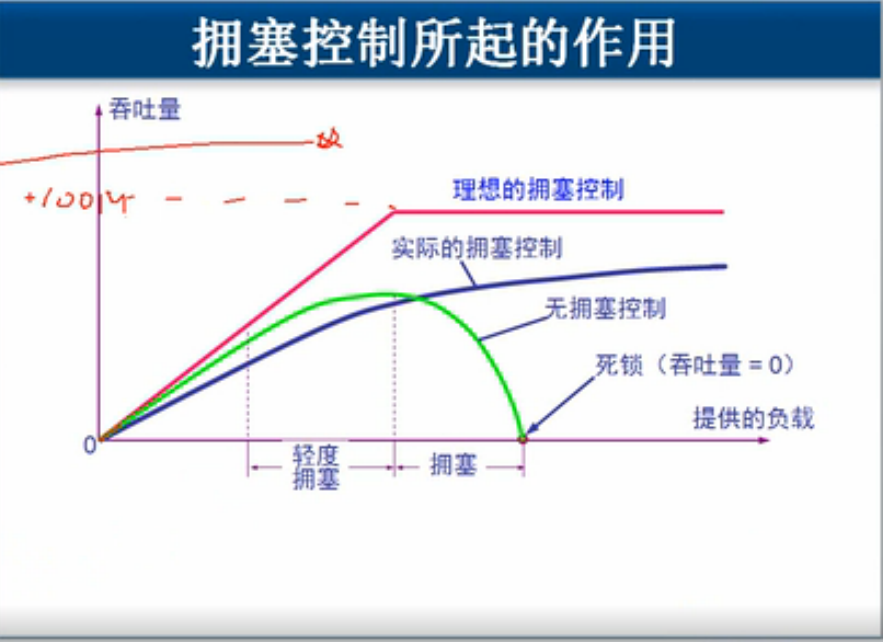

首先探测网络的频宽有多大，所以他会越送越快，直到掉落分包为止。

* 每一个RTT时间就增加一个MSS(最大segment的大小) ，每个RTT 直到丢失封包
* 减少一半的**CongWin** 

$$
rate = \frac{CongWin}{RTT}    Bytes/sec
$$
##### 慢开始

一开始比较慢，然后指数增长 CongWin 的大小，也就是MSS的数目。

当连接开始的时候，提升每个 RTT 发送的 CongWin 的大小。

- 收到ACK的时候提升两倍CongWin的大小，也是就是两倍的segment的数目。

##### 快重传

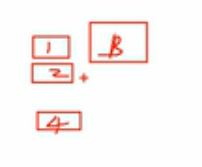

B 收到1 2 4 个包 这时 3 就被确认为挂了 

我们就将直接发送3 个 3 的ACK  发现丢包立刻让A重发

推断丢包

- 收到3个重复的ACK
  - CongWin cut 一半
  - 线性增加CongWin的大小
  - 直接进入 加法增加
- 发生timeout
  - CongWin 替换为 1MSS
  - window 先指数增长
  - 到达临界值的时候线性增长

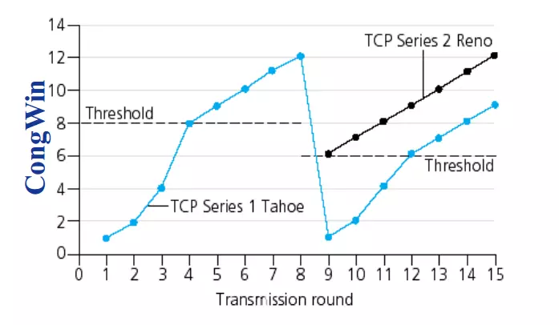

#### 总结

* 双向的连接
* 每个seq的单位是1byte
* 根据流量控制和拥塞控制来决定窗口的大小

##  网络层

### 网络层最重要的两个服务

负责在网络之间尽力转发数据包，基于数据包的ip地址转发

不负责丢失重传 不负责顺序

* 转发:将一个封包从一个路由器转发到最合适的出口路由器
* 路由:决定你的封包的起点到终点的路径  

### ARP 协议：

对于一个ip 我们先判断是否是当前网段，根据子网掩码

在根据子网掩码判断目标地址在哪个网段

如果是同一个网段 就使用arp解析目标地址ip地址的MAC

如果是当前网段就向前面发送一个广播包，交换机遇到这个广播包就会发送这个全为1的包，被动方回应主机的MAC地址

计算机要想跨网段通讯必须得配网关

### 无连接的服务

#### Datagram networks

* 不需要建立连接
* 不需要记录之前的路径
* 根据查表走路径

**转发表**：

前缀匹配: 只要知道前面的bit数目，就可以知道对应的Link interface

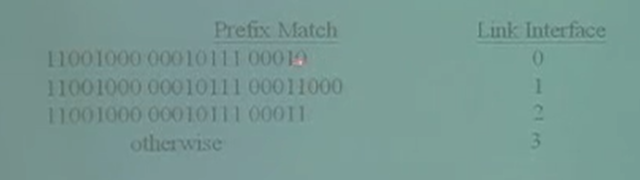

当好几个项都匹配的时候，去到那个最长的匹配的接口。

#### IP datagram format

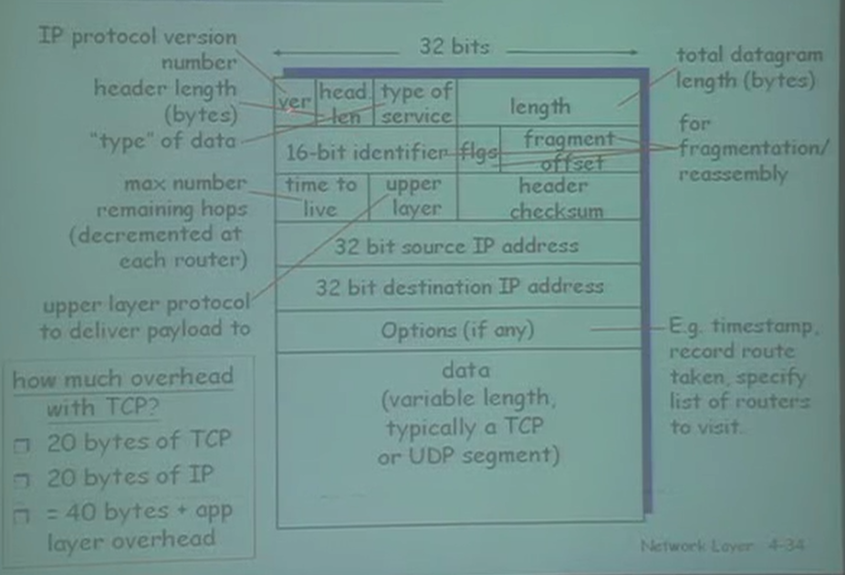

* offset:封包对于原来封包所在的位置
* 16-bit identifien:确定是哪个segment

#### Subnets

可以直接沟通不通过其他路由器

* subnet part(高位bit)
* host part(低位bit)

### IPv6

#### Header(Cont)

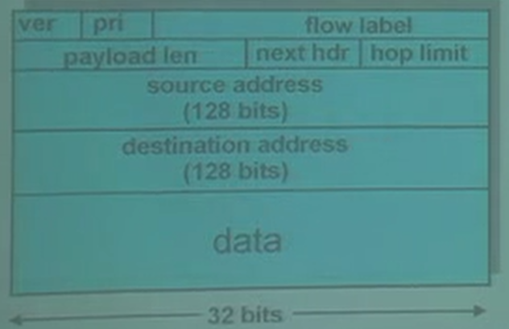

* Checksum: 从IPV4 中去掉了
* ICMPv6: 封包太大的异常 群播

#### 转移 IPv4->IPv6

隧道:IPv6的封包放到IPv4里面

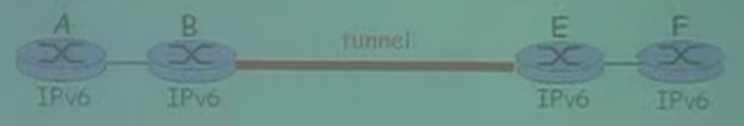

其实就是将V6的封包包在V4中而已

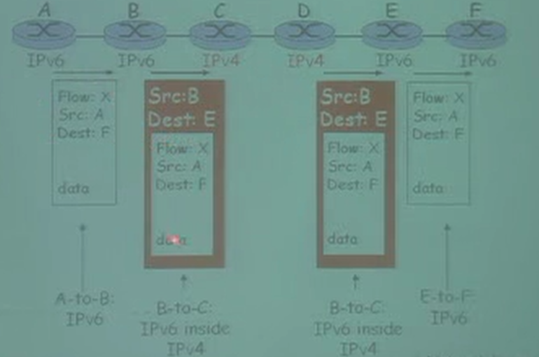

