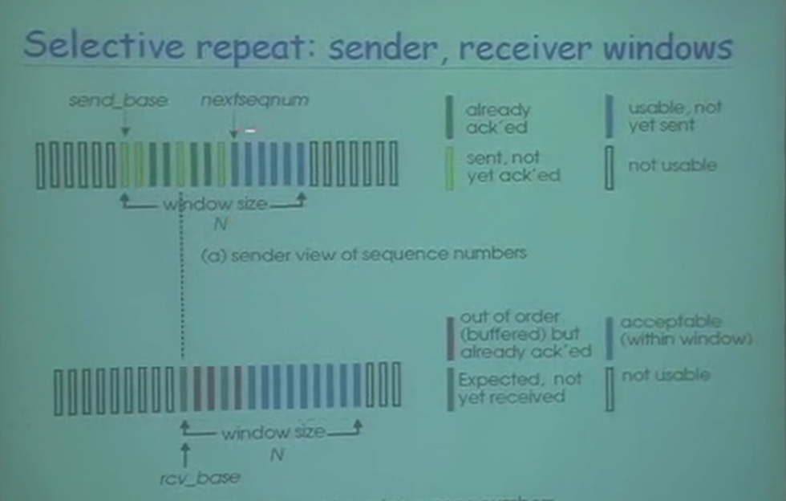
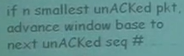
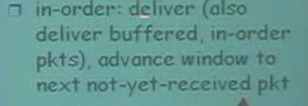
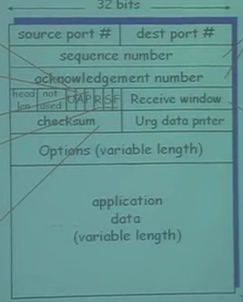
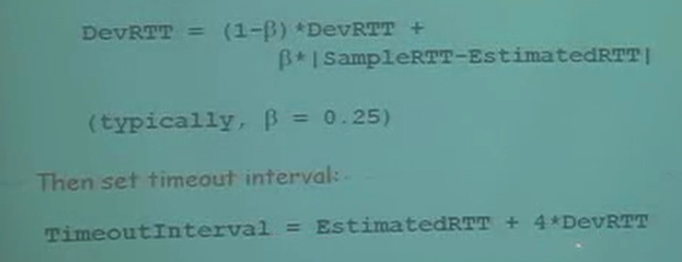

## 网络概论笔记

## TCP 协议

### 滑动窗口协议

#### go back N

如果是out-of-order:

* 丢弃封包
* 回复一个最大的有序的数组

就像上图如果中间一个2号封包丢失了，receiver收到3号封包的时候，是处于out-of-order的情况所以需要返回一个最大的in-order数字也就是回复1号。

#### selective repeat

 

* 发送方

如果最左边变成绿色，就可以移动窗口。

直到下一个没有收到ack的窗口

Sliding Sender Window

* 接受方

如果按照顺序接受到封包，就将in-order的所有封包滑动到下一个没有被收到的地方。

如果收到延迟/迟到的封包，就丢掉返回ACK(n)

**存在的问题**:

Windows size 最好是 seq size 的一半

#### segment

Receive window : 这个参数指的是滑动窗口的长度

S: SYN 建立连线

F: FIN 连线完成

R: RST 关闭连线

ACKs: 你希望n之前（不包括n）的都收到了

对于没有按照顺序的封包：看开发者的实现方式。

#### TCP Round Trip Time and Timeout

timeout 应该大于RTT

使用 SampleRTT：采用取样的方式，测量时间直到收到ACK，忽略重送的封包时间。

#### 总结

* 每个seq的单位是1byte

* 根据流量控制和拥塞控制来决定窗口的大小

  

