# Concept

## OS Elements

* Abstractions 
  * process
  *  thread
  * file
  * socket
  * memory
  * page
* Mechanisms
  * create	
  * schedule
  * open
  * write
  * allocate(分配)
* Policies(策略)
  * least-recently used(LRU)
  * earliest deadline first (EDF)

关于Mechanisms 和 Polices的区别我其实迷惑了很久。

其实总结出来很简单Mechanisms 机制 指的是 what to do

Polices 指的是 how to do

也可以这样理解机制是策略的更高一层抽象，策略是指具体如何实现的方式，机制则是我需要这个功能，但是不关注实现。

举个例子就是Linux内核的调度器（scheduler），提供了任务调度需要的原语操作和结构，并且实现了多种调度算法。

## Process

what is a **Process** : state of a program when executing loaded in memory. (active entity)

* instance of an executing program
* Synonymous with "task" or "job"

A process is like an order of toys

* State of execution

  * program counter
  * stack

* parts & temporary holding area

  * data. register state, occupies state in memory

* may require special hardware

  * I/O devices

  

what does process look like ？

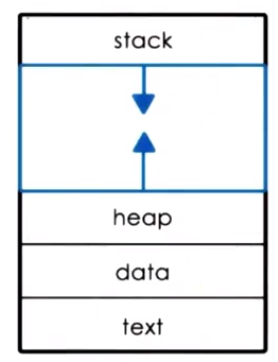

### Process Control Block

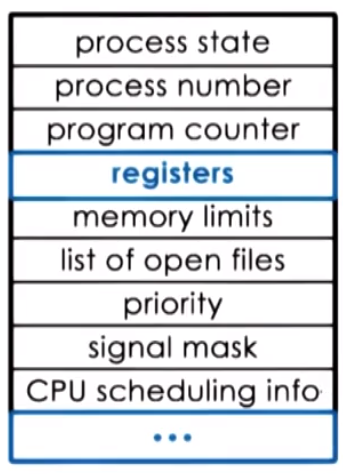

* PCB created when process is created.
* certain fields are update when process state changes
* other fields changed too frequently

### Context Switch(上下文切换)

switching the CPU from the context of one process to the context of another 

* and they are too expensive!
  * direct cost : number of cycles for load 2 store instruction 需要重新载入指令 和存储之前的进程控制表 
  * COLD cache ! cache misses! 在这里我的理解是当一个进程占用CPU的时间过长，会使 cache 中大多数数据都属于他，但是如果这个时候中断当前进程，去切换到其他较少执行的进程，会导致缓存无法击中，需要去下一级缓存中查找。

### Process Lifecycle

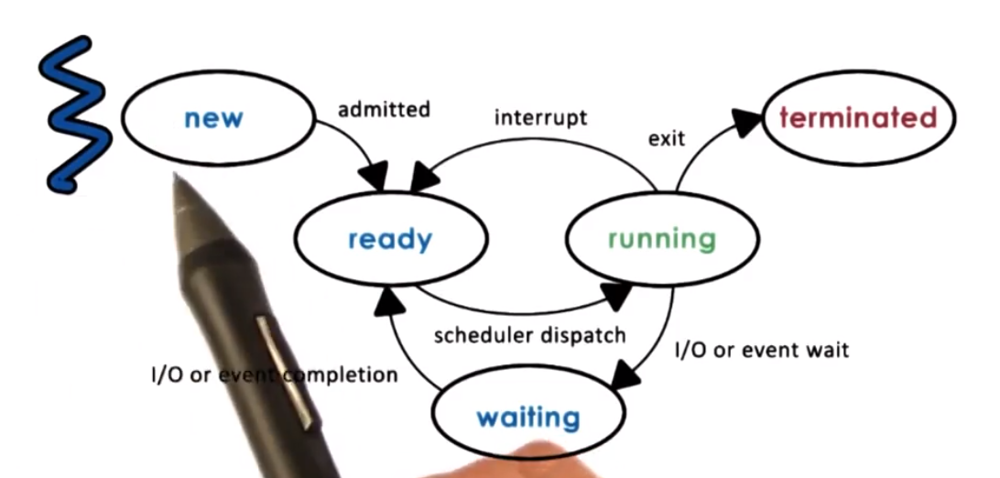

mechanisms for process creation(创建的机制)

* fork 
  * copies the parent PCB into new child PCB
  * child continues execution at instruction after fork(继续执行下面的指令)
* EXEC
  * replace child image 
  * load new program  and start from first instruction(从头开始执行)

### CPU Schedule

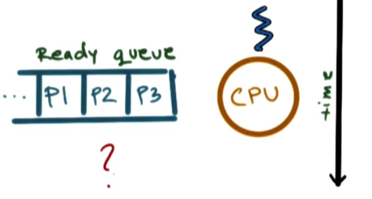

CPU scheduler :  A CPU scheduler determines which one of the currently ready processes will be dispatched to the CPU to start running,and how long it should run for.

* preempt: interrupt and save current context
* schedule: run scheduler to choose next process
* dispatch: dispatch process switch into its context

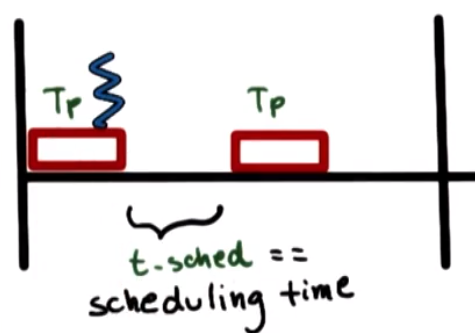

Useful CPU work = Total processing time/Total time = 

(Tp)/(t_sched+Tp)

**timeslice(时间片)** :time `Tp` allocated to a process on the CPU(一个进程在Tp 中所分配的时间)

### Interact(交互)

Inter-Process Communication:IPC **mechanisms**:

* transfer data/info between address spaces
* maintain protection and isolation
* provider flexibility  and performance (提供性能和灵活性)

#### Message passing IPC:

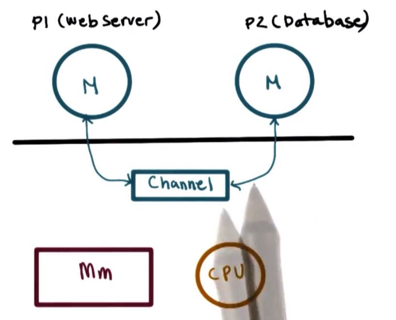

* OS provides communication channel,like shared buffer

* Process:

  * write(send)
  * read(recv)

  messages to/from channel

#### Shared Memory IPC

* OS establishes a shared channel and map it in to each process address spaces
* Processes directly read/write from this memory
* OS is out of the way!

## Thread

Thread Vs. Process

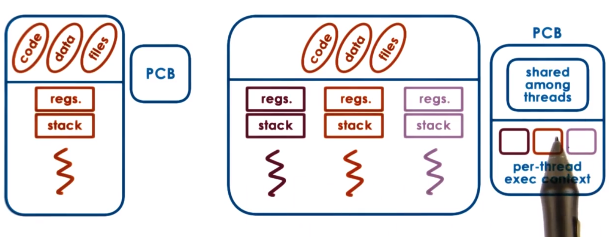

* 每个Thread 拥有自己的 program counter 指令和程序栈，但是共享代码资源和文件

有了进程为什么要有线程？

* speed up 对于单进程来说，会有更快的速度
* hot cache  可以重复利用cache 但是既然如此为什么不使用多进程呢？ 因为多进程并发去做的话每个进程都会有自己的地址空间消耗资源。
* 更加少的资源和线程间通话的代价

### Benefits of Multithreading: Single CPU or when (# of Threads)>(# of CPUs)

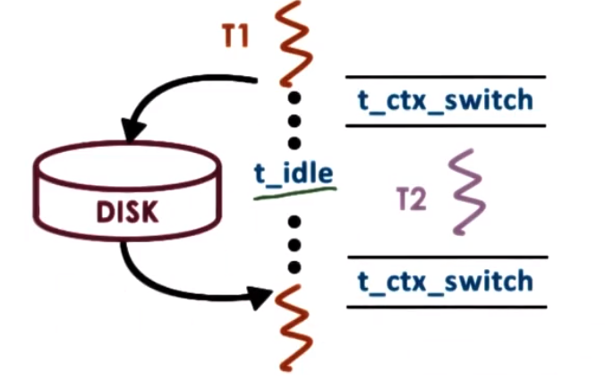

* if (t_idle)>2*(t_ctx_switch) 
  * then context switch to hide idling time 当IO的时候 线程会出现 idle 的情况 但是这个 idle 的情况还是占用 CPU 时间片的，然后 unix 会有一个机制如果这个idle的时间过长 就直接去做上下文切换了 所以也就不存在 idle 的情况
* t_ctx.switch threads < t_ctx_switch processes 每次切换都有虚拟资源申请 进程间的上下问切换回很慢

### Condition Variable

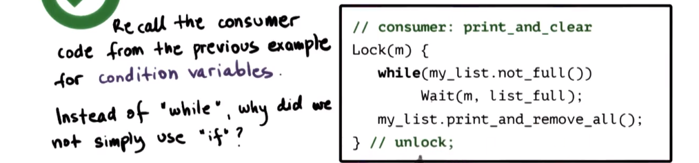

这个问题很有意思，也在面试中困扰了我很久

在这里找到了回答

* while 可以保证多线程的情况下 如果是if 当所有消费者都收到信号后，会全部执行到下面的代码 
* 如果两个线程同时收到唤醒的信号，但是另一个已经获取了锁并改变了list的状态，另外一个线程就会向下执行
* 无法再次获取锁一旦被唤醒

### Deadlocks

A cycle in the wait graph is necessary and sufficient for a deadlock to occur.

what can we do about it?

* deadlock prevention (expensive)
* deadlock detection & recovery (rollback)
* do nothing 

## Thread Design Consideration

### Kernel Level Structures

* Process

  * list of kernel-level threads
  * virtual address space
  * signal handlers

* Light-Weight Process(LWP)

  * user level registers
  * system call args
  * resource usage info 
  * signal mask

  similar to  ULT,but visible to kernal not needed when process not running 

* Kernel-level Threads

  * kernel-level registers
  * stack pointer
  * scheduling info 
  * pointers to associated LWP,Process,CPU structures

* CPU

  * current thread
  * list of kernel-level thread
  * dispatching & interrupt handling information

### Synchronization-Related Issues

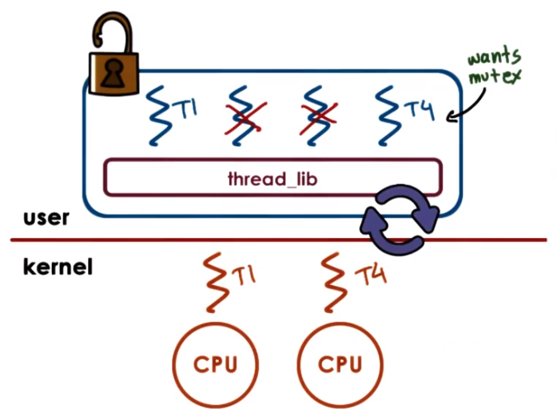

* if critical section is too short -> don't  block  just spin.
* if long critical section use default blocking behavior.

but it in a special case is we should in the multiple CPUs.

### Interrupts vs. signals

* Interrupts
  * evens generated externally(外部的) Components other than the current CPU (I/O devices,timers, other CPUs)
  * determined based on the physical platform
  * appear asynchronously
* Signals
  * events triggered by the CPU & software running on it.
  * determined based on the operating system.
  * in a asynchronously or synchronously.

## Schedule

* Scheduling is simple(FCFS)
* maximize throughput(SJF)
* maximize utilization of CPU devices memory

CPU scheduler

* chooses one of ready tasks to run on CPU

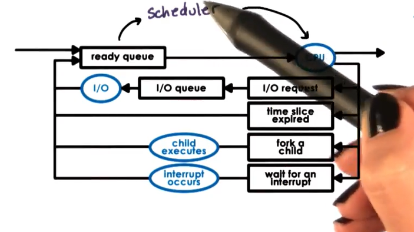

runs when 

* CPU becomes idle
* new task becomes ready
* timeslice expired timeout

### run to completion 

initial assumptions

* group of tasks/job
* known execution time
* no preemption
* single CPU

#### First-Come First-Serve (FCFS)

* schedules tasks in order of arrival

if we have three Thread, thread1,thread2, and thread3, we use FCFS Scheduling

T1 = 1s, T2 = 1s,T3 =10s

Throughput:

3/12 = 0.25 tasks/s

Avg. Completion time:

(1+11+12)/3 = 8 sec

Avg. Wait Time:

(0+1+11)/3 = 4 sec

#### Shortest Job First(SJF)

* schedules tasks in order of their execution time

T1 = 1s, T2 = 2s,T3 =10s

run queue == ordered queue

or

run queue == tree

Throughput:

3/12 = 0.25 tasks/s

Avg. Completion time:

(1+2+12)/3 = 5 sec

Avg. Wait Time:

(0+1+2)/3 = 1 sec

####  SFJ + Preemption

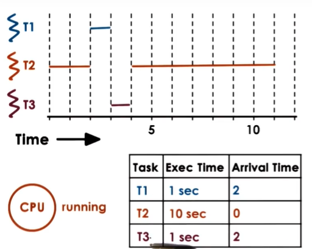

heuristics based on history ?

-> job running time

how long did a task run last n times?

-> windowed 

#### Preemptive Scheduling

Priority Scheduling

* tasks have different **priority level**

* run highest priority task next(preemption)

#### Priority Inversion

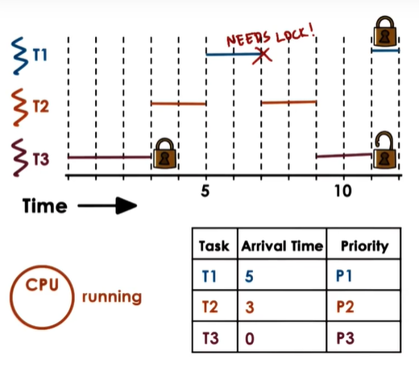

Priority:

T1,T2,T3 (Wrong)

order of execution:

T2,T3,T1

=> priorties "inverted"

Solution:

* temp boost priority of mutex owner

* lower again on release

