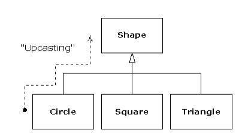
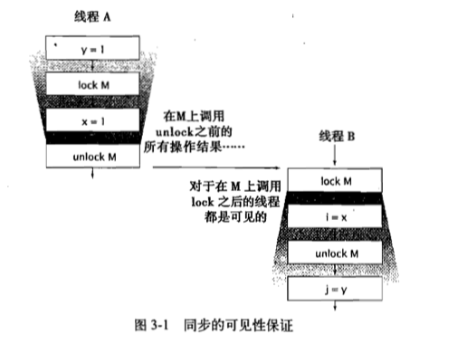

<!-- GFM-TOC -->
* [前言](#前言)
* [第 1 章：对象引论](#一、对象引论)
    * [抽象过程](#抽象过程)
    * [每个对象都有一个接口](#每个对象都有一个接口)
    * [每个对象都提供服务](#每个对象都提供服务)
    * [被隐藏的具体实现](#被隐藏的具体实现)
    * [复用具体实现](#复用具体实现)
    * [继承：复用接口](#继承：复用接口)
    * [伴随多态的可互换对象](#伴随多态的可互换对象)
    * [抽象基类和接口](#抽象基类和接口)
    * [对象的创建、使用和生命周期](#对象的创建、使用和生命周期)   
    * [集合（collection）与迭代器（iterator）](#集合（collection）与迭代器（iterator）)
    * [单根继承结构](#单根继承结构)
    * [向下转型（downcasting）与模板/泛型（template/generic）](#向下转型（downcasting）与模板/泛型（template/generic）)
* [第 2 章：一切都是对象](二一切都是对象)
    * [用引用（reference）操纵对象](#用引用（reference）操纵对象)
* [第 3 章：控制程序流](三控制程序流)
    * [自动递增（increment）和递减（decrement） ](#自动递增（increment）和递减（decrement） )
    * [关系操作符](#关系操作符)
* [第 4 章：初始化与清除](四初始化与清除)   
    * [以构造器确保 初始化](#以构造器确保 初始化)
    * [方法重载](#方法重载)
    * [缺省构造器](#缺省构造器)
    * [this  关键字](#this关键字)
    * [static 的含义 ](#static的含义 )
    * [清除:终结和垃圾回收](#清除:终结和垃圾回收)
    * [finalize()用途何在](#finalize()用途何在)
    * [终结条件](#终结条件)
* [第 5 章 隐藏具体实现](#五隐藏具体实现)
    * [包:程序库单元](#包:程序库单元)
    * [包访问权限](#包访问权限)
    * [Protected:继承访问权](#Protected:继承访问权)
    * [接口和实现](#接口和实现)
* [第 6 章 复用类](#复用类)
    * [组合语法](#组合语法)
    * [初始化基类](#初始化基类)
    * [确保正确清除](#确保正确清除)
    * [组合与继承之间的选择](#组合与继承之间的选择)
    * [受保护(protected)](#受保护(protected))
    * [增量开发](#增量开发)
    * [向上转型(upcasting)](#向上转型(upcasting))
    * [为什么使用"向上转型"](#为什么使用"向上转型")
    * [再次探究组合与继承](#再次探究组合与继承)
* [第 7 章 多态](#七多态)
    * [向上转型 ](#向上转型)
    * [方法调用绑定](#方法调用绑定)
    * [产生正确的行为](#产生正确的行为)
    * [缺陷"重载私有方法"](#缺陷"重载私有方法")
    * [抽象类和抽象方法](#抽象类和抽象方法)
    * [继承于清除](#继承于清除)
    * [构造器内部方法的多态行为](#构造器内部方法的多态行为)
    * [用继承进行设计](#用继承进行设计)
    * [纯继承和扩展](#纯继承和扩展)
    * [向下转型与运行期类型标识](#向下转型与运行期类型标识)
* [第 8 章 接口和内部类](#接口和内部类)
    * [接口](#接口)
    * [闭包和回调](#闭包和回调) 
* [第 9 章 异常与错误处理](#异常与错误处理)
* [第 10 章 类型检查](#类型检查)
    * [为什么需要RTTI](#为什么需要RTTI)
    * [Class 对象](#Class 对象)
* [第 11 章 对象的集合](#对象的集合)
# 前言
* Java 上体现出的 Sun 公司的设计目标：为
程序员降低复杂度。
* 你需要在头脑中创建一个模型，用于加强对这种语言的深
入理解；如果你遇到了疑问，你就能够将它反馈给你的模型并推断出答案。

# 一、对象引论   
## 抽象过程
面向对象编程思想的实质：程序可以通过添加新类型的
对象使自身适用于某个特定问题。   


面向对象程序设计方式：
* 万物皆为对象。
* 程序是对象的集合，它们彼此通过发送消息来调用对方。
_这里的可以把消息想象为调用请求_
* 每个对象都拥有由其它对象所构成的存储。
* 每个对象都拥有其类型（Type）。
* 某一特定类型的所有对象都可以接收(Receive)同样的消息。 _可替代性_


## 每个对象都有一个接口
什么是**类**:具有相同特性（数据元素）和行为（功能）的对象集合。 

面向对象方法并不是仅局限于构件仿真程序。无论你是否同意任何程序都是你所设计的系统
的一个仿真的观念，面向对象技术确实可以将大量的问题降解为一个简单的解决方案。       

每个对象都只能满足某些请求，
这些请求由对象的接口（Interface）所定义，决定接口的便是类型（Type）。


## 每个对象都提供服务
当你正是如开发或理解一个程序设计时，最好的方法之一就是将对象想象为“服务提供者
（Service Provider）”    

## 被隐藏的具体实现
将程序开发人员按照角色分为类创建者（class creator，那些创建新数据类型的程序员）和客
户端程序员（client programmer，那些在其应用中使用数据类型的类消费者）是大有裨益的。 _这里我感觉可以理解为框架的作者负责编写类，只暴露必须的部分。调用api的程序员，不会接触到内部隐藏的脆弱部分。_

类的内部设定边界关键字：
* public：表示紧随其后的元素对任何人都是可用的。
* private：这个关键字表示除
类型创建者和该类型的内部方法之外的任何人都不能访问的元素。 
* protected：仅在于继承类（Inheriting class）可以访问 protected
成员。
* 缺省（default）:“包访问权限（package access）”

## 复用具体实现
新的类可以由任意数量、任意类型的其它对象以任意可以实现新的类中想要的功能的方式所组成。因为你在使用现有的类合成新的类，所以这种概念被称为组合（composition）。

在建立新类时，当你选择是使用继承还是组合时,你应该首先考虑组合，因为它更加简单而灵活。

## 继承：复用接口

在创建了一个类之后，即使另一个新类与其具有相似的功能，你还是得重新创建一个新类。如果我们能够以现有的类为基础，复制它，然后通过添加和修改这个副本来创建新类那就要好得多了。通过继承便可以达到这样的效果，不过也有例外，当源类（被称为基类( base class)、超类(super class)或父类(parent class)）发生变动时，被修改的“副本”（被称为导出类(derived class)、继承类(inherited class)或子类(subclass, childclass)）也会反映出这些变动。  

当你继承了现有类型之后，也就创建了新的类型，这个类型含有所有现有类型的成员（private 被隐藏了而已），最重要的是复制了基类的接口，发送给基类的消息也可以发送给导出类(子类)。 由于我们通过可发送消息的类型可知类的类型，所以这也就意味着导出类与基类具有相同的类型。在前面的例子中，“一个圆形也就是一个几何形状”。通过继承而产生的**类型等价**（type equivalence）是理解面向对象程序设计方法内涵的重要门槛。

**重载**：使导出类和基类之间产生差异的方法是改变现有基
类的方法的行为。

## 是一个（is-a）与像是一个（is-like-a）关系

该只重载基类的方法，导出类对象可以完全替代一个基类对象。这可以被视为“纯粹替代（pure substitution）”，通常称之为“替代法则（substitution principle）”。   

在判断是否使用组合和继承的时候，如果是一种`is-a`的关系，使用继承比较理想。

## 伴随多态的可互换对象

Q：如果你不需要知道哪一段代码会
被执行，那么当你添加新的子类型时，不需要更改方法调用的代码，就能够执行不同的代码。
因此，编译器无法精确地了解哪一段代码将会被执行，那么它该怎么办呢？    

A：面向对象程序设计的最重要的妙诀：在OOP中，程序直到运行时刻才能确定代码的地址。为了解决这个问题OOP采用了**后期绑定**。编译器只需要确定调用方法存在，并且检查调用的参数和返回值的类型就行了。

我们把将导出类看作是它的基类的过程称为“向上转型（upcasting）”。“转型（cast）”这个名称的灵感来自于模型铸造的塑模动作，而“向上（up）”这个词来源于继承图的典型布局方式：通常基类在顶部，而导出类在其下部散开。因此，转型为一个基类就是在继承图中向上移动，即“向上转型（upcasting）”



## 抽象基类和接口
* 抽象类:你不希望任何人创
建基类的实际对象，而只是希望他们将对象向上转型到基类。
* 抽象方法:作为所有导出类都具有的接口方法。
* 接口:提供了接口与实现的完美分离。  


## 对象的创建、使用和生命周期
垃圾回收器（garbage collector）:它可以自动发现对象何时不再被使用，并继而销毁它。

## 集合（collection）与迭代器（iterator）

容器:创建另一种对
象的类型。解决这个特定问题的新的对象类型持有对其它对象的引用。

## 单根继承结构

Java的终极基类:Object

## 向下转型（downcasting）与模板/泛型（template/generic）

* 向下转型（downcasting）:向下转型为更具体的类型。  
* 参数化类型:是编译器可以自动定制作用
于特定类型之上的类。

# 二、一切都是对象  


## 存储到什么地方

* 寄存器（register）:这是最快的存储区。
* 堆栈（stack）：创建程序时，Java 编译器必须知道存储在堆栈内所有数据的确切大小和生命周期，因为它必须生成相应的代码，以便上下移动堆栈指针。
* 堆（heap）：一种通用性的内存池（也存在于 RAM 区），用于存放所有的 Java 对象。
* 静态存储（static storage）：静态存储里存放程序运行时一直存在的数据。
* 常量存储（constant storage）：常量值通常直接存放在程序代码内部，这样做是安全的，因为它们永远不会被改变。
* 非 RAM 存储（non-RAM storage）：如果数据完全存活于程序之外，“流对象”，“持久化对象”。   

## 特例：基本类型（primitive type）
基本类型:因为特别小，用new不是很有效，创建一个拥有值的变量。

## 域（field）和方法（method）

* 域（field，有时被称作数据成员（data 
member））    
* 方法（有时被称作成员函数（member function））

## 基本成员默认值 
千万要小心：当变量作为一个类的成员使用时，Java 才确保给定其默认值，以确保那些是基本类型的成员变量得到初始化。


## 名字可视性（Name visibility） 
为了给一个类库生成不会与其它名字
混淆的名字，Java 采用了与 Internet 域名相似的指定符。 


# 三、控制程序流

## 使用 Java 操作符 

## 自动递增（increment）和递减（decrement） 
对于前缀递增和前缀递减（如  ++a  或  --a  ），会先执行运
算，再生成值。而对于后缀递增和后缀递减（如 a++或 a--），会先生成值，再执行运算。

## 关系操作符

* ==和!=： 比较的就是对象的引用
* equals()：比较两个对象的实际内容是否相同。

# 四、初始化与清除

## 以构造器确保 初始化

命名 方法:
* 取的名字会与成员名称相冲突
* 必须让编译器知道应该调用哪个方法

## 方法重载  
*  缺省构造器
*   有参构造器

方法接受较小的基本类型作为参数时， 如果传入参数较大，就需要进行参数转换。
```java
public class PrimitiveOverloading {
    void  f1 (short x){
        System.out.println("f1 (short x)");
    }

    public static void main(String[] args) {
        PrimitiveOverloading primitiveOverloading = new PrimitiveOverloading();
        int a = 111;
        primitiveOverloading.f1((short) a);
    }
}

```

## 缺省构造器

缺省构造器:没有形式参数。作用:创建一个"基本对象"。

如果你写的类没有构造器，编译器会自动帮你创建一个缺省构造器。

##  this关键字

编译器暗自把所操作对象的引用作 为第一个参数传入f()。
`Banana.f(a,1)`
但是你不能这样书写。
因为这个引 用是 偷偷传入 的，所以这里就提供了一个特定的关键字`this`。

1. 如果在方法内部调用同一个类的方法， 就不必使用`this`直接调用即可。
2. 如果需要明确指出当前对象的引用的时候，才需要使用`this`

```java
public class Leaf {
      int i = 0;
      Leaf increment() {
i++;
        return this;
      }
}
```

## static的含义 

 静态方法: 没有`this`的方法。

 Java禁止全局函数，但是你可以使用静态方法访 问其他静态方法  
和静态字段。

##  清除:终结和垃圾回收

垃圾回收器:只知道释放那些经由`new`分配的内存，所以对于不是`new`分配的
特殊内存就 无法释放。所以Java允许你在类中定义一个叫做`finalize()`的方法
， 一旦垃圾回收器准备好释放对象占用的空间时，首先调用这个方法，并且在下一次垃圾回收动作发生时，才会真正回收内存。

`finalize() ` :在垃圾回收时刻做一些重要的清除工作。
## finalize()用途何在?

* 对象可能不被垃圾回收
* 垃圾回收不等于 析构
* 垃圾回收只和内存有关，垃圾回收器存在的意义就是为了 回收 不再使用的内存。

 垃圾回收和终结都不 保证一定会发生， 如果java虚拟机 并未 面临内存耗尽，就不会 浪费时间在垃圾回收恢复内存上。

## 终结条件

`finalize()`的价值就是用来发现对象是否存在没有 被适当清除的部分。

```java
public class Book {

    boolean checkOut = false;

    Book(boolean checkOut) {
        this.checkOut = checkOut;
    }

    void checkIn() {
        checkOut = false;
    }

    public void finalize(){
        if (checkOut) {
            System.out.println("Error: checked out");
        }
    }
}
public class TerminationCondition {
    public static void main(String[] args) {
        Book book = new Book(true);
        book.checkIn();
        new Book(true);
        System.gc();
    }
}

```

## 垃圾回收器如何工作

Java的"堆指针"可以简单的移动到尚未分配的区域。

垃圾回收器 工作时，一面回收空间， 一面 使堆中的对象紧凑排列，这样堆指针就能够更容易的移动到 传送带开始的地方。

* 引用计数:  一种简单但是很慢的垃圾回收技术，每个对象都含有一个引用计数器，当引用连接至对象 时， 引用计数加1，当引用离开作用域或被置为`null`的时候，引用计数减1。
    * 开销不大，但是在整个程序生命周期内会持续的开销。
    *  存在循环引用时候，出现"对象应该被回收，但是引用计数不为0"
*  基于DFS垃圾回收技术:对于任何活的对象，一定能够在堆栈或者是静态存储区中找到他的引用。从堆栈和静态存储区的所有引用开始遍历，追踪对象，然后是这个对象的引用，反复如此，就能够得到活的对象。循环引用的对象根本不会被发现。  

Java  虚拟机 将采用一种"自适应"的垃圾回收技术。


"停止"----"复制":暂停程序运行，将存活对象复制到另外一个堆，没有复制的都是垃圾。
 搬运的同时，所有指向对象的引用都必须修正，位于 堆和静态存储区的引用可以直接被修正。
    * 需要两个堆，按需从堆分配几块较大的内存，复制动作发生在大块内存之间。
    * 程序稳定没有垃圾时， 切换到"标记 ----清扫"模式，在垃圾少的时候速度很快。
2. "标记 ----清扫":DFS遍历所有活的对象，并设置标记， 结束后，没有标记的对象释放， 但是剩下的堆空间是不连续的 ，所以得重新整理对象。
3. "停止 ---- 复制":当可用内存较低时候，垃圾回收器被激活，发生同时停止程序。

 Java虚拟机的内存 分配单位是"块"，如果对象较大就会 独立占用一个块。
块具有相应的"代数"记录是否存活。
 Java虚拟机会监控垃圾回收器的效率， 如果效率低就采用"标记 ----清扫"，如果内存中碎片较多就会采用"停止 ---- 复制"，这样的自适应策略。


## 成员初始化

所有变量在使用前都能得到恰当的初始化。对于定义于方法内部的局部变量，
Java 以编译时刻错误的形式来贯彻这种保证。


## 构造器初始化

你无法屏蔽自动初始化的进行，它将在构造器被调用之前发生。

```java
class Counter {
    int i;
    Counter() {
         i = 7; 
    }
}
```
i首先会被置 0，然后变成 7。

## 静态数据的初始化  
静态初始化只有在必要时刻才会进行。
初始化的顺序是先“静态”，如果它们尚未因前面的对象创建过程而被初始化），后“非静态”。

## 明确进行的静态初始化

Java 允许你将多个静态初始化动作组织成一个特殊的“静态子句”

```java
class Spoon {
    static int i;
    static {
    i = 47;
    }
}
```
静态初始化动作只进行一次。

## 数组初始化

下面这种情况可以等价于new 
```java
int[] a1 = {1,2,3,4,5};
```

复制引用
```java
int[] a2 = a1;
```

length:所有数组都有一个固有成员，你可以通过它获取数组内包含多少元素。

如果数组的元素不是基本类型，就必须使用`new`。


# 五、隐藏具体实现

考虑的基本问题是"如何将变动的事物与保持不变的事物相互隔离"

## 包:程序库单元

转译单元:java 源代码文件

Java解释器(interpreter)的运行过程:
* 找出环境变量CLASSPATH
* 解释器获取包名称并且将句点替换成反斜杠
* 解释器就从目录中查找你所要创建的类

包的名字可以作为两个名字空间的保护伞。

## 包访问权限
当前包中的其他类对那个成员有访问权限，对外的类没有访问权限。
缺省: 包内部访问，类内部访问。


* 继承的类可以与访问public一样访问protected成员
* 访问器和变异器可以读取和改变值   


## Protected:继承访问权
基类的创建者会希望获得一个特定的成员，并赋予派生类，而 不是所有类以访问权。这就需要 protected 来完成这一工作。

## 接口和实现

封装:把数据和方 法包装进类中，与具体实现的隐藏结合到一起。
类是所有同类型对象的外观和行为进行描述的方式。

# 六、复用类

## 组合语法

 string 而你却只有一个 对象时，该方法便会被调用。

 ## 初始化基类
 当你创建了一个导出类的 对象时，该对象包含了一个基类的子对象(subobject)。

 ## 确保正确清除
清除方法中，你还必须注意对基类和成员对象的清除方法的调用顺序，以防 某个子对象(subobject)依赖于另一个子对象情形的发生。

## 组合与继承之间的选择
组合和继承都允许你在新的类中设置子对象(subobject)，组合是显式地这样做的，而继承 则是隐式的。

组合:
* 用于你想要在新类中使用现有类的功能而非接口。
* 在新类中嵌入某个对象，借此实现你需要的功能，但新类的用户只能看到你为新类定义的接口。
* 有时允许用户直接访问新类中的组合成分也是极具意义的。也就是说，将成员变量声明为public。但是只是特例，一般情况下设置为private正常。

一般使用`is-a`来表达继承，使用`has-a`来表达组合
 
 ## 受保护(protected)

对于子类和包内的类暴露，但是对这个包的用户不暴露，限权属于`public`和`protected`之间。
 
 ## 增量开发
 继承的优点之一是它支持增量开发，可以引入新代码但是不会出现在现有代码引发的BUG。

 ## 向上转型(upcasting)

 继承最重要的方面是用来表现新类和基类的关系，这种关系可以用"新类是现有类的一种类型"这句话来加以概括。

 ## 为什么使用"向上转型"
 向上转型是一种较专有类型向通用类型的转型方式，所以总是很安全的。也就是说，导出类是基类的一个超集。向上转型的时候对于类的接口唯一丢失的就是方法。

## 再次探究组合与继承

慎用继承，先问一下自己:
* 是否是需要从新类向基类向上转型
* 是不是`is-a`模型

## 关键字final
通常是无法改变的。
```java
public class FinalData {
         private static Test monitor = new Test();
         private static Random rand = new Random();
         private String id;
         public FinalData(String id) { this.id = id; }
         // Can be compile-time constants:
         private final int VAL_ONE = 9;
         private static final int VAL_TWO = 99;
         // Typical public constant:
         public static final int VAL_THREE = 39;
         // Cannot be compile-time constants:
         private final int i4 = rand.nextInt(20);
         static final int i5 = rand.nextInt(20);
         private Value v1 = new Value(11);
         private final Value v2 = new Value(22);
         private static final Value v3 = new Value(33);
         // Arrays:
         private final int[] a = { 1, 2, 3, 4, 5, 6 };
         public String toString() {
           return id + ": " + "i4 = " + i4 + ", i5 = " + i5;
         }
         public static void main(String[] args) {
           FinalData fd1 = new FinalData("fd1");
           //! fd1.VAL_ONE++; // Error: can't change value
           fd1.v2.i++; // Object isn't constant!
           fd1.v1 = new Value(9); // OK -- not final
           for(int i = 0; i < fd1.a.length; i++)
 www.plcworld.cn
             fd1.a[i]++; // Object isn't constant!
           //! fd1.v2 = new Value(0); // Error: Can't
           //! fd1.v3 = new Value(1); // change reference
           //! fd1.a = new int[3];
           System.out.println(fd1);
           System.out.println("Creating new FinalData");
           FinalData fd2 = new FinalData("fd2");
           System.out.println(fd1);
           System.out.println(fd2);
           monitor.expect(new String[] {
             "%% fd1: i4 = \\d+, i5 = \\d+",
             "Creating new FinalData",
             "%% fd1: i4 = \\d+, i5 = \\d+",
             "%% fd2: i4 = \\d+, i5 = \\d+"
}); }
}
```
* 数据
    * 一个`static`又是`final`的域只占用一份不能改变的存储空间。
    * 对于对象引用使用`final`,则表示引用恒定不变，就是一旦指向一个对象，就无法对他改变指向另一个对象。但是对象的自身是可以修改的。
    * VAL_ONE和VAL_TOW是带有编译期数值的final原始类型，所以两者都可以用作编译期常量，没有重大区别。VAL_THREE 是一种更加典型的定义，定义为public,定义static是指只有一份，定义是final指说明他是一个常量。
    * static 在装载的时候被初始化,不会因为创建对象时候都初始化。
空白final:
你被强制在数据成员的定义处或者是每个构造器中用表达式对 final 进行赋值。这正是 final
数据成员在使用前总是被初始化的原因所在
参数final:
Java允许你在参数列表中以声明的方式指明为final。这意味着你无法在方法中以更改参数引用所指向的对象。  
* 方法
    * 锁住方法，以预防任何继承类修改他的定义。
    * 效率:发现final方法调用命令时，会根据自己的谨慎判断，跳过插入程序代码的方式执行调用机制，提高效率，如果方法体过长，那么效率的提升不会很明显。（是直接将方法展开，以方法体重的实际代码替代原来的方法调用）
    * private 隐含的都是final,你可以为private增加final 但是并不能内方法增加任何额外的意义。重写只有在某方法是基类接口的一部分才会出现，如果一个方法是private就不是基类接口的一部分。

* 类
    * 当你将整个类都定义为final的时候，就声名了你不打算继承该类。
    * 由于类是final的所以所有方法都是隐含final的，不会被重写。

## 初始化类加载

第一个对象被构建的时候才发生加载，当访问static数据成员或者是static方法时候,才会被加载。static在初始化之初会在加载时依据程序的顺序一次 初始化。

* 先加载 子类，但是过程中发现有基类，于是就继续去加载，不管你打算是否产生一个该基类的对象， 都会发生

    * 根基类的静态初始化后，静态初始化下一个导出类，以此类推。

* 加载类必要的类之后，开始创建对象，对象的所有原始类型都是缺省值，引用被设置为0,基类构造器和导出类 的构造器一样，以相同的顺序来经历相同的过程。
* 基类构造器完成后，实例变量才会初始化


# 七、多态

## 向上转型 

```java
public class Note {
    private String noteName;

    public Note(String noteName) {
        // 因为wind 继承自instrument 所以instrument的接口一定定义在wind中
        this.noteName = noteName;
    }

    @Override
    public String toString() {
        return noteName;
    }

    public static final Note
            MIDDLE_C = new Note("Middle C"),
            C_SHARP = new Note("C Sharp"),
            B_FLAT = new Note("B Flat");
}
```
因为wind 继承自instrument 所以instrument的接口一定定义在wind中


## 方法调用绑定
绑定:将一个方法调用与方法主体关联起来称作“绑定”。
动态绑定:在运行的时候根据对象的类型进行绑定。

Java中除了static和final方法其他方法都是后期绑定的。

final的一个重要的作用就是关闭动态绑定，最好根据环境选择使用final，而不是为了提高性能。


## 产生正确的行为

在编译期间，编译器不需要获得任何特殊的信息，就 能进行正确的调用。

我们所作的代码修改，不会对程序中其他不应受到影响的部分 产生破坏。从另一方面说就是，多态是一项让程序员“将改变的事物与未变的事物分离开来”

## 缺陷"重载私有方法"

非private方法才可以被重写，如果尝试重写private 虽然编译不会报错，但是不会按照期望执行。

## 抽象类和抽象方法
`abstract method`：的机制。这种方法是不完整 的;仅有声明而没有方法体。下面是抽象方法声明所采用的语法。

抽象类和抽象方法非常有用，因为它们可以显化一个类的抽象性，并告诉用户和编译器 怎样按照它所预期的方式来使用。

调用顺序:
1. 调用基类构造器,反复递归下去，首先构造层次的根，然后是导出类，以此类推。
2. 按照声明顺序调用成员的初始状态设置模块。
3. 调用导出类的构造器主体。

## 继承于清除

## 构造器内部方法的多态行为

*  在其他任何事物发生之前，将分配给对象的存储空间初始化成二进制的零。
* 如前所述的那样，调用基类的构造器，此时，调用基类构造器。此时，调用被重写的draw方法(在调用构造器之前调用)，radius的值是0。
* 按照声明的顺序调用成员变量的初始化代码。
* 调用导出类的构造器主体。

有益的规则:用尽可能的简单方法使对象进入正常状态，如果可以的话避免调用其他方法。唯一可以调用的是基类的private方法，因为他们自动final。


## 用继承进行设计

用继承表达行为之间的差异，用属性表达状态上的差异。


## 纯继承和扩展

## 向下转型与运行期类型标识

多态意味着不同的形式。

# 八、接口和内部类

## 接口

接口也可以包含数据成员，都是隐含的static和final的。接口只提供了形式，而从未提供任何具体实现。

为了使一个类遵循某个特定的接口，需要使用`implements`关键字，表示该接口是这个类的外貌。

## 闭包和回调 

内部类是面向对象的闭包，因为它不仅包含外围类对象(“创 建内部类的作用域”)的信息，还自动拥有一个指向此外围类对象的引用，在此作用域内， 内部类有权操作所有的成员，包括 private 成员。

# 九、异常与错误处理

基本理念是结构不佳的代码不能运行。
* 在适当的级别处理问题
* 解决问题并且重新调用产生异常的方法
* 进行少许修补，然后绕过异常
* 用别的数据进行计算，以代替方法返回的期望值
* 把当前运行环境的事情做完，然后把相同的异常重抛到上层
* 进行简化
* 让类库更加安全。

# 十、类型检查

RTTI(运行期类型识别):当你只有一个指向对象的基类的引用的时候，RTTI机制可以让你找出这个对象确切的类型。

## 为什么需要RTTI
 
 面对对象编程的基本目的是:你的代码只操纵基类。

 RTTI:在运行期的时候识别一个对象的类型。
 多态是面向对象编程的基本目标。

 ## Class 对象

 运行期的时候想要生成这一个类的对象，运行这个程序的Java虚拟机首先会检查这个类的Class是否已经加载完成。Java并不是一开始执行就完全被加载的。

 ## 使用字面量常量  

使用字面量可以不加try语句，因为他会在编译器得到检查。

## 反射(Reflection):运行期的类信息

在编译期，编译期必须要知道你要通过RTTI来处理的所有类。

RTTI和反射的区别
* RTTI编译器在编译期打开和检查.class文件。
* 反射在运行期打开和检查.class文件。

# 十一、对象的集合


## 数组

* Java的数组与容器会因为时刻存在的边界检查带来固定的性能开销。

## 数组是一级对象  

* 对象数组保存的是引用
* 基本类型数组直接保存的是基本类型的值

## 基本类型的容器  

* 容器类只能保存对象的引用。
* 数组可以直接保存基本类型。
* 创建和访问基本类型的数组效率高。

## Arrays 类

## 复制数组

 浅复制:shallow copy 只复制引用

## 数组的比较

## 策略（strategy）设计模式
通过使用策略，将会发生变化的代码包装在类中（即所谓策略对象）。将策略对象交 给保持不变的代码，后者使用此策略实现它的算法。

Java 标准类库中的排序算法为各种类型作了优化——针对基本类型设计的“快速排序 （Quicksort）”，以及针对对象设计的“稳定归并排序 （stable merge sort）”。所 以你无须担心排序的性能，除非你可以证明排序部分的确是程序效率的瓶颈。

## 在已排序的数组中查找
`Arrays.binarySearch()`是对没有重复元素的有序数组进行排序

## 数组小结

数组是效率最高的一种保存对象的方式，是你的第一种选择。如果要保存基本信息，就只能使用数组。

对于复杂类型的对象，Java提供了容器类库,基本分为
List,Set和Map。

## 容器简介

Java2 容器类类库的用途是"持有你的对象"，并将其划分成两个不同的概念:

* Collection: 一组独立的元素，通常有某种规则应用在于其上。List必须保持元素特定的顺序，Set不能有重复元素。
* Map:一组成对的键值对（key-value）对象。初看起来这似乎应该是一个 Collection，其元素是成对的对象，但是这样的设计实现起来太笨拙了，于是 我们将 Map 明确提取出来形成一个独立的概念。

## 容器的缺点：未知类型

* 因为你的对象引用在加入容器的时候就丢失了类型信息，所以对于添加入容器的对象没有
类型限制，即使你刻意保持容器的类型，例如类型“猫”的容器，别人还说可以轻易的将狗加入容器
* 因为丢失了类型信息，容器只知道它保存的是Object类型的引用。所以使用容器中的元素前必须要
做类型转换操作。

## 迭代器

迭代器是一种对象，他的工作是遍历并选择序列中的对象。

* 使用方法 iterator()要求容器返回一个 Iterator。第一次调用 Iterator 的 next() 方法时，它返回序列的第一个元素。
* 使用 next()获得序列中的下一个元素。
* 使用 hasNext()检查序列中是否还有元素。
* 使用 remove()将上一次返回的元素从迭代器中移除。

## 容器的分类法


* 常用的容器使用雷塞粗线表示。
* 点线方框表示接口。
* 虚线方框表示抽象类。
* 点线箭头表示实现一个接口，如果是抽象类就表示实现部分接口。

Abstract 开头的类只是为了实现特定的接口的简单工具而已。

所以上图可以简化成


Collection 的功能方法
* boolean add(Object)

* boolean addAll(Collection)

* void clear( )

* boolean contains(Object)

* boolean containsAll(Collection)

* boolean isEmpty( )

* Iterator iterator( )

* boolean remove(Object)

* boolean removeAll(Collection)

* boolean retainAll(Collection)

* int size( )

* Object[] toArray( )

* Object[] toArray(Object[] a)

## List的功能方法

* ArrayList 随机访问元素
* LinkedList 不是为了快速随机访问，而是一套更通用的方法

`次序`是List最重要的特点,他保证维护元素特定的顺序。

## Set的功能方法

Set具有Collection完全一样的接口，没有任何额外的功能。
实际上Set就是Collection，只是行为不同。

* Set（接口）:存入Set的每个元素必须是唯一的，Set不保证能存入重复的元素，加入Set的元素必须定义equals()方法确定对象的唯一性。不保证次序的唯一性。
* HashSet:为快速查找设计的 Set。存入 HashSet 的对象必须定 义 hashCode()。
* TreeSet:保持次序的Set，底层为树。可以从Set中提取有序的序列。
* LinkedHashSet()具有HashSet的查询速度，内部使用链表维护元素的顺序。

保存元素的方式:

* TreeSet 采用红黑树的数据结构排序元素。
* HashSet 采用散列函数，目的是快速查找元素
* LinkedHashSet 内部使用散列加快查询速度，同时使用链表维护次序，使得元素看上去是以插入的顺序保存的。

## SortedSet
* 使用SortSet(TreeSet是其唯一的实现),可以确保元素处于排序的状态，还可以使用SortedSet 接口提供的额外功能。
* Comparator comparator()： 返回当前 Set 使用的 Comparator，或者返回 null，表示以自然方式排序。
* Object first()：返回容器中的第一个元素。 Object last()：返回容器中的最末一个元素。 SortedSet subSet(fromElement, toElement): 生成此 Set 的子集，范围 从 fromElement（包含）到 toElement（不包含）。
* SortedSet headSet(toElement): 生成此 Set 的子集，由小于 toElement 的 元素组成。
* SortedSet tailSet(fromElement): 生成此 Set 的子集，由大于或等于 fromElement 的元素组成。

SortSet的意思是 按比较函数对元素排序，不是指元素的插入次序排序。

## Map的功能和方法
HashMap 基于散列表的实现（取代Hashtable）插入和查询 键值对的开销是固定的。可以通过构造器设置容量和装填因子，以调整容器的性能。

* HashMap 使用equal()判断当前键是否和表中存在的键相同。
* 默认的Object.equals() 只是比较对象的地址，如果使用自己的类作为

自建对象为何要同时重写equal()和hashCode()
hashCode 是生成你一个整型的值，该整形被处理后，作为数组下标放入Entry，equal() 方法是用来插入或者查询的时候在插入值和数组中的散列码比较相等之后，进行equal比较。

为解决数组容量被固定的问题，不同的键可以产生相同的下标。可能会有冲突。

## 覆盖HashCode 
设计HashCode()时最重要因素，无论何时，同一个对象调用hashCode()都应该生成相同的值

不应该使hashCode()依赖具有唯一性质的对象信息，尤其是使用this的值。


## 选择接口的不同实现

基于某个特定的操作，以及你需要执行的速度在他们中间进行选择。

## 快速报错

Java容器有一种保护机制，在你迭代某个容器的时候，有一个线程介入其中，修改删除某个对象。就会产生不可
预料的后果。但是Java容器库采用了fail-fast机制，会探查容器上任何除了你进程操作以外的操作，一旦报错
就抛出异常。

```java
public class FailFast {
    public static void main(String[] args) {
        Collection<String> c = new ArrayList<>();
        Iterator<String> it = c.iterator();
        ((ArrayList<String>) c).add("An Object");
        try {
            String s = it.next();
        } catch (ConcurrentModificationException e) {
            System.out.println(e);
        }
    }
}
```
 
 在取得迭代器之后，又有东西被放入容器。当程序的不同部分修改同一个容器的时候
 就可能导致容器状态不一样。

 ## 持有引用

对象是可获得的：是指对象可以在程序中的某处找到。
用Reference对象作为你和普通引用之间的媒介（代理）。

* SoftReference: 内存敏感的高速缓存 
* WeakReference: 为了实现规范映射而设计的
* PhontomReference:用做调度回收前的清理工作

## WeakHashMap

用来保存WeakReference
每个值只保存一份实例来节省存储空间。
WeakHashMap允许垃圾回收器自动清理键和值。


```java
public class CanonicalMapping {
    public static void main(String[] args) {
        int size = 1000;
        Key[] keys = new Key[size];
        WeakHashMap<Key, Value> map
                = new WeakHashMap<>();
        for (int i = 0; i < size; i++) {
            Key k = new Key(Integer.toString(i));
            Value v = new Value(Integer.toString(i));
            if (i % 3 == 0) {
                keys[i] = k;
            }
            map.put(k, v);
        }
        System.gc();
    }

}
```

可以看到垃圾回收器每个三个键就会跳过一个键，因为指向那个键的普通引用被存入了keys数组 
所以那个对象不会被垃圾回收器回收


# 十二、范型 

范型：适用于许多许多种类型
核心概念:告诉编译器你想要使用什么类型，然后编译器会帮你处理一切细节。

## 一个堆栈类

## 范型方法
是否拥有范型方法，与是否是范型类没有任何关系。 
如果调用范型方法传入的是基本类型，自动打包机制会介入其中，将基本类型的值包装成为对应的对象。

## 杠杆利用类型参数推断

## 范型的擦除
Java范型是使用擦除来实现的，这意味着当你使用范型的时候，任何具体类型信息
都会被擦除，你唯一知道的就是你在使用一个对象。

范型只有在静态检查类型的时期才会出现，在此之后所有的范型类型都会被擦除。
在编写类的时候，提醒自己"拥有范型的对象，只是一个Object"

# Java IO 系统

## File类

## 输入和输出

流：代表有能力产出数据的数据源对象或者是有能力接受数据的接收端对象。

## InputStream类型 
InputString 的作用是用来表示从不同数据源产生的输入的类

* 字节数组
* String对象
* 文件
* 管道 
* 一个由其他种类的流组成的序列
* 其他数据源

## OutputStream类型  
决定了数据要去往的地方:
* 字节数组
* 文件
* 管道 

## 缓冲输入文件


```java
public class BufferedInputFile {
    public static String
    read(String filename) throws IOException {
        BufferedReader in = new BufferedReader(new FileReader(filename));
        String s;
        StringBuilder sb = new StringBuilder();
        while ((s = in.readLine()) != null) {
            sb.append(s + "\n");
        }
        in.close();
        return sb.toString();
    }

    public static void main(String[] args) throws IOException{
        System.out.println(read("ThinkingInJava.iml"));
    }
}
```

## 从内存输入

StringReader是面向字符的读取 

## 格式化内存输入

```java
public class FormattedMemoryInput {
    public static void main(String[] args) throws IOException {
        try {
            DataInputStream in = new DataInputStream(
                    new ByteArrayInputStream(
                            BufferedInputFile.read("ThinkingInJava.iml").getBytes()
                    )
            );
            while (true) {
                System.out.print((char)in.readByte());
            }
        } catch (EOFException e) {
            System.out.println("End of steam");
        }
    }
}

```

## 对象序列化

当你创建对象的时候，只要你需要，它就会一直存在。
轻量级持久性:持久性意味着一个对象的生命周期不取决于程序是否正在执行。
对象序列化特别聪明的地方是不仅保存了对象的全景图，而且能追踪对象包含的所有引用。

## 寻找类
如果还原的过程中，类文件不在路径中，就会得到一个ClassNotFoundException异常。

## transient（瞬时）关键字
意思是不用麻烦你保存或者恢复数据--我自己会处理


# 枚举类型
## 基本的enum特性

* ordinal() 返回int 指的是定义的顺序。
* Enum类实现了Comparable接口，具有compareTo()方法。
* 同时实现类Serializable接口。
* valueOf()是在enum中定义static方法，给定名字返回给定实例。

## 向enum中添加方法

## values()的神秘之处

values() 是通过编译期后期插入的static方法 


# 注解

优点:
* 编译期检查
* 干净的易读的代码

## 基本语法

定义注解 ：
注解和Java其他接口一样，可以被编译成为.class文件
标准注解:
* @Override
* @Deprecated  注解了元素会发出警告
* SuppressWarnings 关闭不当的编译器警告

元注解:
* @Target 定义你的注解将要运用在什么地方
* @Rectetion 定义在哪个级别可用 
    * 类文件(CLASS)Class文件有用VM丢弃
    * 运行时(RUNTIME)可以通过反射读取信息
    * 源代码(SOURCE)将被编译器丢弃

标记注解:(marker annotation)没有元素的注解

## 注解元素

* 所有类型
* String
* Class
* Annotation
* 以上类型的数组

如果有其他类型，编译期就会报错
默认值不能设置为null

## 生成外部文件

```java
package annotations.databases;

import annotations.DBTable;
import com.sun.org.apache.bcel.internal.generic.IF_ACMPEQ;

import java.lang.annotation.Annotation;
import java.lang.reflect.Field;
import java.util.ArrayList;
import java.util.List;

public class TableCreator {
    public static void main(String[] args) throws ClassNotFoundException {
//        System.out.println(args[0]);
//        if (args.length < 1) {
//            System.out.println("arguments: annotated classes");
//            System.exit(0);
//        }
//        for (String className : args
//        ) {
            // 获取指定类对象
        Class<?> cl = Member.class;
        // 获取类对象的注解
        DBTable dbTable = cl.getAnnotation(DBTable.class);
        if (dbTable == null) {
            System.out.println("no dbtable annotations in class "+"Member");
        }
        String tableName = dbTable.name();
//        System.out.println(tableName);
//        }
        List<String> columDefs = new ArrayList<>();
        for (Field field : cl.getDeclaredFields()
        ) {
            String columnName = null;
            Annotation[] anns = field.getDeclaredAnnotations();
            if (anns.length < 1) { // 不是tableString
                continue;
            }
            if (anns[0] instanceof SQLInteger) {
                SQLInteger sInt = (SQLInteger) anns[0];
                if (sInt.name().length() < 1) {
                    columnName = field.getName().toUpperCase();
                }
                else
                    columnName = sInt.name();
                columDefs.add(columnName + " INT" + getConstraints(sInt.constraints()));
            }
            if (anns[0] instanceof SQLString) {
                SQLString sString = (SQLString) anns[0];
                if (sString.name().length() < 1) {
                    columnName = field.getName().toUpperCase();
                }
                else
                    columnName = sString.name();
                columDefs.add(columnName + " VARCHAR(" + sString.value()+")"+getConstraints(sString.constraints()));
            }
            StringBuilder createdCommand = new StringBuilder(
                    "CREATE TABLE " + tableName + "("
            );
            for (String columDef : columDefs
            ) {
                createdCommand.append("\n   " + columDef + ",");
            }
            String tableCreate = createdCommand.substring(
                    0, createdCommand.length() - 1
            ) + ");";
            System.out.println(tableCreate);
        }
    }
    private static String getConstraints(Constraints con) {
        String constraints = "";
        if (!con.allowNull()) {
            constraints += " NOT NULL";
        }
        if (con.primaryKey()) {
            constraints += " PRIMARY KEY";
        }
        if (con.unique()) {
            constraints += " UNIQUE";
        }
        return constraints;
    }
}

```

# 并发

## 并发的多样性
编写多线程程序最基本的困难是在协同不同线程驱动任务之间对这些资源的使用，以使这些资源不会同时被多个任务访问。

## 改进代码设计  

Java的线程机制是抢占式的，这表示调度机制会周期的中断线程，上下文切换到下一个线程。

## 定义任务 

Thread.yield()表示对线程的调度器（让CPU从一个线程转换到另一个线程)

垃圾回收的时候 因为Thread 注册了自己，在run()并且死亡之前，垃圾回收器无法回收它

## 使用Executor 线程池

* CacheThreadPool 为每个任务都创建一个线程
* FixedThreadPool 一次性预先执行代价高昂的线程分配 `Executors.newFixedThreadPool(5);`
* FixedThreadPool 希望在另一个线程中连续运行的任务，如果提交了多个任务，这些任务将会排队。 会首先初始化线程，然后依次执行，死亡。

当任务都是同类型并且相对独立的时候，线程池的性能才能达到最佳。

### 设置线程池的大小
* 过大，大量的线程在相对很少的CPU和内存资源上发生竞争。
* 过小，将导致许多空闲的处理器无法执行工作，从而降低吞吐率。


### 管理队列任务
ThreadPoolExecutor 允许提供一个BlockingQueue 来保存等待执行的任务

* 有界队列
    有助于避免资源耗尽的情况发生：
    * ArrayBlockingQueue
    * LinkedBlockingQueue
    * PriorityBlockingQueue   
    但是队列填满怎么办？
    使用**饱和策略**
* 无界队列
* 同步移交(Synchronous Handoff)队列
    对于非常大的或者无界的线程池，使用SynchronousQueue来避免任务排队,SynchronousQueue不是一个真正的队列，而是一种线程之间的移交机制。
    ```java
    /**
     * Adds the specified element to this queue, waiting if necessary for
     * another thread to receive it.
     *
     * @throws InterruptedException {@inheritDoc}
     * @throws NullPointerException {@inheritDoc}
     */
    public void put(E e) throws InterruptedException {
        if (e == null) throw new NullPointerException();
        if (transferer.transfer(e, false, 0) == null) {
            Thread.interrupted();
            throw new InterruptedException();
        }
    }
    ```


## 从任务中产生返回值

## 休眠
```java
public class SleepTask extends LIftOff {
    @Override
    public void run() {
        try {
            while (countDown-- > 0) {
                System.out.print(status());
                TimeUnit.MILLISECONDS.sleep(100);
            }
        } catch (InterruptedException e) {
//            e.printStackTrace();
            System.err.println("Interrupted");
        }
    }
    public static void main(String[] args) {
        ExecutorService exec = Executors.newCachedThreadPool();
        for (int i = 0; i < 5; i++) {
            exec.execute(new SleepTask());
        }
        exec.shutdown();
    }
}
```
对于sleep()的调用会抛出`InterruptedException`异常，并且能可以看到，run()中被捕获，不会垮线程传播回main()

## 后台线程

不属于程序中不可或缺的部分。非后台线程结束时，程序也就终止了。
只要任何非后台线程还在运行，程序就不会终止。

后台线程工厂类

```java
public class DaemonThreadFactory implements ThreadFactory {
    @Override
    public Thread newThread(Runnable r) {
        Thread t = new Thread(r);
        t.setDaemon(true);
        return t;
    }
}
```

```java
public class DaemonFromFactory implements Runnable {
    @Override
    public void run() {
        while (true) {
            try {
                TimeUnit.MILLISECONDS.sleep(100);
                System.out.println(Thread.currentThread() + " " + this);
            } catch (InterruptedException e) {
                e.printStackTrace();
            }
        }
    }

    public static void main(String[] args) throws InterruptedException {
        // 创建方法重载为接受一个ThreadFactory 而这个对象用来创建新的线程
        ExecutorService exec = Executors.newCachedThreadPool(new DaemonThreadFactory());
        for (int i = 0; i < 10; i++) {
            exec.execute(new DaemonFromFactory());
        }
        System.out.println("All daemons started");
        TimeUnit.MILLISECONDS.sleep(500);

    }
}
```

一旦main()推出JVM就会关闭所有后台进程，非后台的Executor 通常是更好的选择，因为可以控制任务同时关闭

## 加入一个线程

A 线程在B线程上调用B.join()指的是等待B线程结束，如果B线程中断，则运行A线程。 

## 内置锁
synchronized 块必须在给定一个在其上同步的对象，最合理的方式是
使用当前对象，synchronized(this)，如果获取了synchronized块上的
锁，那么该对象其他synchronized 方法和临界区就不能被调用类。

### 三种应用方式
* 修饰实例方法：进入同步代码块之前要获得当前实例的锁
* 修饰静态方法: 进入同步代码快之前要获得当前类对象的锁    
    当用于对象的锁的时候
* 修饰代码块：进入同步代码块之前要获得给定对象的锁


同步代码块(Synchronized Block)
每个Java对象都可以用来实现一个同步的锁，这些锁叫做内置锁(Intrinsic Lock)或监视器锁(Monitor Lock)
**是对象内部的锁** 然后线程去获取。。。


### 解决共享资源竞争

Java提供关键字synchronized 当任务执行被synchronized关键子保护的代码的时候，检查锁是否可用，获取锁，执行代码，释放锁。

对于一个特定的对象来说，他的所有的synchronized方法共享一个锁，可以防止多个任务同时访问方法。
对于对象中的域来说，设置为private是十分必要的，否则synchronized就不能限制其他任务直接访问域。

如果一个任务在一个对象是调用了一个方法，又调用了另一个方法，
在任务第一次给对象加锁的时候，计数加1，每当这个任务给对象获得锁的时候，计数加1，离开synchronized方法后计数减1。计数变成0，完全释放锁。


每个访问临界共享资源的方法都必须同步，否则他们就不会正常工作。
### 重入

线程调用自己已经获取的锁的时候，这个请求就会成功 
意味着锁的操作粒度是`线程`，而不是`调用`

### monitor
JVM就是根据该标示符来实现方法的同步的：当方法被调用时，调用指令将会检查方法的 ACC_SYNCHRONIZED 访问标志是否被设置，如果设置了，执行线程将先获取monitor，获取成功之后才能执行方法体，方法执行完后再释放monitor。在方法执行期间，其他任何线程都无法再获得同一个monitor对象。 其实本质上没有区别，只是方法的同步是一种隐式的方式来实现，无需通过字节码来完成。

对象在内存中的布局分为3块区域：
* 对象头
* 实例数据:存放类的属性数据信息，包括父类的属性信息
* 对齐填充:填充数据不是必须存在的，仅仅是为了字节对齐


一般而言，synchronized使用的锁对象是存储在Java对象头里的
JVM 采用两个字存储对象头（数组分配三个字，多一个字来记录数组长度）

主结构主要是由 Mark Word 和ClassMetadata Address组成


每个对象都存在着一个monitor 与之关联，当一个monitor被某个线程持有后，便就处于锁定状态。
monitor由ObjectMonitor实现 C++源码如下
```C++
ObjectMonitor() {
    _header       = NULL;
    _count        = 0; //记录个数
    _waiters      = 0,
    _recursions   = 0;
    _object       = NULL;
    _owner        = NULL;
    _WaitSet      = NULL; //处于wait状态的线程，会被加入到_WaitSet
    _WaitSetLock  = 0 ;
    _Responsible  = NULL ;
    _succ         = NULL ;
    _cxq          = NULL ;
    FreeNext      = NULL ;
    _EntryList    = NULL ; //处于等待锁block状态的线程，会被加入到该列表
    _SpinFreq     = 0 ;
    _SpinClock    = 0 ;
    OwnerIsThread = 0 ;
  }
```
ObjectMonitor 有两个队列 _WaitSet 和 _EntryList
保存ObjectWaiter 对象列表 等待锁的线程都会被封装成为ObjectWaiter 对象
* 多线程访问同一段同步代码的时候，会首先进入_EntryList，当线程获得对象进入_Owner区域，_Owner变量设置为当前线程同时_count 数目加一。
* 线程调用wait()方法释放持有的monitor，owner变量恢复为 `null`,count--，进入_WaitSet等待被唤醒。
* 线程执行完毕将释放monitor 并复位变量的值，方便其他线程获取monitor。


### 代码块底层原理
反编译synchronized 同步代码块


```java
public class SyncCodeBlock {

   public int i;

   public void syncTask(){
       //同步代码库
       synchronized (this){
           i++;
       }
   }
}
```
主要看看syncTask

```java
public void syncTask();
    descriptor: ()V
    flags: ACC_PUBLIC
    Code:
      stack=3, locals=3, args_size=1
         0: aload_0
         1: dup
         2: astore_1
         3: monitorenter  //注意此处，进入同步方法
         4: aload_0
         5: dup
         6: getfield      #2             // Field i:I
         9: iconst_1
        10: iadd
        11: putfield      #2            // Field i:I
        14: aload_1
        15: monitorexit   //注意此处，退出同步方法
        16: goto          24
        19: astore_2
        20: aload_1
        21: monitorexit //注意此处，退出同步方法
        22: aload_2
        23: athrow
        24: return
      Exception table:
      //省略其他字节码.......
}

```
值得注意的是编译器将会确保方法通过何种方式完成，每个 monitorenter 都会执行对应 monitorexit 指令，为了保证异常完成时候，相互配对，所以编译器会自动产生一个异常处理器，目的就是来执行monitorexit指令。


## Java 虚拟机对synchronized 的优化

* 偏向锁
* 轻量级锁
* 自旋锁
* 锁消除

## 锁优化
高效并发是JDK1.5-1.6 的一个重要改进

* Adaptive Spinning 适应性自旋
* Lock Elimination 锁消除
* Lock Coarsening 锁粗化
* Lightweight Locking 轻量锁
* Biased Locking 偏向锁

### 自旋锁和适应性自旋
锁的升级:
偏向锁->轻量级锁->重量级锁
### 偏向锁
偏向锁就是在无竞争的情况下的同步原语，在无竞争的情况下把整个同步操作消除。
如果一个线程获得了锁，那么锁就会进入偏向模式，Mark Word
结构就会变成偏向锁结构，当这个线程再次请求锁的时候，就不需要
进行任何同步操作，就是获取锁的过程，省去了大量申请锁的操作。


### 轻量级锁
对象实例由对象头、实例数据组成，其中对象头包括markword和类型指针，如果是数组，还包括数组长度。    
HotSpot 虚拟机的对象头：
| 类型 | 32位JVM  | 64位JVM |  
|---| ----- | -------- | 
|markword| 32bit | 64bit | 
|类型指针| 32bit | 64bit，开启指针压缩时为32bit  |
| 数组长度 | 32bit |32bit |

对象头的markword:


轻量级锁操作之前的堆栈与对象的状态:


当代码进入同步块的时候，如果同步对没有锁定(标志位为01)首先虚拟机会将当前线程的栈帧中建立一个名为锁记录的空间，拷贝指定对象的markword。

然后尝试将对象的markword更新指向LockRecord的指针。
如果更新操作失败，虚拟机会首先检查MarkWord是否指向当前线程的栈，如果只说明当前线程拥有了这个对象的锁，就可以直接进入同步块操作。不然就说明这个锁对象已经被其他线程抢占了。否则这个锁对象已经被其他线程抢占了。


### 自旋锁和自适应自旋

看看持有锁的线程是否很快可以释放锁，我们需要让线程执行一个忙循环，
这项技术就是就是所谓的自旋锁。

* JDK1.4.2引入，默认关闭，使用-XX:+UseSpinning 参数就可以开启
* JDK1.6 默认开启
如果自旋超过了限定的次数仍然没有成功获取锁，就会采用传统的方式挂起线程。

自适应自旋

自适应意味着自旋的时间不再固定，而是由**前一次在同一个锁上的自旋时间**
以及**锁拥有者的状态决定**。

* 对于一个锁对象自旋等待刚刚成功获得过锁，并且持有锁的线程正在运行，那么虚拟机就会认为很有可能获得锁，就会允许自旋等待延长。
* 对于一个锁对象如果很少成功获得锁，以后获取这个锁就会省略自旋过程。

### 锁消除 

```java
public String concatString(String s1, String s2, String s3) {
        return s1 + s2 + s3;
       
    }
```
在JDK1.5以及以后的版本会被优化为StringBuilder的连续append()操作。

```java
public java.lang.String concatString(java.lang.String, java.lang.String, java.lang.String);
    Code:
       0: new           #2                  // class java/lang/StringBuilder
       3: dup
       4: invokespecial #3                  // Method java/lang/StringBuilder."<init>":()V
       7: aload_1
       8: invokevirtual #4                  // Method java/lang/StringBuilder.append:(Ljava/lang/String;)Ljava/lang/StringBuilder;
      11: aload_2
      12: invokevirtual #4                  // Method java/lang/StringBuilder.append:(Ljava/lang/String;)Ljava/lang/StringBuilder;
      15: aload_3
      16: invokevirtual #4                  // Method java/lang/StringBuilder.append:(Ljava/lang/String;)Ljava/lang/StringBuilder;
      19: invokevirtual #5                  // Method java/lang/StringBuilder.toString:()Ljava/lang/String;
```
在JDK1.5之前采用的是StringBuffer。
首先编译器会观察sb对象，然后发现他的动态作用域就在方法内部，也就是说sb对象的引用是不会`逃逸`到concatString()方法外部也就是其他线程无法访问到他。虽然有锁但是可以被很安全的消除掉。


## 显式Lock对象

显示的Lock对象在加锁和释放方面，对于内建的synchronized锁来说来赋予你更细粒度的控制力。

与内置锁的不同点:
* 无条件
* 可轮询
* 定时的可以中断的锁获取操作
* 显示加锁


解决了 synchronized 的不足:
* 中断一个正在等待获取锁的线程
* 利用可定时，可轮询的锁避免了死锁的发生


### 公平性
* 公平的锁上，线程将按照他门发送的请求顺序获得锁
* 非公平的锁上，不提倡插队行为，但无法防止某个线程在合适的时候插队。

## 原子性与易变性

除了long和double以外所有基本类型上的”基本操作“。
JVM将long和double读取和写入操作发生上下文切换，从而导致不同任务可以得到不正确的操作（字撕裂）

Q:为什么要在访问某个共享并且可变的变量的时候要求线程在同一个锁上同步
A:为了确保某个线程写入变量的值对于其他的线程是可见的,如果一个线程在未持有正确锁的情况下读取某个变量，那么读到的可能是一个失效的值。


* 有序性: 编译器与运行的时候会注意到这个变量是共享的，所以不会将该变量上的操作与其他内存操作一起重排序。volatile 变量不会缓存到在寄存器或者其他处理器不可见的地方。
* 保证原子性： 定义long和double变量的时候使用volatile关键字，获得简单赋值和返回操作的原子性。 
* 避免使用原子操作替代同步
* 可视性：一个任务作出的更改，即使在不中断的意义上讲是原子性的，
对其他任务也可能是不可视的，不同任务的状态有不同的视图
* 保证可视性： 将一个域声明为volatile，那么对一个域产生了写操作，
读操作就可以立马看到修改。也就是立刻写入主存，而读取操作就在主存。

如果一个域的值依赖它之前的值，volatile就无法工作了。


## 原子类   


## 线程本地存储 

防止任务冲突的第二种方式是根除对变量的共享

## 线程状态

* 新建
* 就绪
* 阻塞
* 死亡

## 中断

你可以中断sleep()的调用会抛出InterruptedException 但是不能中断IO和带有Synchronized的方法

线程池：shutdown 是停止等待中的线程，正在运行的线程就直到它运行完
shutdownNow指的是 中断所有已经开始的线程
```java
void interruptIfStarted() {
            Thread t;
            if (getState() >= 0 && (t = thread) != null && !t.isInterrupted()) {
                try {
                    t.interrupt();
                } catch (SecurityException ignore) {
                }
            }
        }
```
## 饱和策略 
有界队列被填满后，饱和策略开始发挥作用
饱和策略可以通过调用`setRejectedExecutionHandler`来修改

* Abort  中止 默认的饱和策略，调用者可以捕获这个异常，根据需求编写自己的处理代码。
* Discard 抛弃策略 会悄悄抛弃任务
* Discard-Oldest 会抛弃下一个被执行的任务，尝试重新提交新的任务
* Caller-Runs 策略实现一种调节机制

## 线程之间的协作

### wait() 与 notifyAll()


调用sleep()和yield()锁没有释放
当一个任务遇到了对wait()的调用的时候，线程执行将会挂起，对象的锁将会释放。

sleep()和wait()的区别:
* wait时期锁是释放的
* notify() notifyAll() 令时间到期，从wait()中恢复

优化忙等待

```java
class AB implements Runnable {
    boolean flag = false;
    public synchronized void run() {
        try {
            TimeUnit.SECONDS.sleep(2);
        } catch(InterruptedException e) {
            System.out.println("sleep interrupted in A");
        }
        System.out.println("A setting flag = true");
        flag = true;
    }


}

class BetterWait implements Runnable {
    private AB a = new AB();
    public synchronized AB getA() { return a; }

    public synchronized void run() {
        System.out.println("Better a.flag = " + a.flag);
        try {
            if(!a.flag) {
                System.out.println("BetterWait reset");
                // 等待 让出线程的限权
                wait();
                a.flag = false;
                System.out.println("BetterWait reset a.flag = false");
            }
        } catch(InterruptedException e) {
            System.out.println("BetterWait.run() interrupted");
        }

    }

    public static void main(String[] args) {
        ExecutorService exec = Executors.newCachedThreadPool();
        BetterWait better = new BetterWait();
        exec.execute(better.getA());
        exec.execute(better);
        try {
            TimeUnit.SECONDS.sleep(4);
        } catch(InterruptedException e) {
            System.out.println("sleep interrupted in main()");
        }
        // 获取锁
        synchronized (better) {
            // 激活等待的
            better.notify();
        }
        exec.shutdownNow();
    }
}
```

将一个线程首先wait()等到变成true就在主线程对这个线程 notify()

### notify() 与 notifyAll()
    
notify() 当条件发生变化，必须只有一个任务能够受益。

## 死锁 
某个任务在等待一个任务，而后者又等待其他任务，一直下去得到一个互相等待的循环。