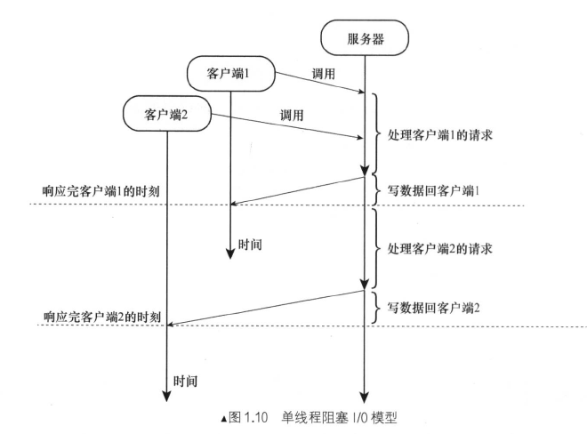
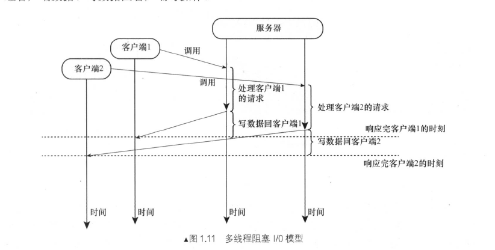

# 单线程阻塞模型

特点

* 单线程:服务端只有一个线程处理客户端的所有请求
* 阻塞I/O 在读写线程的时候是阻塞的，读取客户端数据要等待客户端发送数据并且把操作系统内核的数据复制到用户进程才能解决阻塞。

缺点

* 性能很差，只有一个线程处理数据，当前线程正在处理请求的时候，无法处理其他请求。

# 多线程阻塞模型

利用多线程机制多分配一个线程，当多个请求过来的时候，服务器端在接受客户端请求后，分别创建多个线程对他们进行处理。客户端与服务器线程的比例是1:1

特点

* 能够提高服务器端的并发处理能力，但是每个线程需要分配一个线程池进行操作。
* 多线程需要上下文切换。

# 单线程非阻塞 I/O 模型

单线程非阻塞I/O模型的最大特点是，在调用读取和写入接口后立马返回，而不是阻塞。

探讨单线程非阻塞I/O 模型先了解一下非阻塞情况下的套字节检测机制。

* 应用程序遍历套字节时间检测,尝试读写。使用一个线程负责遍历套字节列表，同时处理数据的拼凑。
* 内核遍历套字节检测: