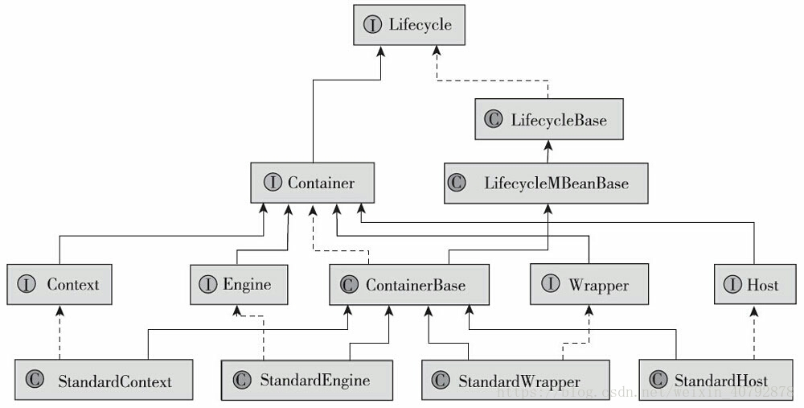
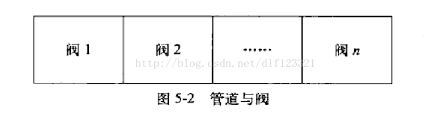
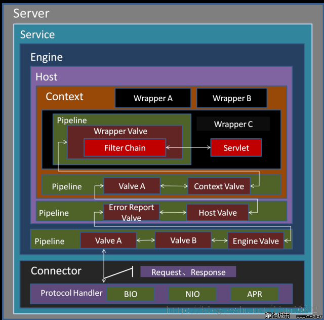
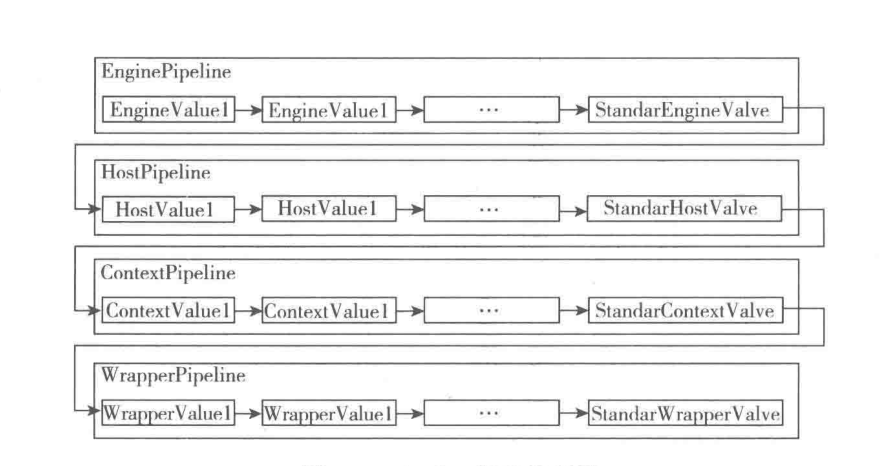

#  容器

servlet 容器是用来处理servlet 资源，为Web 客户端填充 response 的模块

Tomcat 有4种容器:

* Engine 整个 Catalina servelt 引擎
* Host 包含了一个或者多个Context 容器的虚拟主机
* Context 表示一个web app  一个context 有多个Wrapper
* Wrapper 表示一个独立的servelt

这些容器都实现了Container 接口

我们的本章的上半部分主要讲解的是Wrapper 与 Context

## Container

因为所有的容器都实现于Tomcat 的Container 接口所以我们讲解一下Container 接口



Container 主要需要实现的方法是 addChild() 和 removeChild()

```java
/**
     * Add a new child Container to those associated with this Container,
     * if supported.  Prior to adding this Container to the set of children,
     * the child's <code>setParent()</code> method must be called, with this
     * Container as an argument.  This method may thrown an
     * <code>IllegalArgumentException</code> if this Container chooses not
     * to be attached to the specified Container, in which case it is not added
     *
     * @param child New child Container to be added
     *
     * @exception IllegalArgumentException if this exception is thrown by
     *  the <code>setParent()</code> method of the child Container
     * @exception IllegalArgumentException if the new child does not have
     *  a name unique from that of existing children of this Container
     * @exception IllegalStateException if this Container does not support
     *  child Containers
     */
public void addChild(Container child);
/**
     * Remove an existing child Container from association with this parent
     * Container.
     *
     * @param child Existing child Container to be removed
     */
public void removeChild(Container child);
```

并且更具上面的注释，在实现add 方法的时候必须对传入的子容器设置父容器。

## 管道

Tomcat 并没有采用遍历Valve 的方式去实现阀的遍历执行。也没有采用Tomcat4 之前的实现采用ValveContext的实现。

但是我们可以稍微了解下这个Valve Context 的实现。

类似于Java 的双亲委派机制。



对于每个阀调用的时候都会传入一个叫做ValveContext的实例。这个ValveContext 实例可以获取到这个管道中所有的阀，所以可以使用他的invokeNext  来调用之后的阀。

```java
public void invoke(Request req,Response res,ValveContext context){
  context.invokeNext(req,res);
  // 下面才是当前阀的逻辑
}
```

我觉得这里使用递归调用下面的阀的过程的好处是： 

如果可以通过回搠可以对之前执行完成的阀进行一些额外的操作，如果你需要将当前的状态传递到下一个阀中去的话，就可以将invoke() 放置在方法末尾，如果你需要基于之前的阀进行操作的话，你可以将invoke()放置在方法开头，这样大大能提高用户DIY 代码的灵活性。



可以很清晰的看到，对于阀和阀之间都是采用双向箭头来表示，因为可以通过回搠回到上一个阀中。

在Tomcat 7的实现中则是将Valve 设置成为单项链表的实现，每个pipeline的基础阀在链表的尾部，并且如果有新的valve 被嵌入的时候，将他插入在尾部，并且在基础阀的前一个节点。

```java
// Add this Valve to the set associated with this Pipeline
if (first == null) {
  first = valve;
  valve.setNext(basic);
} else {
  Valve current = first;
  while (current != null) {
    if (current.getNext() == basic) {
      current.setNext(valve);
      valve.setNext(basic);
      break;
    }
    current = current.getNext();
  }
}
```

所以如果我们要调用Pipeline的话就会从链表头部开始调用直到调用到链表的末尾，去调用子容器的Pipeline 不断委托下去，这样有个好处就是可以将原本杂乱无章的代码逻辑，采用流水线的方式执行，并且能够让每个Valve 都有接触资源的机会，也方便于之后的代码维护，可以对阀进行有序的增删改。

Tomcat 所有容器的Valve 调用如下图所示:




```java
public class CoyoteAdapter implements Adapter {
   /**
     * 适配器调用Engine的第一个阀
     */
    @Override
    public void service(org.apache.coyote.Request req,
                        org.apache.coyote.Response res)
        throws Exception {
  connector.getService().getContainer()
                          .getPipeline().getFirst().
                          invoke(request, response); // 一个复杂的调用
    }
}
```

```java
final class StandardEngineValve
    extends ValveBase {
  /**
     * Engine 调用
     */
      @Override
    public final void invoke(Request request, Response response)
        throws IOException, ServletException {

        // Select the Host to be used for this Request
        Host host = request.getHost();
        if (host == null) {
            response.sendError
                (HttpServletResponse.SC_BAD_REQUEST,
                 sm.getString("standardEngine.noHost", 
                              request.getServerName()));
            return;
        }
        if (request.isAsyncSupported()) {
            request.setAsyncSupported(host.getPipeline().isAsyncSupported());
        }

        // Ask this Host to process this request
        host.getPipeline().getFirst().invoke(request, response);
    }

}
```

```java
/**
*Context 调用 Wrapper 的第一个阀
     */
    @Override
    public final void invoke(Request request, Response response)
        throws IOException, ServletException {

        // Disallow any direct access to resources under WEB-INF or META-INF
        MessageBytes requestPathMB = request.getRequestPathMB();
        if ((requestPathMB.startsWithIgnoreCase("/META-INF/", 0))
                || (requestPathMB.equalsIgnoreCase("/META-INF"))
                || (requestPathMB.startsWithIgnoreCase("/WEB-INF/", 0))
                || (requestPathMB.equalsIgnoreCase("/WEB-INF"))) {
            response.sendError(HttpServletResponse.SC_NOT_FOUND);
            return;
        }

        // Select the Wrapper to be used for this Request
        Wrapper wrapper = request.getWrapper();
        if (wrapper == null || wrapper.isUnavailable()) {
            response.sendError(HttpServletResponse.SC_NOT_FOUND);
            return;
        }

        // Acknowledge the request
        try {
            response.sendAcknowledgement();
        } catch (IOException ioe) {
            container.getLogger().error(sm.getString(
                    "standardContextValve.acknowledgeException"), ioe);
            request.setAttribute(RequestDispatcher.ERROR_EXCEPTION, ioe);
            response.sendError(HttpServletResponse.SC_INTERNAL_SERVER_ERROR);
            return;
        }
        
        if (request.isAsyncSupported()) {
            request.setAsyncSupported(wrapper.getPipeline().isAsyncSupported());
        }
        wrapper.getPipeline().getFirst().invoke(request, response);
    }

```

