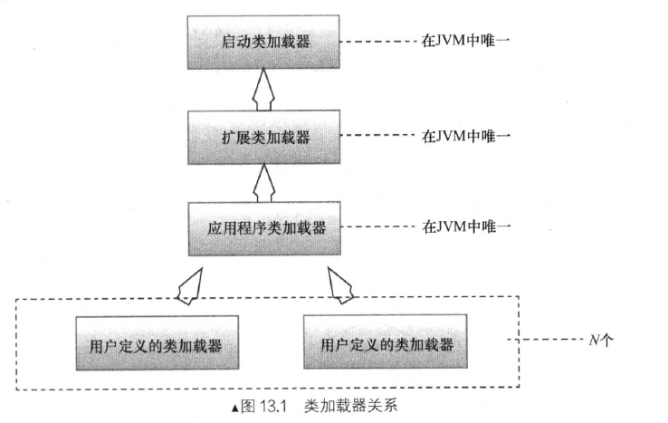

# 类加载器


类加载的好处是可以将Java 类动态的加载到 JVM 中并且运行，就可以在程序运行中再加载类。

在Java 体系中，我们可以将系统分为3中类加载器:

* 启动类加载器: 加载Java 的核心库，把核心的Java 类加载进JVM。这个加载器使用的原生 C++ 实现，是所有其他类加载器的父类加载器，负责加载<Java_HOME>/jre/lib 目录下的JVM 指定类库。
* 拓展类加载器:加载Java 的拓展类库，加载<Java_HOME>/jre/lib/etx 目录中的类。
* 应用程序类加载器: 系统类加载器负责加载用户类库中的指定类库。



并且类加载器还有各种机制:

* 在Java 中，我们用完全匹配类命名来标识一个类，就是用包名.类名，但是在JVM 中一个类由完全匹配类名和一个类加载器实例的ID来标识一个类，当我们判断两个类是否相等的时候，只要他们由两个不同的类加载器加载的前提下才有意义，否则就算相同的字节码，如果由不同的类加载器实例加载，这两个类也是不相同的。这种特征为我们提供了隔离机制。

* 类加载器有一个全盘机制当类加载加载一个类的时候，他的依赖的应用的其他所有类都由这个类加载器加载，除非显示的调用这个其他类加载加载。

  * 对于类加载器加载对象的时候他只会去加载那些必须的对象，只会加载父类对象，理由也很简单为了实现多态，需要将父类的入口方法连接起来，实现方法表。对于这些父类，调用加载子类的类加载器去加载，并且通过向上委托的方式加载。

  * 只有真正执行到对应的代码，遇到 new 关键词的时候，才会去加载对应的外部引用的类，达到了按需处理的效果。

  * 如果当前类加载器，已经加载了对应的类，第二次遇到new时候，Java 会隐式的从方法区中获取对应的类。

    

# 载入器

Tomcat 如果使用的系统的类加载器去加载某个servlet 中所有需要使用的类，那么servlet 就可以访问所有的类，比如 Java 虚拟机中环境变量中CLASSPATH 指明路径下的所有类和库。servlet 应该只允许再入WEB-INF/class 中的目录，以及它的子目录下的类。

并且Tomcat 需要实现自定义类加载器的原因是因为为了提供自动重载的功能。类载入器会开启一个线程不断检查文件的时间戳。如果要实现重载入的功能就必须实现Reload 接口。在Tomcat 7 中已经将Reloader 接口合并入Loader 接口中。

​                                                                                                                                                                                                                                                                                                                                                                                                                                                                                                                                                                                                                                                                                                                                                                                                                                                                                                                                                                                                                                                                                                                                                                                                                                                                                                                                                                                                                                                                               

## WebAppLoader

对于Tomcat 的重载，如果你在 conf/server.xml 的 ｀<Context>｀标签设置了 reloadable 为ture 的话,Tomcat 会为你开启一个后台线程，去监控该 Context 中所有classes 文件的修改，并且重新加载。 

```java
/**
     * Execute a periodic task, such as reloading, etc. This method will be
     * invoked inside the classloading context of this container. Unexpected
     * throwables will be caught and logged.
     */
@Override
public void backgroundProcess() {
  if (reloadable && modified()) {
    try {
      // 如果发现有文件修改
      // 就将当前线程的类加载类加载器设置为 WebappClassLoader
      Thread.currentThread().setContextClassLoader
        (WebappLoader.class.getClassLoader());
      if (container instanceof StandardContext) {
        ((StandardContext) container).reload();
      }
    } finally {
      if (container.getLoader() != null) {
        Thread.currentThread().setContextClassLoader
          (container.getLoader().getClassLoader());
      }
    }
  } else {
    closeJARs(false);
  }
}
```

这个函数将会不断的调用，我们来看看他对应的 WebappLoader.modified() 方法吧！

```java
 /**
     * Has the internal repository associated with this Loader been modified,
     * such that the loaded classes should be reloaded?
     */
    @Override
    public boolean modified() {
        return classLoader != null ? classLoader.modified() : false ;
    }

```

他会调用WebappLoader 中的属性变量 WebappClassLoader的modified() 方法，而这个方法会检查class 文件和jar 包文件是否被修改，如果被修改的话就立刻返回true ，注意是当遇到第一个被修改的文件，就会返回true。

```java
     /*
		 * Have one or more classes or resources been modified so that a reload
     * is appropriate?
     */
    public boolean modified() {

        if (log.isDebugEnabled())
            log.debug("modified()");

        // Checking for modified loaded resources
        int length = paths.length;

        // A rare race condition can occur in the updates of the two arrays
        // It's totally ok if the latest class added is not checked (it will
        // be checked the next time
        int length2 = lastModifiedDates.length;
        if (length > length2)
            length = length2;

        for (int i = 0; i < length; i++) {
            try {
                long lastModified =
                    ((ResourceAttributes) resources.getAttributes(paths[i]))
                    .getLastModified();
                if (lastModified != lastModifiedDates[i]) {
                    if( log.isDebugEnabled() )
                        log.debug("  Resource '" + paths[i]
                                  + "' was modified; Date is now: "
                                  + new java.util.Date(lastModified) + " Was: "
                                  + new java.util.Date(lastModifiedDates[i]));
                    return (true);
                }
            } catch (NamingException e) {
                log.error("    Resource '" + paths[i] + "' is missing");
                return (true);
            }
        }

        length = jarNames.length;

        // Check if JARs have been added or removed
        if (getJarPath() != null) {

            try {
                NamingEnumeration<Binding> enumeration =
                    resources.listBindings(getJarPath());
                int i = 0;
                while (enumeration.hasMoreElements() && (i < length)) {
                    NameClassPair ncPair = enumeration.nextElement();
                    String name = ncPair.getName();
                    // Ignore non JARs present in the lib folder
                    if (!name.endsWith(".jar"))
                        continue;
                    if (!name.equals(jarNames[i])) {
                        // Missing JAR
                        log.info("    Additional JARs have been added : '"
                                 + name + "'");
                        return (true);
                    }
                    i++;
                }
                if (enumeration.hasMoreElements()) {
                    while (enumeration.hasMoreElements()) {
                        NameClassPair ncPair = enumeration.nextElement();
                        String name = ncPair.getName();
                        // Additional non-JAR files are allowed
                        if (name.endsWith(".jar")) {
                            // There was more JARs
                            log.info("    Additional JARs have been added");
                            return (true);
                        }
                    }
                } else if (i < jarNames.length) {
                    // There was less JARs
                    log.info("    Additional JARs have been added");
                    return (true);
                }
            } catch (NamingException e) {
                if (log.isDebugEnabled())
                    log.debug("    Failed tracking modifications of '"
                        + getJarPath() + "'");
            } catch (ClassCastException e) {
                log.error("    Failed tracking modifications of '"
                          + getJarPath() + "' : " + e.getMessage());
            }

        }

        // No classes have been modified
        return (false);

    }
```

下面我们会到WebappLoader 的	backgroundProcess() 方法，来看看发现修改之后到底会做一些什么事情呢？

```java
 @Override
    public void backgroundProcess() {
        if (reloadable && modified()) {
            try {
                // 如果发现有文件修改
                // 就将当前线程的类加载类加载器设置为 WebappClassLoader
                Thread.currentThread().setContextClassLoader
                    (WebappLoader.class.getClassLoader());
                if (container instanceof StandardContext) {
                    ((StandardContext) container).reload();
                }
            } finally {
                if (container.getLoader() != null) {
                    Thread.currentThread().setContextClassLoader
                        (container.getLoader().getClassLoader());
                }
            }
        } else {
            closeJARs(false);
        }
    }
```

他会调用Context 的reload() 方法，我们可以简单的看一下他的作用:

```java
    @Override
    public synchronized void reload() {

        // 省略

        try {
            stop();
        } catch (LifecycleException e) {
            log.error(
                sm.getString("standardContext.stoppingContext", getName()), e);
        }

        try {
            start();
        } catch (LifecycleException e) {
            log.error(
                sm.getString("standardContext.startingContext", getName()), e);
        }

        setPaused(false);

        // 省略

    }

```

他主要会调用 stop() 和 start() 方法。  但是你会提出一个疑问，怎么就调用了生命周期的 stop() 和 start() 就能够完成类的热加载呢？ 这完全不科学

stop 和 start 都会调用 StandardContext 的生命周期函数start/stopInternal 我们可以看看这里有有没有什么思路

```java
@Override
    protected synchronized void stopInternal() throws LifecycleException {


 		// 略
				// 关闭子容器
        try {

            // Stop our child containers, if any
            final Container[] children = findChildren();
            
            ClassLoader old = bindThread();
            try {
                // Stop ContainerBackgroundProcessor thread
                threadStop();

                for (int i = 0; i < children.length; i++) {
                    children[i].stop();
                }
            
                // Stop our filters
                filterStop();
            
                if (manager != null && manager instanceof Lifecycle &&
                        ((Lifecycle) manager).getState().isAvailable()) {
                    ((Lifecycle) manager).stop();
                }
            
                // Stop our application listeners
                listenerStop();
            } finally{
                unbindThread(old);
            }


						// 关闭ClassLoader
            Realm realm = getRealmInternal();
            if ((realm != null) && (realm instanceof Lifecycle)) {
                ((Lifecycle) realm).stop();
            }
            if ((cluster != null) && (cluster instanceof Lifecycle)) {
                ((Lifecycle) cluster).stop();
            }
            if ((loader != null) && (loader instanceof Lifecycle)) {
                ((Lifecycle) loader).stop();
            }

        } finally {

            // Unbinding thread
            unbindThread(oldCCL);

        }
		// 略


    }
```

其实代码很长，我们只需要关注两个点，一个是关闭下面的子容器Wrapper 一个是关闭对应的ClassLoader 这里的ClassLoader 也是WebappLoader 他也有自己的生命周期函数，当他调用的时候，他会将内部的WebappClassLoader 实例执行 stop 生命周期函数(主要是将一些属性置为null 方便gc), 然后将这个实例置为null 方法垃圾收集器回收。

```java
WebappClassLoader.stop()

/**
* Stop the class loader.
*
* @exception LifecycleException if a lifecycle error occurs
*/
@Override
public void stop() throws LifecycleException {
		notFoundResources.clear();
    resourceEntries.clear();
    resources = null;
    repositories = null;
    repositoryURLs = null;
    files = null;
    jarFiles = null;
    jarRealFiles = null;
    jarPath = null;
    jarNames = null;
    lastModifiedDates = null;
    paths = null;
    hasExternalRepositories = false;
    parent = null;
}
```

```java
WebappLoader.stopInternal()
// Throw away our current class loader
  if (classLoader != null) {
    ((Lifecycle) classLoader).stop();
    DirContextURLStreamHandler.unbind(classLoader);
  }


classLoader = null;
```

我们发现了这个stop()函数会将Context 的所有成员变量都清除，可以想象为一个卸载的过程，我们再来看看这个start() 对应的startInternal 是怎么样的吧!

首先他会将webappLoader 设置为属性，但是这是内部的webappClassLoader 是空的

```java
if (getLoader() == null) {
            WebappLoader webappLoader = new WebappLoader(getParentClassLoader());
            webappLoader.setDelegate(getDelegate());
            setLoader(webappLoader);
} 
```

随后会调用 webappLoader 对应的生命周期函数:

```java
 // Start our subordinate components, if any
if ((loader != null) && (loader instanceof Lifecycle))
  ((Lifecycle) loader).start();

```

需要关注的是这个生命周期函数的内部调用了一个重要方法createClassLoader() ，就是这个方法对内部的webappClassLoader 进行赋值。

```java
/**
     * Create associated classLoader.
     */
private String loaderClass =
        "org.apache.catalina.loader.WebappClassLoader";
private WebappClassLoader createClassLoader()
  throws Exception {

  Class<?> clazz = Class.forName(loaderClass);
  WebappClassLoader classLoader = null;

  if (parentClassLoader == null) {
    parentClassLoader = container.getParentClassLoader();
  }
  Class<?>[] argTypes = { ClassLoader.class };
  Object[] args = { parentClassLoader };
  Constructor<?> constr = clazz.getConstructor(argTypes);
  classLoader = (WebappClassLoader) constr.newInstance(args);

  return classLoader;

}
```

他才用反射的方式创建了classLoader 并将其返回。

当classLoader 相关参数配置完成后，StandardContext 会调用loadOnStartup() 方法

```java
public void loadOnStartup(Container children[]) {

  // Collect "load on startup" servlets that need to be initialized
  TreeMap<Integer, ArrayList<Wrapper>> map =
    new TreeMap<Integer, ArrayList<Wrapper>>();
  for (int i = 0; i < children.length; i++) {
    Wrapper wrapper = (Wrapper) children[i];
    int loadOnStartup = wrapper.getLoadOnStartup();
    if (loadOnStartup < 0)
      continue;
    Integer key = Integer.valueOf(loadOnStartup);
    ArrayList<Wrapper> list = map.get(key);
    if (list == null) {
      list = new ArrayList<Wrapper>();
      map.put(key, list);
    }
    list.add(wrapper);
  }

  // Load the collected "load on startup" servlets
  for (ArrayList<Wrapper> list : map.values()) {
    for (Wrapper wrapper : list) {
      try {
        wrapper.load();
      } catch (ServletException e) {
        getLogger().error(sm.getString("standardWrapper.loadException",
                                       getName()), StandardWrapper.getRootCause(e));
        // NOTE: load errors (including a servlet that throws
        // UnavailableException from tht init() method) are NOT
        // fatal to application startup
      }
    }
  }

}
```

这个函数比较简单，分为两步，一个是收集 load on start up 的类。

```xml
<servlet>
  <servlet-name>default</servlet-name>
  <servlet-class>org.apache.catalina.servlets.DefaultServlet</servlet-class>
  <init-param>
    <param-name>debug</param-name>
    <param-value>0</param-value>
  </init-param>
  <init-param>
    <param-name>listings</param-name>
    <param-value>false</param-value>
  </init-param>
  <load-on-startup>1</load-on-startup>
</servlet>

<servlet>
  <servlet-name>jsp</servlet-name>
  <servlet-class>org.apache.jasper.servlet.JspServlet</servlet-class>
  <init-param>
    <param-name>fork</param-name>
    <param-value>false</param-value>
  </init-param>
  <init-param>
    <param-name>xpoweredBy</param-name>
    <param-value>false</param-value>
  </init-param>
  <load-on-startup>3</load-on-startup>
</servlet>
```

随后调用wrapper.load();将他们加载。

##  总结

可以看出Tomcat 对于类重载不是真正意义上的重载，他只是重新卸载一遍Context 将那些在Context中所有装载好的类全部卸载，然后将Context 重新装载，并且只装载那些写在 load on start up 上的 servlet ,对于那些已经修改好的类，之后只需要通过反射重新加载就成了。

思考：现在我们的业务代码是写在Servlet 上的，这时候我修改了一个类是Servlet 需要引用的，这时候我们热加载并调试的流程是怎么样的?

ans: 首先Tomcat 的线程监听到 WEB-INF 下面的 classes 有文件被修改,随后找出这个文件，并且卸载这个文件对应的Context( 就是你的应用程序) 随后加载那些 load on start up  的servlet，并没有加载你的业务 servlet, 随后你打开浏览器访问你的对应URL Tomcat 对你的servlet 进行加载，并且执行这个service() 方法，遇到了 new 了你修改的类，这时候就会用webappClassLoader 加载并运行新类的代码。


// TODO Servlet InstanceManage