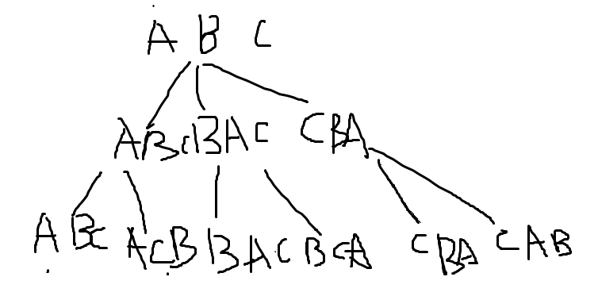

# 字符串的排列

输入一个字符串,按字典序打印出该字符串中字符的所有排列。例如输入字符串abc,则打印出由字符a,b,c所能排列出来的所有字符串abc,acb,bac,bca,cab和cba。

可以画出一个递归树



每次递归都将当前的字母和之后的字母交换，然后不断深入。

```java
import java.util.*;
public class Solution {
    private ArrayList<String> result;
    private TreeSet<String> paths = new TreeSet<>();
    public ArrayList<String> Permutation(String str) {
       
       result = new ArrayList<>();
         if(str .equals("") ){
            return result;
        }
       find(str,0);
         result.addAll(paths);
        return result;
    }
    
    public void find(String str,int index){
        if(index == str.length()){
            paths.add(str);
            return;
        }
        for(int i = index;i<str.length();i++){
            char[] array =  str.toCharArray();
            char tmp = array[index];
            array[index] = array[i];
            array[i] = tmp;
            str = new String(array);
            find(str,index+1);
        }

    }
}
```

