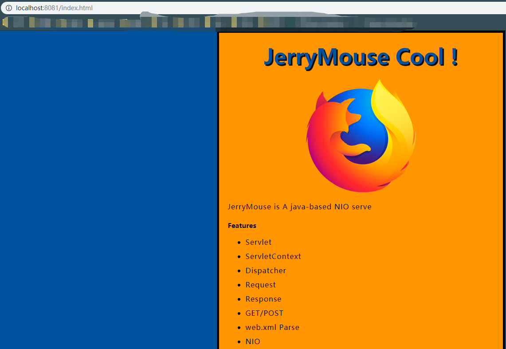

这坑开了有三个多月了，是今年春招的时候开始写的方轮子。感觉很多基本的功能都已经完成了，下面分享上来给大家讲下写这个方轮子的心路历程。

## 起因

起初在牛客上看到一篇帖子 [《震惊！文科生如何三个月转行成为Java工程师？ 》](https://www.nowcoder.com/discuss/156087) 这个作者自己写了一个HTTP server ,我突然想到为什么我不去实现一个呢？

因为其实在转到 Java（为了就业） 之前我是学习Python的，曾经用Python 实现过一个类似于 Scrapy 的爬虫框架，但是因为转到Java之后迫于繁杂的 Java 知识体系，也就没有想到写轮子这件事。但是这篇博客真的激起了我写轮子的欲望。


## 如何做？怎么做？

但是如何从头写一个服务器呢?就是模仿！

我看到那篇帖子的作者曾经提到他是看了一个Java SE的学习视频跟着慢慢写了一个1000多行的服务器，再自己慢慢迭代代码。

行！就这样，去找这个视频！但是发现 作者留下了一个失效百度云地址。不过这怎么能阻挡我写轮子的欲望，经过一下午的谷歌，终于找到了这个视频 [2018百战程序员JAVA全系列终结版第11阶：手写服务器httpserver项目](https://www.bilibili.com/video/av31470470/?p=3)。

是一个培训班的视频，起初我有些抵触，因为我觉得对我来说看培训班的视频的学习效率会不怎么高，没想到这个作者讲的十分的好，带我重新理解了一遍，web.xml 解析，反射解耦这些操作。花了两天的时间跟着视频做了一个十分简易的 BIO HTTP server。

## 看作者源码

一个简易的BIO server 并不使我满足，于是我开始去 Github 上学习作者的源码 [WebServer](https://github.com/songxinjianqwe/WebServer) 。当时还对 NIO 没有一个明确的概念，对于 reactor 模型没有一个深刻的概念，不过没有什么能阻挡我的，查阅了资料并且了解了 unix IO 模型之后的我就开始继续看着作者的源码写轮子。

期间主要实现了:

### NIO Reactor

我的实现是用一个 Acceptor 阻塞的获取Socket 连接，然后使用多个Poller 非阻塞轮询 socket 读事件，然后交给线程池处理。

其实对于线程池数目与Poller 的调参也有需要注意的点，我这边因为Poller的操作是计算密集型的操作所以选择了 CPU 核心数目+1 的方案，而后面的线程池我则使用的是200个线程(IO 密集型)，而且需要注意的一点是对于溢出调度队列的线程，系统默认是采用抛出异常的方式，我这边采用的是 调用者执行的方式  使用主线程去串行的执行溢出的任务。这样的好处是会慢，但是也不会出现抛出异常的情况。

## 协同开发

这段时间，因为最最基础的功能已经开发完毕，所以我把我的轮子分享给牛客上认识的春招战友们一起开发。

我最要感谢的是和我一起开发的时候，一直交流的伙伴鸡哥，那段时间我们两个人满脑子都是轮子，考虑 NIO 考虑session的实现，聊到深夜，也与我反复重构了这个项目。

还有就是 offer 收割机表哥，他帮我指出了一个问题，就是 NIO selector 的注册不是并发的，当时我看 WebServer 的作者的时候也没有仔细思考。

```java
 private boolean events() {
        log.info("Queue大小为{},清空Queue,将连接到的Socket注册到selector中", events.size());
        boolean result = false;
        PollerEvent pollerEvent;
        for (int i = 0, size = events.size(); i < size && (pollerEvent = events.poll()) != null; i++) {
            result = true;
            pollerEvent.run();
        }
        return result;
    }
```

后来修改为并发注册之后并发量提升了 10%。

## 继续迭代：Servlet 容器 

于是我还是不满足，因为我的轮子这样的话就和 牛客的 NIO server 没有区别了，于是我查阅资料，其实我发现作者的 server 并没有引入servlet 容器这个概念。

于是我给自己定了三个小目标：

* 引入 servlet 容器 
* 支持静态资源
* 热加载实现

为了实现这个三个任务，我阅读了《深入刨析Tomcat》，也慢慢锻炼了自己的实现能力，因为这本书是BIO的实现并且代码贴的较少，所以跟着实现也是比较麻烦的，不过这能阻止的了我吗？冲就完事了。

### 支持静态资源

于是我先实现了静态资源的支持，看到图片和 jq 能够直接通过 `href`直接嵌入页面是一件多开心的事情啊！



### 引入servlet容器

这个实现还是比较麻烦的，因为 Tomcat 的概念比较繁杂，需要先理解 Tomcat 的架构才行，我这边只是实现了 Context 和 Wrapper 两个容器，可以基本完成单应用程序。


### 热加载实现

热加载这个是我这两天实现的，我这边独立出一个线程递归的扫描所有的 class 文件，然后重新创建一个自定义的类加载器，重新加载一遍指定的 servlet 再将指定的 servlet 实例重新放入 Wrapper 就能实现热加载。

这边的实现还是很简陋，需要进一步改进。


## 总结

希望能继续迭代下去吧，真的从这个轮子中学习到很多光看书和写CURD项目学不到的东西，不过代码写的不够优雅，需要再次重构这个项目，而且对于造轮子这件事情也不再惧怕了。如果有人想知道我具体实现的细节的话，我可以写一个这个轮子的实现细节。

项目链接:[ttps://github.com/xiantang/JerryMouse](https://github.com/xiantang/JerryMouse)

如果这个项目对你有帮助，或者我的学习经历使你对产生了兴趣请Star 或者参与进来。

